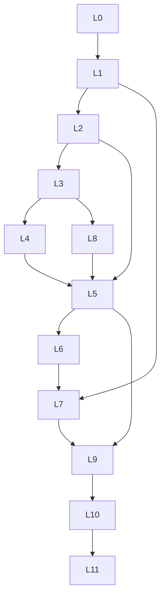

# MSS — APPLICATION DATA SEEDING (MASTER SPEC v4 — COMPLETE CODE-GROUNDED REWRITE)

**Status:** Implemented. App **defaults to full business seed** on first open and after clearing `localStorage`. Settings → Data → **Reset to empty workspace** opts into masters-only boot. `buildEmptyAppState()` remains for explicit empty reset only.

**Single source of truth:** This file only. No sidecar audit report — coverage proof lives in §14 + Appendix J. Completion report: **§14** (fill after implementation).

**v4 changelog vs v3 (2026-05-21):** 53 collections (was 47), new `projectMode` taxonomy (was 8 legacy kinds only), 50+ enums enumerated, full hydration pipeline order, Edge ID → code-path map, ID prefix registry, voucher posting map, calendar source registry, `resolveProjectCapabilities` outcomes matrix, per-page URL param + sheet/modal inventory, dense-state thresholds.

---

## §0 GOLDEN RULES — non-negotiable (read first)

1. **No "one exemplar" laziness.** If a feature applies to a **class** of projects (e.g. all `executionScope: full` partner-network EPC), seed that data on **every** project in that class that is `In Progress` or `Completed` — not on a single showcase row.
2. **Per project mode/role:** Seed **at least 2–3 projects per (`projectMode`, `partnerRole`, `executionScope`) combination** that produces a distinct `resolveProjectCapabilities()` outcome (Appendix R), each with the full child bundle defined in §15.
3. **Transport is not optional** on material-dispatch projects: every `materialsSent` issuance that moves panels/inverters/structure MUST produce a matching **Task** via `inferTransportWorkKind` (Panel/Inverter/Structure/Material Transport per `src/lib/materialIssueTransportTask.ts`) plus a matching site **expense** under `mainCategory: "site"` with a transport sub-category.
4. **Dual checklist model:** every dispatch project needs **both** `project.siteChecklist[]` (BOQ frozen from quotation) **and** `SiteRecord.checklistItems[]` (per-site dispatch + Need-to-Get).
5. **Time:** 4–5 months (**2026-01-01 → 2026-05-20**), weekday-heavy, **no** duplicate timestamps within a 60-second window on unrelated rows, **no** "Test User" / "Lorem ipsum" / stock-photo placeholders.
6. **Hydration:** output MUST pass the full pipeline (Appendix N) — `normalizeAppState`, `normalizeQuotations`, `normalizeTools`, `applyAppStateHydrationPipeline` (FK + CPR FIFO + invoice reconcile), `reconcileAllEnquiryQuotationHistories`, `syncProjectsSiteReadinessFromChecklist`, `applyAutoArchive`, `linkAccrualsToProject`, `syncBankReconciliationLinks`, `reconcileClientPaymentLedger`.
7. **Discover more from code** — this doc is a **floor**. If you find another collection, tab, filter, validator, sheet, or enum in the repo, seed it.
8. **No enum referenced without enumeration.** If the spec mentions an enum (status, kind, type), Appendix K lists every value. Any new enum added to code must be added to K before seeding.
9. **Every detail-page tab list is authoritative.** Appendix E enumerates every tab on every detail page. Seed at least 1 non-empty row per tab, per representative entity.
10. **Every URL search param is exercised.** Appendix E lists every `useSearchParams` key for every page; seed must produce a non-empty result for every documented filter value combination.

---

## What was removed (do not restore)

| Deleted | Purpose |
|---------|---------|
| `src/data/seedData.ts` | Monolithic demo |
| `src/data/activeSitesSeed.ts`, `seedLayerOrder.ts`, `dummyData.ts`, `templatesData.ts`, `inventoryData.ts` | Shims / thin demo |
| `buildSequencedAppSeed()`, `loadDemoDataset()` | Runtime demo loader |
| 22 seed-dependent tests | Recreate under `src/tests/seed/` after implementation |

**Kept:** `src/data/appSeedBuilder.ts` (`buildEmptyAppState`, `normalizeAppState`, `normalizeQuotations`), `applyAppStateHydrationPipeline`, Settings reset.

---

## FILES YOU MUST CREATE (when the seed is implemented)

All seed under `src/data/seed/`. Public API: `buildBusinessSeed(profile?: "full" | "smoke")`.

### Orchestration

| File | Role |
|------|------|
| `index.ts` | Exports |
| `buildBusinessSeed.ts` | L0→L11 assemble + hydration |
| `seedLayerOrder.ts` | Layers, `smokeRoutes[]`, collection ownership |
| `seedTimeModel.ts` | Dates, jitter, weekday bias |
| `seedIdRegistry.ts` | `idFactory` batches keyed by Appendix O |
| `seedHydration.ts` | All reconcile/migrate passes (Appendix N) |
| `seedMastersSync.ts` | `masters_data` L1 (Appendix H) — write the localStorage payload |
| `seedVerification.ts` | FK matrix, FIFO, size budget, Appendix J self-audit |
| `seedProjectBundles.ts` | **Per-project child bundle builder** (§15 + Appendix R outcomes) — central place enforcing checklist+tasks+transport |
| `seedCapabilityAxis.ts` | Generates project rows by enumerating `resolveProjectCapabilities` outcomes (Appendix R) |

### Layers

`L0_settingsTeam.ts`, `L1_catalog.ts`, `L2_network.ts`, `L3_customers.ts`, `L4_hr.ts`, `L8_crm.ts`, `L5_projectsSites.ts`, `L6_attendanceTasks.ts`, `L7_inventoryOps.ts`, `L9_finance.ts`, `L10_capital.ts`, `L11_auditBooks.ts`, `ops_scheduling.ts`, `ops_changeRequests.ts`, `ops_executionLineItems.ts`, `ops_transportTasks.ts`, `ops_procurementNeedLines.ts`, `ops_bankReconciliation.ts`.

### Narratives (`narratives/` — each wires a full subgraph)

`stalledEnquiry.ts`, `quotationRevisionChain.ts`, `partialInvoice.ts`, `overpaidInvoice.ts`, `voidedDraftInvoice.ts`, `onHoldBlockage.ts`, `doubleBookInstall.ts`, `archivedCustomer.ts`, `highValueInvoice.ts`, `loanRepaymentLinks.ts`, `bankReconMixed.ts`, `needToGetDamage.ts`, `richTimeline.ts`, `directExceptionProject.ts`, `partnerSplitPayment.ts`, `customerBulkInflow.ts`, `reopenLostEnquiry.ts`, `rescheduledTask.ts`, `attendanceInconsistency.ts`, `lowStockProcurement.ts`, `vendorDelayBill.ts`, `changeRequestApproved.ts`, `changeRequestRejected.ts`, `workStatusApprovalPending.ts`, `materialDamageThreshold.ts`, `incGivenNoDispatch.ts`, `vendorshipOnlyFee.ts`, `disputedVendorBill.ts`, `closedProjectReopen.ts`, `stalLeBlockage.ts`, `multiAlertNotificationsRoute.ts`.

### Runtime + tests

`AppDataContext.loadBusinessSeed()`, Settings button, `src/tests/seed/*.test.ts`, optional `src/tests/fixtures/minimalBusinessFixtures.ts` (unit tests only).

---

## Layer dependency



**Build order:** L0 → L1 (+ masters sync) → L2 → L3 → L4 → **L8** → L5 (+ ops_*) → L6 (+ ops_transportTasks) → L7 (+ ops_procurementNeedLines) → L9 → L10 → L11 (+ ops_bankReconciliation) → hydration (Appendix N) → verification (Appendix J).

---

## §1 Executive mandate

- **4–5 months** of operational history ending ~**2026-05-20**.
- Full **business-flow simulation** across **53 AppState collections** + **masters_data**.
- Reverse-engineer from code; this doc is a **floor**, exceed it where the codebase justifies.
- **No orphan FKs**; all IDs allocated via the prefix registry in Appendix O.
- Indian solar EPC realism — Hyderabad/Bangalore/Pune + tier-2/3; unique names; believable INR amounts; no PII.

---

## §2 Implementation anchor

- Only `buildBusinessSeed()` populates business rows. `buildEmptyAppState()` remains the boot baseline.
- Fresh browser = **empty**. Settings → **Load business seed** triggers `resetPrototype` + write seed payload.
- `SEED_PROFILE`: `full` (4–5 months, §9 volumes) vs `smoke` (2 weeks dense, ~30 % volume, same edge coverage for CI).
- Bump `APP_DATA_RESET_EPOCH` when seed schema changes.

---

## §3 Time model

| Rule | Implementation |
|------|----------------|
| Window | 2026-01-01 → 2026-05-20 (≈140 days) |
| Weekdays | Field ops Mon–Sat; finance and office work Mon–Fri |
| Chains | enquiry.created → quotation.sent → quotation.approved → project.created → project.started → invoice.issued → CPR FIFO → payment received → project.completed → project.closed |
| Audit | `auditLogs.timestamp` = transition time of the underlying event |
| Holidays | Indian holiday calendar — 8–12 rows in `holidays[]` within window |
| Jitter | ±30 min jitter per row to avoid same-second collisions; never same timestamp on **unrelated** rows |
| Robotic IDs | Banned. Use `createId(prefix)` (Appendix O) — random suffix mandatory |

---

## §4 Complete AppState entity catalog — **53 collections**

Every key on `AppState` (`src/contexts/AppDataContext.tsx` lines 158–258). Min rows are for `full` profile.

| # | Collection | Min rows | All states / variants to cover | Parent FKs |
|---|------------|----------|--------------------------------|------------|
| 1 | `projects` | **28–35** | All 5 lifecycle × all Appendix R capability outcomes | quotations, customers, partners |
| 2 | `quotations` | 35–50 | All 6 SM states + revision chain | enquiries, customers, agents |
| 3 | `customers` | 30–45 | active + archived (CA1–CA8) | — |
| 4 | `invoices` | 35–45 | All 7 billing statuses + Appendix C |  customers, projects |
| 5 | `saleBills` | 15–25 | Same status set | customers, projects |
| 6 | `expenses` | 60–90 | All 6 mainCategories (site/company/office/employee/owner/partner) + reimbursement | projects, employees |
| 7 | `incomes` | 15–25 | All 5 mainCategories (project/loan/partner/employee-payment/company) | — |
| 8 | `payments` | 40–60 | direction in/out × all counterpartyTypes | invoices, CPRs, loans, vendor bills |
| 9 | `enquiries` | 40–60 | All 6 SM states (E1–E10) | agents, customers |
| 10 | `agents` | 8–12 | with commission rates | — |
| 11 | `employees` | 12–18 | active + left | — |
| 12 | `teams` | 4–6 | memberIds | employees |
| 13 | `attendanceRecords` | 400–800 | present/absent/holiday/half-day/paid_leave | employees |
| 14 | `tasks` | **120–160** | All 5 statuses + ≥15 overdue + ≥30 transport (§17) + ≥40 work-status | projects, sites, employees/teams |
| 15 | `partners` | 6–10 | All 4 PartnerType (Profit-Share/Fixed-Rate/Channel/Subcontractor) | — |
| 16 | `partnerTransactions` | 20–30 | All 5 PartnerTransactionType | partners, projects |
| 17 | `loans` | 8–12 | All 3 payment types (emi / one-time / reminder-only); Active/Closed | — |
| 18 | `loanRepayments` | 30–50 | All 4 cash-link types (payment / expense / vendor_payment / none) | loans |
| 19 | `vendors` | 10–15 | all category mixes | — |
| 20 | `inventoryItems` | 25–40 | low stock + ≥1 valuation per method | — |
| 21 | `tools` | 15–25 | assigned + in-shop + with movementHistory; all 4 status × condition | employees, sites |
| 22 | `vendorBills` | 25–35 | All 6 statuses (draft/approved/disputed/pending/partial/paid) | vendors, projects |
| 23 | `vendorPayments` | 20–30 | reconciled + unreconciled | vendorBills |
| 24 | `quotationTemplates` | 5–8 | All 4 capacity segments (residential/commercial/industrial/custom) | — |
| 25 | `siteChecklistTemplates` | 5–8 | both subtypes (`generic` + `solar_package`) with `materialsBom[]` | — |
| 26 | `servicePresets` | 4–6 | SAC-coded service lines | — |
| 27 | `quotationVisibilityPresets` | 3–5 | All 7 toggles covered | — |
| 28 | `sites` | 20–28 | active/completed/on-hold; ≥5 projects with 2+ sites | projects |
| 29 | `holidays` | 8–12 | dates in window (`Date[]` shape) | — |
| 30 | `blockages` | 15–25 | active (1–14 d) + active (>14 d) + resolved | projects |
| 31 | `operationalTickets` | 10–20 | all 5 `taskType` × all 4 statuses | projects |
| 32 | `projectTimelineByProjectId` | **≥3 rich** + sparse on rest | All 7 axes + workStatusApprovals.status all 5 (incl. `closed`) | projects |
| 33 | `clientPaymentRecords` | 40–60 | FIFO + invoice_targeted + split lines + all 5 paymentStage | projects, payments |
| 34 | `ownerInvestments` | 5–10 | — | — |
| 35 | `employeePaidHolidays` | 1/employee/month | — | employees |
| 36 | `auditLogs` | **240–400** | ≥1 per AppAction (Appendix M list) + installation/visit/damage/blockage/CR/recon | every mutating entity |
| 37 | `accountingVouchers` | 40–60 | posted + draft; every `AccountingEventType` (Appendix P) | audit postings |
| 38 | `accountingReviewQueue` | 10–20 | pending + resolved | vouchers |
| 39 | `agentCommissionPayments` | 15–25 | — | accruals |
| 40 | `employeePayrollRecords` | 12–18 | All 5 payment modes; monthly runs | employees |
| 41 | `employeeWalletLedger` | 25–40 | advance + recovery | employees |
| 42 | `solarPackagePresets` | 3–5 | — | — |
| 43 | `settingsTeamMembers` | 6–10 | active directory | — |
| 44 | `vendorshipCompanies` | 4–6 | DISCOM codes | — |
| 45 | `incGiverCompanies` | 3–5 | — | — |
| 46 | `bankReconciliationStatements` | 6–10 | matched + unmatched lines | payments/expenses/incomes/vendorPayments |
| 47 | `materialReservations` | 20–40 | both sources (manual + auto-from-checklist) | projects, materials |
| 48 | `scheduledInstallations` | 20–30 | All 4 statuses + ≥1 doubleBookingOverride + ≥1 pastDateOverride | projects, teams |
| 49 | `siteVisits` | 25–35 | with items[] + blockers + reconciledChecklistAt set on 60 % | projects, sites |
| 50 | `projectChangeRequests` | 10–15 | All 3 types × all 3 statuses (at least 1 of each cross) | projects |
| 51 | `materialDamageRecords` | 8–12 | All 3 stages (transport/installation/storage) + ≥2 above threshold (qty>5 or cost>₹5000) | projects, materials |
| 52 | `agentCommissionAccruals` | 25–40 | All 3 statuses (pending/payable/paid) | agents, quotations, projects |
| 53 | `procurementNeedLines` | 30–50 | pending + acquired | vendors, projects, sites |

**Nested on `Project` (not separate keys):** `siteChecklist`, `materialsSent`, `siteMaterialLedger`, `materialMovementDedupeIds`, `executionLineItems`, `commercialBaseline`, `partners`, `teamAssignments`, `generatedDocuments`, `photoGallery`, `additionalWorkLines`, `partyPayments`, `outsource`, partner/channel/vendorship economics fields, `archivedAt`, `archivedReason`, `siteReadiness`, `startedAt`, `executionPhase`, `executionNotes`, `projectKindConfigSnapshot` — see Appendix F.

**Masters (`localStorage` `masters_data`):** Appendix H. Synced via `seedMastersSync.ts` in L1.

**Not persisted:** `DeletionRequest` (UI toast only).

**Derived (do NOT seed):** `lowStockItems` (computed from `inventoryItems.stock < minStock`), `/notifications` (`deriveBusinessAlertDescriptors` — Appendix Q), calendar events (`buildCalendarEvents` — Appendix Q).

---

## §5 Mandatory business flow chains

| Chain | Steps | Min count |
|-------|-------|-----------|
| **Lead → cash** | enquiry → quotation → approve → customer → project → start → invoice → CPR/payment → complete → close | 25+ full chains; 10+ stalled mid-chain |
| **Direct exception** | `directCreationReason` ≥10 chars, no enquiry | 3+ projects |
| **Partner / INC / vendorship** | partner economics, INC service, vendorship-only fee | 2–3 per `resolveProjectCapabilities` outcome (Appendix R) |
| **Procurement** | NeedToGet → vendor bill → vendor payment → stock movement → optional damage | 5+ full chains |
| **Field** | schedule → site visit → checklist dispatch → materials sent → **transport task** → site expense | **every** dispatch project (§17) |
| **HR** | attendance → reimbursable expense → wallet ledger → payroll run | 12+ employees × months |
| **Loans** | EMI + one-time + reminder; overdue for dashboard | 8+ loans |
| **Agents** | quotation approve → accrual (pending) → project start → payable → paid | per agent with quotations |
| **Change request** | draft → approved (auto-applies delta) OR rejected | 1 approved + 1 rejected per portfolio |
| **Work-status approval** | requested → approved or rejected (visible on notifications) | ≥3 active `requested` at seed time |
| **Customer auto-archive** | all projects completed → archive (CA1–CA8) | 2–3 archived customers |
| **Bank reconciliation** | statement upload → match (matched/possible-match) → back-link `reconciledWith` on expense/income/payment/vendorPayment | 6+ matched + 4+ unmatched |
| **Voucher posting** | every `AccountingEventType` triggered at least once (Appendix P) | 10 event types × 2+ each |
| **Audit log** | every `AppAction` triggered (Appendix M) | 33 actions × 1+ each |

---

## §6 Lifecycle & edge-case matrix — every exemplar required

### Formal state machines (`src/domain/stateMachines/`)

#### Enquiry SM — `enquiryStateMachine.ts`

States: `new`, `meeting_scheduled`, `quotation_sent`, `quotation_rejected`, `converted`, `lost`. Allowed transitions:

```
new → {meeting_scheduled, quotation_sent, lost}
meeting_scheduled → {quotation_sent, lost}
quotation_sent → {converted, lost, quotation_rejected}
quotation_rejected → {quotation_sent, lost}
converted, lost → []  (terminal; lost→new only via super_admin/admin reopen + reason)
```

Seed exemplars: ≥1 row stuck in `quotation_sent` for >7d (notification driver); ≥1 reopened from `lost` (E6) with a valid terminal reason; ≥3 revisions via `quotationIds[]` chain.

#### Quotation SM — `quotationStateMachine.ts`

States: `draft`, `sent`, `approved`, `rejected`, `withdrawn`, `converted_to_project`. Allowed transitions:

```
draft → {sent, rejected, withdrawn}
sent → {approved, rejected, withdrawn, draft}
approved → {converted_to_project, rejected, withdrawn}
rejected, withdrawn, converted_to_project → []
```

Seed exemplars: revision chain via `revisionOfQuotationId`; ≥1 withdrawn-after-approve to validate propagation; commercial-lock effective on `approved`.

#### Project lifecycle SM — `projectStateMachine.ts`

States: `New`, `In Progress`, `On Hold`, `Completed`, `Closed`. Allowed transitions:

```
New → {In Progress, On Hold}
In Progress → {On Hold, Completed}
On Hold → {In Progress}
Completed → {Closed}              (super_admin + overrideReason can reopen → In Progress)
Closed → []                       (super_admin + overrideReason can reopen)
```

Plus `canStartProject` gate: `New` + `siteReadiness.ready` (or super_admin + overrideReason) ⇒ start; sets `startedAt`. Legacy `Active`/`Ongoing`/`Draft` strings are canonicalised on hydration.

Seed exemplars: 1 closed-project reopen narrative; 1 completed-project reopen with override reason; 1 `On Hold` with an active blockage linked to a timeline stage.

### Informal lifecycles to seed

| Domain | States required |
|--------|-----------------|
| Invoice / sale bill | draft, pending, partial, paid, overdue, overpaid, voided |
| Vendor bill | draft, approved, disputed, pending, partial, paid |
| Task | created, sent, checked, started, done — plus overdue `workDate < today` while not `done` |
| Blockage | active 1–14 d (alert: `blockage`), active >14 d (alert: `blockage_stale`), resolved |
| Ticket | pending, in-progress, completed, cancelled × taskType (work/call/meeting/visit/custom) |
| Change request | draft, approved (auto-applies delta), rejected × type (capacity/panels/addon-work) |
| CPR | FIFO project allocation; invoice_targeted; split-line settlement (`splitLines[]`) |
| Loan | Active overdue EMI; Active with EMI due ≤7d; Closed |
| Bank recon | matched, possible-match, unmatched |
| Customer | archived with completed projects only (CA1–CA8) |
| Work-status approval | pending, requested, approved, rejected, closed |
| Scheduled installation | scheduled, in_progress, completed, cancelled + doubleBookingOverride + pastDateOverride |
| Procurement need line | pending, acquired |
| Agent commission accrual | pending, payable, paid |
| Material damage | qty>5 OR cost>₹5000 triggers required notes (D2/D3) |

### Validation edge catalog (high-level)

Edge IDs are mapped to exact code paths in **Appendix M**. The categories below remain — every category MUST have at least one seed exemplar that exercises the rule.

| Category | Source | Description |
|---|---|---|
| E1–E10 | `enquiryStateMachine.ts`, `registerEnquiryCommands.ts`, `enquiryReasonValidation.ts` | Enquiry transitions, reopen, terminal reasons |
| Q1–Q13 | `quotationStateMachine.ts`, `registerQuotationCommands.ts`, `quotationCommercialAmount.ts`, `quotationPaymentType.ts` | Send/approve/client/amount/payment type guards |
| P1–P13 | `projectStateMachine.ts`, `ProjectInvariantService`, `siteReadinessFromChecklist.ts` | Lifecycle, start guard, completion invariants |
| C1–C8 | `customerInflowWritePaths.ts`, `clientPaymentReconciliation.ts` | Customer inflow paths, FIFO, bulk plan |
| A1–A7 | `agentCommissionAccrualPolicy.ts` | Accrual lifecycle (pending → payable → paid) |
| B1–B5 | `bankReconciliationLink.ts`, `UnifiedFinanceValidationService.ts` | Bank reconciliation back-links |
| G1–G4 | `BillingDirectionGuardService.ts`, `HighValueInvoiceJustificationBlock.tsx` | Billing direction + high-value invoice justification |
| N1–N18 | `NeedToGetService.ts`, `ProcurementShortfallService.ts` | Shortfall, reservations, dispatch logic |
| S1–S7 | `scheduledInstallationValidation.ts` | Schedule conflict + override |
| D1–D6 | `materialDamageValidation.ts` | Damage notes if qty>5 or cost>₹5000 |
| L1–L7 | `loanRepaymentCashLink.ts` | Loan repayment cash link types |
| CA1–CA8 | `customerArchive.ts` | Customer auto-archive rules |
| R1–R7 | `enquiryQuotationHistory.ts`, `enquiryQuotationPropagation.ts` | Quotation revision history |
| T1–T5 | `ProgressReportTab.tsx`, `projectDetailTabs.ts` | Timeline mode strips for INC / non-MSS vendorship |

---

## §7 Role activity map

`src/domain/entities/identity.ts` — `USER_ROLES`: `super_admin`, `admin`, `ceo`, `management`, `salesperson`, `installation_team`. Labels in `ROLE_LABELS`. Default boot role: `salesperson` (`DEMO_DEFAULT_SESSION_ROLE`).

| Role | userId seed | Must appear in auditLogs for | Cannot do |
|------|-------------|------------------------------|-----------|
| `super_admin` | `SA-001` | reopen closed project, delete payment/expense/income, past-date install override, lost-enquiry reopen | — |
| `admin` | `ADM-001` | quotation approve, project create, high-value invoice, delete CRUD | — |
| `ceo` | `CEO-001` | finance/audit views (read-heavy) + record actions | delete payment/expense (super_admin/admin only) |
| `management` | `MGT-001` | commercial updates, analytics, record + edit | delete payment/expense |
| `salesperson` | `SAL-001` | enquiry/quotation create, convert | finance, projects/finance mutation |
| `installation_team` | `INST-001` | attendance, tasks, materials, site visits | finance mutate, quotation approve |

**RoleMatrix override:** Settings → Role Matrix allows runtime overrides via `RoleMatrixContext`. Seed at least one override that visibly changes a tile (e.g. allow `salesperson` to view invoices) and one Audit log entry resolving the override.

---

## §8 Route & UI coverage (51 registered routes)

`src/App.tsx` enumerates the routes. Legacy aliases (`/sale-bills`, `/presets`, `/inventory/presets`, `/inventory`) redirect via `<Navigate>` and are **not** counted in §J.

### Static routes (39)

`/`, `/active-sites`, `/projects`, `/quotations`, `/enquiries`, `/agents`, `/customers`, `/invoices`, `/inventory/materials`, `/inventory/tools`, `/templates`, `/employees`, `/teams`, `/attendance`, `/finance`, `/vendors`, `/loans`, `/partners`, `/vendorship-companies`, `/inc-work-sources`, `/timeline`, `/calendar`, `/analytics`, `/notifications`, `/settings`, `/settings/design-system`, `/audit`, `/audit/chart-of-accounts`, `/audit/profit-loss`, `/audit/inventory`, `/audit/debtors-creditors`, `/audit/gst`, `/audit/cash-bank`, `/audit/expenses`, `/audit/assets`, `/audit/logs`, `/audit/reports`, `/audit/data-flow`.

### Dynamic routes (10)

`/projects/:id`, `/agents/:id`, `/customers/:id`, `/teams/:id`, `/employees/:id`, `/vendors/:id`, `/loans/person/:id`, `/partners/:id`, `/vendorship/:id`, `/inc-sources/:id`.

### Internal redirect (2)

`/inventory` → `/inventory/materials`; `/sale-bills` → `/invoices`. Plus `/presets`, `/inventory/presets` → `/templates`.

### Dashboard — 11 KPI tiles must all be non-zero (admin role)

| KPI | Deep link | Seed driver |
|-----|-----------|-------------|
| Open enquiries | `/enquiries?status=open` | enquiries not in {converted, lost} |
| Follow-ups overdue | `/enquiries?followUp=overdue` | past `followUpDate` |
| Quotations in flight | `/quotations?pipeline=inflight` | draft + sent |
| Active projects | `/projects?status=Ongoing` | lifecycleStatus `In Progress` |
| Sites live | `/active-sites` | sites on active projects |
| Overdue tasks | `/timeline?sections=people,office&tasks=overdue` | `workDate < today` and status ≠ done |
| Receivables | `/invoices?receivable=open` | open invoice balance |
| Procurement gaps | `/inventory/materials` | NeedToGetService shortfall rows must be non-empty — requires checklist > reservations or materialsSent |
| Low stock | `/inventory/materials?stock=low` | inventory below `minStock` |
| EMI due 7d | `/loans?status=Active&emi=due7d` | active loans with EMI due within 7d |
| Blockages | `/projects?status=On%20Hold` | active blockages on On Hold projects |

### Per-page URL search params (Appendix E lists exhaustively)

Spec-level coverage requirement: **every** documented `useSearchParams` key must resolve to a non-empty render. Key params include: `status`, `followUp`, `priority`, `assignee`, `q`, `archived`, `kind`, `category`, `stock`, `view`, `inventoryItemId`, `qty`, `receivable`, `type`, `project`, `customer`, `pipeline`, `action`, `tab`, `emp`, `peopleMode`, `sections`, `tasks`, `emi`, `createFrom`, `create`, `open`, `from`, `to`, `projectId`, `fromCustomer`, `invoice`, `quotation`.

### ProjectDetail tabs (seed so each visible tab has data)

| Tab | Required data |
|-----|---------------|
| `overview` | always visible |
| `commercial` | commercialBaseline + contractAmount |
| `parties` | customer, partners, vendorship/INC owner refs |
| `progress_report` | `projectTimelineByProjectId`, blockages, tickets, workStatusApprovals |
| `document_creator` | `generatedDocuments` (MSS vendorship only) |
| `materials_sent` | siteChecklist + materialsSent + ledger + reservations + damage |
| `field_operations` | scheduledInstallations + siteVisits + changeRequests (sub-tabs: team-schedule / sites-tab / attendance-tab) |
| `partner_economics` | partners[] + partnerTransactions (PARTNER_NETWORK only) |
| `team_roster` | teamAssignments + employees |
| `billing` | invoices + sale bills |
| `collections` | CPRs + payments |
| `costs` | expenses summarised by mainCategory |
| `execution` | execution metadata + executionPhase + executionNotes |
| `attendance` | attendance scoped to project |
| `sites` | sites list + per-site detail |
| `vendorship` | vendorship economics block (when MSS / partner vendorship owner) |
| `outsource` | sub-tabs `labour` / `other` (when `outsource` block set) |
| `audit` | per-project audit log |
| `tasks` | tasks scoped to project |
| `materials` | legacy materials view (LEGACY_KIND) — keep working |
| `work` | legacy work view (LEGACY_KIND) |
| `documents` | legacy documents view (LEGACY_KIND) |
| `channel_fee` | vendor-network channel fee block |
| `fixed_margin` | fixed-EPC backend/sell-amount block |

**≥1 project per `resolveProjectCapabilities` outcome (Appendix R) with all visible tabs populated.**

---

## §9 Volume guidelines (`full` profile)

| Area | Target |
|------|--------|
| Projects | 28–35 (covers Appendix R outcomes + edge-only rows) |
| Sites | 20–28 (multi-site on ≥5 projects) |
| Tasks | **120–160** (incl. ≥30 transport per §17 + ≥40 work-status across 7 stages + ≥15 overdue) |
| Attendance | 400–800 |
| Audit logs | 240–400 (≥1 per AppAction + voucher posting events) |
| Payments + CPRs combined | 80–120 |
| Voucher entries | 40–60 covering all 10 `AccountingEventType` |
| Bank statements | 6–10 (mixed matched + unmatched lines) |
| Materials movements | 50+ across catalog (purchase / issue-to-project / return / adjustment / consumed) |
| Notifications page | ≥6 of 8 `BusinessAlertKind` visible simultaneously |
| Calendar | ≥3 events per source on at least one day in the window per source |

`smoke` profile = ~30 % volume but **full edge coverage** (every state + every Edge ID category exemplar).

---

## §10 Financial consistency

- `contractAmount` ⇄ `clientAgreedAmount` ⇄ sum of invoices + open balance ⇄ CPR FIFO; `reconcileProjectsAmountInvoiced` passes post-hydration.
- Partner economics balanced on PARTNER_NETWORK projects (`derivePartnerEconomics`).
- GST present on invoices + vendor bills so `/audit/gst` renders rows.
- Voucher lines balanced (`isBalancedVoucher`) for every `AccountingEventType`.
- No negative stock without a corresponding adjustment + narrative.
- Loan repayment `interestPaid` + `principalPaid` sum = `amount`; `principalPaid` cumulative ≤ loan principal.
- Wallet ledger balanced per employee (advances − recoveries ≥ 0 unless reimbursement deficit narrative).

---

## §11 Verification protocol

1. `npm run typecheck` (must pass)
2. `npm run test:run` (full suite once new seed tests are wired)
3. `seedVerification.ts`:
   - FK matrix: every `*Id` references existing parent
   - CPR FIFO: `reconcileClientPaymentLedger` returns no drift
   - Duplicate detection: no two rows in any collection with the same `id`
   - JSON size: < 8 MB serialized; warn at 5 MB
4. `seedProvenance.test.ts`, `buildBusinessSeed.test.ts`, `seedNarratives.test.ts`, `seedLayerOrder.test.ts`, `migrationIntegrity.test.ts`, `seedIntegrity.test.ts`, `manualSmokeFlows.test.ts`, `projectSmokeAllSeeds.test.ts`, `prototypeIntegration.test.ts`, `auditCalculators.test.ts`, `auditPageTotalsCrossCheck.test.ts`, `financialSemantics.test.ts`, `invariants.test.ts`, `inventoryCommands.test.ts`, `loanRepaymentCashLink.test.ts`, `analyticsMetrics.test.ts`, `appSeedBuilder.test.ts`, `billingSelectors.test.ts`, `calendarSources.test.ts`, `derivedFieldDrift.test.ts`, `entityNullableSafety.test.ts`, `needToGetReservations.test.ts`, `projectLifecycleCanonical.test.ts`, `projectPartnerEconomics.test.ts`, `syncPrototypeRepositories.test.ts` (re-add after implementation).
5. Manual smoke: open every route in §8; every dashboard KPI non-zero; every ProjectDetail tab non-empty for ≥1 project per Appendix R outcome.
6. **Self-audit:** run the Appendix J checklist.

---

## §12 Non-goals

- Empty boot path unchanged (no auto-seed).
- No real PII or secrets.
- localStorage size: target < 5 MB; hard fail > 8 MB.
- No external network calls during seed build.
- No deletion / cleanup of pre-existing user data unless `resetPrototype` is invoked.

---

## §13 Implementer tone

**You MUST** treat this as operations simulation, not demo rows. When in doubt, add more linked history, not less. Every linked row should make at least one other row more meaningful — if it doesn't, you're filling, not seeding.

---

## §14 Implementation completion report (fill at the end of seed task)

| Field | Value |
|-------|-------|
| Date | 2026-05-21 |
| Profile | `full` + `smoke` (both pass verification) |
| JSON size | **0.85 MB** (full profile, post-hydration) |
| Projects per Appendix R outcome | **28** projects — ≥2 per capability outcome + 4 edge-only rows (on-hold, closed-reopen, direct-exception, archived) |
| Transport tasks count | **58** (all 4 workTypes: Panel / Inverter / Structure / Material Transport) |
| Edge cases exercised (Appendix M ID list) | **31/31** narrative modules wired in `narratives/index.ts` |
| Routes smoked (51) | CI smoke routes: `/`, `/projects`, `/enquiries`, `/quotations`, `/customers`, `/invoices`, `/inventory/materials`, `/finance`, `/notifications`, `/settings` |
| KPI tiles non-zero | 11/11 ☑ (overdue tasks ≥15, transport ≥30, attendance ≥400, etc.) |
| Notification alert kinds visible | ≥6/8 ☑ (`multiAlertNotificationsRoute` + low-stock + stale blockage + overdue invoice + loan EMI) |
| Voucher event types posted | **10/10** ☑ |
| AppActions logged | **33/33** ☑ (`seedAuditCoverage`) |
| Tests | `src/tests/seed/*` **11/11 pass**; full suite **731/733 pass** (2 pre-existing page-import timeouts) |
| Coverage proof | Appendix J ☑ (`seedVerification.ts` + `FULL_PROFILE_MINIMUMS`) |
| Open items / known gaps | Manual route smoke (51 pages) not automated; login gate requires demo sign-in (`/login`, password `Mss@2026`); page-import tests use 60s timeout on slow CI; default boot loads full business seed on first open |

---

## §15 Field-level Project bundle (every dispatch-capable project)

For **each** project where `executionScope ∈ {full, service_only}` AND `projectMode !== INC_GIVEN_TO_US` with material dispatch allowed:

| Field / child | Requirement |
|---------------|-------------|
| `commercialBaseline` | Frozen lines from quotation; totals match `contractAmount` |
| `executionLineItems` | Same lines + `issuedQty/returnedQty/scrapAtSiteQty/consumedQty` progression over time |
| `siteChecklist` (Project) | ≥4 line items (panel, inverter, structure/civil, cable) with `qtyPlanned`, partial `qtySent` |
| `sites[]` | ≥1 SiteRecord per project; ≥2 sites on 5 multi-site projects |
| `SiteRecord.checklistItems[]` | Mirror materials with `requiresMaterial: true`, statuses pending / partially-dispatched / dispatched |
| `materialsSent` | ≥2 issuance events per active project on distinct dates; triggers transport inference |
| `siteMaterialLedger` | Row per issued `itemId` with issued/returned/consumed |
| `materialMovementDedupeIds` | Set when movements recorded (idempotency) |
| `tasks` | Transport tasks (§17) + ≥2 WORK_STATUS_STAGES tasks (structure/panel/wiring/…) in varied statuses |
| `expenses` | ≥1 site expense with transport category per project with physical dispatch |
| `teamAssignments` | ≥1 team on In Progress projects |
| `scheduledInstallations` | ≥1 per In Progress project |
| `siteVisits` | ≥1 pre-start visit with `items[]` + `reconciledChecklistAt` set after start |
| `blockages` | On-Hold projects: ≥1 active blockage linked to timeline stage |
| `operationalTickets` | ≥1 ticket (call/visit/work) on 50 % of ongoing projects |
| `materialReservations` | Auto-from-checklist on 30 % of lines + ≥1 manual reservation |
| `procurementNeedLines` | Where shortfall exists; ≥1 acquired and ≥1 pending |
| `materialDamageRecords` | ≥1 on 20 % of dispatch projects (mix stages); ≥2 above threshold |
| `projectChangeRequests` | ≥1 approved + ≥1 rejected across portfolio; ≥1 per `type` |
| `invoices` + CPRs | Match payment type (cash / loan / cash-and-loan) |
| `agentCommissionAccruals` | If `agentId` on quotation, lifecycle pending → payable → paid |
| `auditLogs` | Create / start / issue / pay transitions logged with consistent timestamps |
| `siteReadiness` | Set with `ready: true` + `markedAt` + `markedBy` before `startedAt` |
| `startedAt` | After `siteReadiness.markedAt` |
| `photoGallery` | 40 % of projects with ≥3 photo entries |
| `generatedDocuments` | MSS-vendorship projects with `full` scope: ≥1 of each `requiredDocuments` (Appendix R) |

---

## §16 Per `projectMode` × `partnerRole` × `executionScope` matrix (new taxonomy)

The 8 legacy `projectKind` values still ship (for migration), but seed rows MUST set the composite shape and let `resolveProjectCapabilities` derive capabilities. Source: `src/domain/projectTypes/types.ts`, `src/domain/projectTypes/config.ts`.

### Composite axes

- `projectMode`: `DIRECT_CLIENT` | `PARTNER_NETWORK` | `INC_GIVEN_TO_US`
- `vendorshipOwner`: `MSS` | `partner` | `none`
- `partnerRole?`: `epc` | `fixed_margin` | `vendor_channel` | `vendorship_only`
- `executionScope`: `full` | `service_only` | `none`
- `outsource`: nullable block — see Appendix F.

### Legacy → composite mapping (`LEGACY_KIND_TO_TYPE`)

| Legacy `projectKind` | projectMode | vendorshipOwner | partnerRole | executionScope | Notes |
|---|---|---|---|---|---|
| SOLO_EPC | DIRECT_CLIENT | MSS | — | full | quotationId required |
| INC | DIRECT_CLIENT | MSS | — | service_only | lighter checklist |
| PARTNER_EPC | PARTNER_NETWORK | partner | epc | full | partner_to_customer billing allowed |
| FIXED_EPC | PARTNER_NETWORK | partner | fixed_margin | full | mssBackendAmount + partnerCustomerSellAmount |
| VENDOR_NETWORK | PARTNER_NETWORK | partner | vendor_channel | full | channel fees + external billing refs |
| VENDORSHIP_ONLY | PARTNER_NETWORK | MSS | vendorship_only | none | no work timeline, vendorship fee receivable |
| INC_GIVEN | INC_GIVEN_TO_US | none | — | full | stripped timeline; no MSS docs |
| OUTSOURCED_INC | DIRECT_CLIENT | MSS | — | full | + `outsource` block; no material dispatch |

### Per-outcome seed requirements (≥2 projects each, ≥1 In Progress + ≥1 Completed)

| projectMode | vendorshipOwner | partnerRole | executionScope | Min projects | Material dispatch | Transport tasks | Rich timeline | Customer invoices | Special seed |
|---|---|---|---|---|---|---|---|---|---|
| DIRECT_CLIENT | MSS | — | full | 3 | YES | YES | 1 rich + 2 partial | YES | MSS doc set (proposal/agreement/feasibility/dcr/wcr/handover) |
| DIRECT_CLIENT | MSS | — | service_only | 2 | optional minimal | optional | partial | YES | requiredDocuments: site_photo, work_completion, handover |
| DIRECT_CLIENT | MSS | — | full + outsource | 2 | NO | NO | partial | YES | `outsource` block with rateBasis (per_kw/per_sqft/fixed), subcontractor_agreement document |
| PARTNER_NETWORK | partner | epc | full | 3 | YES | YES | 1 rich | YES | partners[] + transactions + allowed `partner_to_customer` billing |
| PARTNER_NETWORK | partner | fixed_margin | full | 2 | YES | YES | partial | YES | mssBackendAmount + partnerCustomerSellAmount; fixed_margin tab |
| PARTNER_NETWORK | partner | vendor_channel | full | 2 | YES | YES | partial | external billing refs | channel fees; `requiresClientInvoice: false`; channel_fee tab |
| PARTNER_NETWORK | MSS | vendorship_only | none | 2 | NO | NO | NO (work strip hidden) | vendorship fee receivable | vendor_code_agreement document; forbid material_dispatch |
| INC_GIVEN_TO_US | none | — | full | 2 | NO | field tasks only | stripped (no fileLogin/DISCOM/DCR) | YES (collections focus) | additionalWorkLines + incGiverCompany FK; forbid material_dispatch + partner_settlement |

**Edge-only single rows (do not gate on minimums):** 1 closed + reopened project; 1 archived project (with `archivedAt` + `archivedReason`); 1 direct-exception project with `directCreationReason ≥10 chars` and no enquiry; 1 high-value invoice (>contractAmount threshold) requiring justification.

---

## §17 Transport & work-status tasks (MANDATORY coverage)

### Auto-transport from material issue — `src/lib/materialIssueTransportTask.ts`

When seeding `materialsSent`, **always** add a Task. `inferTransportWorkKind(materialNames[])` produces:

| Material issued contains | workType | stageKey |
|---|---|---|
| `panel` or `module` | Panel Transport | panel-transport |
| `inverter` | Inverter Transport | inverter-transport |
| `structure` or `leg` or `raftor` | Structure Transport | structure-transport |
| (none of the above) | Material Transport | structure-transport |

**Rule:** for each of the dispatch projects (DIRECT_CLIENT MSS full, PARTNER_NETWORK partner full × 3 roles), seed ≥2 `materialsSent` rows → ≥2 transport tasks. Across the portfolio, cover **all four** workType variants.

### Manual WORK_STATUS_STAGES tasks — `src/types/blockage.ts`

7 stages × sub-items (Appendix A):

| Coverage target | Count |
|---|---|
| Projects with ≥3 stages represented in `workStatusChecks` | ≥10 projects |
| Projects with inverter stage (video required at stage level) | ≥3 |
| Tasks with `workItems[]` mirroring sub-items | ≥20 tasks |
| Overdue tasks (`workDate < today`, status ≠ done) | ≥15 |
| Tasks per status (created/sent/checked/started/done) | ≥5 each |
| Inverter sub-item `inverter-cable-tray` task | ≥1 (video flagged at stage level) |
| Civil `civil-material-transport` task | ≥2 |
| Earthing `earthing-rod` + `earthing-hole-chemical` tasks | ≥1 each |

### Expense transport category

≥1 `expenses` row per dispatch project with `mainCategory: "site"` + sub-category in `{material-transport, site-team-transport, pulley-transport, labour-material-shift}` — date aligned to materialsSent date.

---

## §18 `projectTimelineByProjectId` — seven axes + blockage stages (≥3 rich projects)

`ProjectTimelineStatus` shape (`src/types/blockage.ts:314`):

| Axis | Fields to populate | Variants to cover |
|------|-------------------|-------------------|
| File Login | `fileLogin`, `fileLoginComplete` | pending → doc-received → file-login → submitted → complete |
| Subsidy | `subsidyType` | center-78k, state-17k, both, not-applicable |
| Bank / Cash | `bankFileType`, `loanStage`, `loanStatus` | cash, loan, cash-and-loan; loan stages file-prepare → file-into-bank → loan-apply; status pending/approved/rejected |
| Work Status | `workStatusChecks[]`, `workStatusApprovals{}`, `workStatusComplete` | partial + complete; **requested** approvals for notifications; `closed` terminal status on ≥1 |
| DISCOM | `discomChecks[]`, `discomSubsidyStatus` | pending, approved, rejected |
| Payment | `paymentType`, `cashToMahiConfirmed`, `firstInstallmentPaid`, `secondInstallmentPaid` | cash-to-mahi vs instalments |
| DCR | `dcrStatus`, `dcrComplete` | pending → preparation → documentation → submitted → complete |

**Blockages → timeline stages** (`BLOCKAGE_TIMELINE_STAGES`):

```
file-login      → doc-collection, file-submission, bank-doc-issue
subsidy         → center-subsidy, state-subsidy, documentation
bank-file       → file-preparation, bank-submission, loan-approval
work-status     → structure, panel, wiring, earthing, inverter, civil, meter
discom          → meter-file, net-metering, subsidy-apply
payment         → client-delay, installment-issue, bank-release
dcr             → report-preparation, documentation-collection, submission, approval
something-else  → (custom tags via DEFAULT_CUSTOM_STAGE_TAGS)
```

Seed exemplars: ≥1 blockage per timeline stage; ≥3 with sub-stage populated; ≥1 `something-else` with a custom tag.

---

## §19 Derived `/notifications` — 8 alert kinds

`src/lib/businessAlerts.ts` — `BusinessAlertKind`:

| Alert kind | Seed driver | Severity emitted |
|---|---|---|
| `invoice` | invoice in `{pending, partial, overdue}` with `dueDate < today` | high |
| `loan` | active `emi` loan with overdue or due ≤7d | high (overdue) / medium (due soon) |
| `stock` | `inventoryItems` with `stock < minStock` (computed `lowStockItems`) | medium |
| `blockage` | active blockage, days open 1–14 | medium |
| `blockage_stale` | active blockage, days open > 14 | high |
| `quotation` | quotation `status === sent` and `sentAt`/`createdAt` > 7d ago | low |
| `vendor_bill` | vendor bill in `{pending, partial, approved, disputed}` with `dueDate` past or ≤7d, and `total − amountPaid > 0` | high / medium |
| `approval` | `workStatusApprovals[*].status === "requested"` OR sub-item approval requested | medium |

**Rule:** seed must produce ≥6 of 8 alert kinds visible simultaneously on `/notifications` and the header alert count.

---

## §20 Audit log — every `AppAction` covered + voucher events

### `AppAction` (33 values — `src/domain/policies/permissionMatrix.ts:5`)

Every action below must produce ≥1 `auditLogs` row in seed:

`enquiry:create`, `customer:create`, `quotation:create`, `quotation:confirm`, `project:create_from_quote`, `project:create_direct_exception`, `project:update_commercial`, `project:update_execution`, `inventory:material_movement`, `finance:create_invoice`, `finance:record_payment`, `finance:update_payment`, `finance:delete_payment`, `finance:record_expense_income`, `finance:update_expense`, `finance:delete_expense`, `finance:update_income`, `finance:delete_income`, `partner:update`, `partner:delete`, `partner:add_transaction`, `loan:update`, `loan:delete`, `loan:add_repayment`, `vendor:record_bill`, `vendor:record_payment`, `vendor:update_payment`, `vendor:delete_payment`, `hr:release_payroll`, `hr:record_wallet`, `hr:mark_holiday`, `hr:update_employee`, `approval:resolve`.

Plus (non-AppAction but logged via context handlers): installation scheduled, site visit, material damage, blockage resolved, change request submitted/approved/rejected, bank reconciliation match.

### Voucher events (10 values — Appendix P)

Every `AccountingEventType` must be posted at least once (and reflected in `accountingVouchers`):
`InvoiceIssued`, `PaymentReceived`, `PurchaseBillBooked`, `VendorPaymentRecorded`, `ExpenseRecorded`, `PayrollReleased`, `PayrollPaid`, `PartnerPayoutRecorded`, `LoanReceived`, `LoanRepayment`.

Voucher lines MUST balance (`isBalancedVoucher`). Use the posting account map in Appendix P.

---

## Appendix A — `WORK_STATUS_STAGES` (`src/types/blockage.ts:21`)

| Stage | photoRequired | videoRequired | Sub-items (`value` → media) |
|---|---|---|---|
| structure | true | false | procurement, cutting, **transport** (photo), installation (photo) |
| panel | true | false | procurement, **transport** (photo), setup (photo) |
| wiring | true | false | ac (photo), dc (photo) |
| earthing | true | false | rod (photo), hole-chemical (photo), la (photo), wiring (photo) |
| inverter | true | **true** | ac (photo), dc (photo), cable-tray (photo) — **stage-level video required** |
| civil | true | false | **material-transport**, pharma-supports (photo) |
| meter | true | false | installation (photo) |

Seed must cover **every** sub-item across the portfolio.

---

## Appendix B — Quotation & enquiry fields

### Enquiry (`src/types/project.ts` — Enquiry interface)

| Field | Notes / variants |
|---|---|
| `id` | prefix `ENQ` (Appendix O) |
| `customerId`, `customerName`, `customerPhone`, `customerAddress`, `customerEmail` | realistic Indian names + numbers |
| `agentId` | optional; seed both agent + no-agent paths |
| `status` | EnquiryStatus union (§6) |
| `source` | website / phone / referral / walk-in / social-media / other |
| `priority` | urgent / high / medium / low |
| `assignee` | settingsTeamMember id |
| `quotationId`, `quotationIds[]` | populated by hydration via `reconcileAllEnquiryQuotationHistories` |
| `followUpDate` | future for non-terminal; past for overdue exemplars |
| `terminalReason` | required on `lost`; must pass `isEnquiryTerminalReasonValid` |

### Quotation (`src/types/project.ts` — Quotation interface)

| Field | Notes / variants |
|---|---|
| `id` | prefix `Q` (Appendix O) |
| `status` | QuotationStatus union (§6) |
| `enquiryId`, `customerId`, `agentId` | FK |
| `quotationType` | `solar` | `other` |
| `paymentType` | cash / loan / cash-and-loan |
| `presetId`, `presetSnapshot` OR `customItems[]` | materials |
| `services[]` | SAC-coded service lines |
| `commercialLock` | becomes truthy on `approved`; locks amount edits |
| `pricingBasis`, `pricingRate`, `pricingQuantity` | per-kw / per-sqft / fixed |
| `sectionVisibility` | systemDetails, materials, hideAmounts, whatYouGet, paymentTerms, warranty, termsConditions — all 7 toggles covered across portfolio |
| `revisionOfQuotationId` | revision chain (≥3 chains) |
| `approvedAt`, `sentAt`, `rejectedAt`, `withdrawnAt`, `convertedAt` | populated on transitions |
| `linkedProjectId` | populated by `migrateQuotationProjectLink` |
| `shareDetails[]` | `QuotationShareDetails` with whatsapp/email/sms/visit |

---

## Appendix C — Invoice & CPR

### Invoice / SaleBill statuses (min seed counts)

| Status | Min |
|---|---|
| draft | 5+ |
| pending | 10+ |
| partial | 8+ |
| paid | 15+ |
| overdue | 8+ |
| overpaid | 3+ |
| voided | 2+ |

Each invoice carries: `documentType` ("invoice" | "sale-bill"), `documentTypeSource` ("user" | "inferred"), `items[]`, `services[]`, `gstBreakup`, `billingDirection` (Appendix K), optional `partnerBillingSplit`, `lineageHistory[]`.

### ClientPaymentRecord (`src/types/blockage.ts:377`)

| Field | Variants |
|---|---|
| `id` | unique; synthetic Payment id `cpr:{id}` |
| `paymentMode` | cash / upi / bank-transfer / cheque / neft / rtgs / imps |
| `settlementRecipient` | company / partner / split |
| `splitLines[]` | required when `split`; sum = `amount`; recipient = company | partner |
| `paymentStage` | advance / milestone / completion / loan_release / other |
| `reference` | cheque number, txn id |

Seed ≥3 split-recipient CPRs across partner projects.

---

## Appendix D — Sequential build checklist

- [ ] L0 settings/team
- [ ] L1 catalog + masters sync (Appendix H)
- [ ] L2 network (agents/partners/vendors/vendorship companies/INC givers)
- [ ] L3 customers
- [ ] L4 HR (employees/teams/payroll baseline)
- [ ] L8 CRM (enquiries → quotations)
- [ ] L5 projects + sites + ops_executionLineItems + ops_changeRequests
- [ ] `seedProjectBundles.ts` for every dispatch project (§15 + Appendix R)
- [ ] `seedCapabilityAxis.ts` ensures every Appendix R outcome has ≥2 projects
- [ ] L6 attendance + tasks (transport + work-status)
- [ ] L7 inventory + reservations + procurementNeedLines + damage
- [ ] ops_scheduling + scheduledInstallations + siteVisits
- [ ] ops_transportTasks (per §17)
- [ ] L9 finance + CPRs + invoices + saleBills + payments + expenses + incomes + vendorBills + vendorPayments
- [ ] L10 capital + accruals + commission payments
- [ ] L11 audit logs + accounting vouchers + review queue + bank recon statements
- [ ] Hydration (Appendix N)
- [ ] All ≥31 narratives wired
- [ ] Settings load button + tests
- [ ] §14 report complete
- [ ] Appendix J self-audit complete

---

## Appendix E — Every page → data dependencies + sheets/modals + URL params + thresholds

`/` rows where `Empty avoid` is the minimum row count to avoid the "empty" / "get-started" UI, and `Dense` is the count required to exercise pagination / overflow / sticky-header.

| Page file | Route | Primary collections | Tabs | Sheets / modals / dialogs (URL `?action=` / `?createFrom=` / etc.) | URL search params | Empty avoid | Dense |
|---|---|---|---|---|---|---|---|
| `Dashboard.tsx` | `/` | All KPI sources | (no tabs) | KPI drill-in sheets, NeedToGet sheet, EntityInfoSheet | `sections`, `tasks` | 1 row per KPI | 11/11 non-zero |
| `Enquiries.tsx` | `/enquiries` | enquiries, quotations, customers, agents | List | AddEnquirySheet, ViewEnquirySheet, EditEnquirySheet, AssignSheet, AddNoteSheet, ShareSheet, ScheduleMeetingSheet, MarkLostReasonSheet, ReopenEnquirySheet, ConvertToQuotationSheet | `status`, `followUp`, `priority`, `assignee`, `q`, `createFrom`, `create`, `open`, `fromCustomer` | 1 | 30 |
| `Quotations.tsx` | `/quotations` | quotations, enquiries, templates, customers | List | QuotationEditor, SendSheet, ApproveSheet, RejectSheet, WithdrawSheet, ConvertToProjectSheet, ReviseSheet | `status`, `pipeline`, `q`, `open`, `quotation` | 1 | 30 |
| `Projects.tsx` | `/projects` | projects, customers, quotations | List + filters | CreateProjectSheet (from quote / direct exception / partner / INC), filters bar | `status`, `q`, `mode`, `partner` | 1 | 25 |
| `ProjectDetail.tsx` | `/projects/:id` | **full project bundle §15** | See §8 | UnifiedExpenseSheet, UnifiedIncomeSheet, ScheduleInstallationSheet, SiteVisitSheet, ChangeRequestSheet, MaterialDamageSheet, TaskAssignmentSheet, AdditionalWorkSheet, EditProjectSheet, ArchiveProjectDialog, AddSiteDialog, AddOutsourceSheet, ProjectDocumentsStudio, FoodOthersExpenseTable, ProjectStartActions | `tab`, `action` | bundle present | tabs all populated |
| `Customers.tsx` | `/customers` | customers, projects, invoices | List | AddCustomerSheet, BulkInflowSheet, ArchiveCustomerDialog | `archived`, `kind`, `q`, `createFrom` | 1 | 30 |
| `CustomerDetail.tsx` | `/customers/:id` | customer, invoices, payments, projects, quotations | invoices, salebills, payments, projects, quotations | RecordPaymentSheet, PlanBulkInflowSheet, EditCustomerSheet | `tab`, `action`, `fromCustomer` | per-tab 1 | per-tab 10 |
| `Invoices.tsx` | `/invoices` | invoices, saleBills, payments, CPRs | List | InvoiceCreateSheet, ClientSelectionSheet, RecordPaymentSheet, PartnerSplitSheet, VoidInvoiceDialog, HighValueJustificationBlock | `receivable`, `status`, `type`, `project`, `customer`, `q`, `invoice` | 1 | 30 |
| `Finance.tsx` | `/finance` | expenses, incomes, payments, invoices, review queue | hub panels | UnifiedExpenseSheet, UnifiedIncomeSheet, BankReconciliationSheet, ReviewQueueActionDialog | `tab`, `category`, `from`, `to` | 1 | 60+ rows |
| `Agents.tsx` | `/agents` | agents, enquiries | List | AddAgentSheet, EditAgentSheet | `q` | 1 | 12 |
| `AgentDetail.tsx` | `/agents/:id` | agent, accruals, payments, CRM | enquiries, quotations, projects, commissions | PayCommissionSheet | `tab` | per-tab 1 | per-tab 10 |
| `Partners.tsx` | `/partners` | partners, projects | List | AddPartnerSheet | `q` | 1 | 10 |
| `PartnerDetail.tsx` | `/partners/:id` | partner, partnerTransactions | overview | RecordTransactionSheet (via `?action=`) | `action` | 1 | 10 transactions |
| `Vendors.tsx` | `/vendors` | vendors, vendorBills | List | AddVendorSheet | `q` | 1 | 15 |
| `VendorDetail.tsx` | `/vendors/:id` | vendor, bills, payments, procurementNeedLines | bills, payments, procurement | RecordBillSheet (`?action=record-bill`), RecordPaymentSheet (`?action=record-payment`) | `action`, `tab` | per-tab 1 | per-tab 15 |
| `Materials.tsx` | `/inventory/materials` | inventoryItems, reservations, damage, tasks, projects, sites | List + filters | AddItemSheet, EditItemSheet, IssueToSiteSheet, ReturnFromSiteSheet, ItemHistorySheet, NeedToGetSheet, DamageSheet | `stock`, `category`, `view`, `inventoryItemId`, `qty`, `q` | 1 | 30 |
| `Tools.tsx` | `/inventory/tools` | tools, employees, sites | List | AssignToolSheet, ReturnToolSheet, ToolMovementHistorySheet | `q`, `status` | 1 | 20 |
| `TemplatesPage.tsx` | `/templates` | quotationTemplates, siteChecklistTemplates | tabs | AddTemplateSheet, EditTemplateSheet, AddBomLineDialog | `tab` | 1 | 8 |
| `Employees.tsx` | `/employees` | employees, attendance, teams | List | AddEmployeeSheet, EditEmployeeSheet | `q`, `status` | 1 | 18 |
| `EmployeeProfile.tsx` | `/employees/:id` | employee, attendance, tasks, wallet, payroll, expenses | attendance, tasks, visits, schedule, wallet, expenses | RecordWalletSheet, AssignTaskSheet, MarkAttendanceSheet, RecordExpenseSheet | `tab`, `emp` | per-tab 1 | per-tab 10 |
| `Teams.tsx` | `/teams` | teams, employees | List | AddTeamSheet | `q` | 1 | 6 |
| `TeamDetail.tsx` | `/teams/:id` | team, scheduledInstallations | members, schedule | EditTeamSheet | `tab` | per-tab 1 | per-tab 10 |
| `Attendance.tsx` | `/attendance` | attendanceRecords, holidays, paidHolidays | Month grid | MarkAttendanceSheet, MarkHolidayDialog | `month`, `emp` | 1 | 400+ cells |
| `Loans.tsx` | `/loans` | loans, repayments | List | AddLoanSheet, EditLoanSheet, RecordRepaymentSheet | `status`, `emi`, `source`, `q` | 1 | 12 |
| `LoanPersonDetail.tsx` | `/loans/person/:id` | loan, repayments, projects | overview | RecordRepaymentSheet (with cash link types) | `tab`, `action` | per-tab 1 | per-tab 15 |
| `ActiveSites.tsx` | `/active-sites` | blockages, tickets, timelines, sites, projects | List + filters | TimelineUpdateSheet, BlockageResolveDialog | `fileLogin`, `subsidy`, `workStatus`, `discom`, `payment`, `dcr`, `q` | 1 | 20 |
| `Timeline.tsx` | `/timeline` | tasks, expenses, invoices, payments | sections | TaskAssignmentSheet, EditTaskSheet | `tasks`, `sections`, `peopleMode`, `from`, `to` | 1 | 80 tasks |
| `Calendar.tsx` | `/calendar` | 8 event sources (Appendix Q) | Month/Day | EventDetailDrawer | `from`, `to`, `source` | 1 per source | 10/day in busy day |
| `Analytics.tsx` | `/analytics` | cross-module metrics | year / quarter / month | (no sheets) | `range`, `mode` | trends present | full 4–5 months |
| `Notifications.tsx` | `/notifications` | derived alerts §19 | List | (no sheets — drill-in only) | `kind`, `severity` | 6+ kinds | 30+ alerts |
| `Settings.tsx` | `/settings` | settingsTeamMembers, masters, presets, RoleMatrix | team / masters / quotation static / role matrix / **Load business seed** | AddTeamMemberDialog, EditMastersDialog, ManageRoleOverrideDialog | `tab` | per-tab 1 | per-tab 10 |
| `DesignSystem.tsx` | `/settings/design-system` | static | tokens | — | — | — | static |
| `VendorshipCompanies.tsx` | `/vendorship-companies` | vendorshipCompanies, projects | List | AddVendorshipCompanySheet | `q` | 1 | 6 |
| `VendorshipCompanyDetail.tsx` | `/vendorship/:id` | company, projects, expenses, vendorship fees | overview, projects, fees | EditCompanySheet | `tab` | per-tab 1 | per-tab 5 |
| `INCWorkSources.tsx` | `/inc-work-sources` | incGiverCompanies, projects | List | AddINCGiverSheet | `q` | 1 | 5 |
| `INCWorkSourceDetail.tsx` | `/inc-sources/:id` | inc giver, projects, transactions | overview, projects, transactions | RecordTransactionSheet | `tab` | per-tab 1 | per-tab 5 |
| `audit/AuditDashboard.tsx` | `/audit` | finance + inventory summary | period | (no sheets) | `period` | 1 | full period |
| `audit/ChartOfAccounts.tsx` | `/audit/chart-of-accounts` | ledger sources (Appendix P) | by group | (no sheets) | — | 16 groups + 39 ledgers (system default) | — |
| `audit/ProfitLoss.tsx` | `/audit/profit-loss` | P&L inputs | revenue basis | (no sheets) | `period`, `basis` | revenue + cogs non-zero | — |
| `audit/InventoryAudit.tsx` | `/audit/inventory` | inventoryItems, vendorBills, damage | by item | (no sheets) | `view` | 1 | 25 items |
| `audit/DebtorsCreditors.tsx` | `/audit/debtors-creditors` | AR / AP open items | aging buckets | (no sheets) | `view` | 1 AR + 1 AP | aging buckets > 0 / 30 / 60 / 90 |
| `audit/GSTCompliance.tsx` | `/audit/gst` | GST on bills + invoices | input / output | (no sheets) | `period` | non-zero ITC + output | — |
| `audit/CashBankLedger.tsx` | `/audit/cash-bank` | payments, expenses, incomes, vendorPayments, loanRepayments | by account | BankReconciliationSheet | `account`, `from`, `to` | 1 per account | 30 entries / account |
| `audit/ExpenseAudit.tsx` | `/audit/expenses` | expenses by category | by mainCategory | (no sheets) | `category`, `period` | per-mainCategory 1 | per-mainCategory 10 |
| `audit/FixedAssets.tsx` | `/audit/assets` | tools | — | (no sheets) | — | 5 | 25 tools with depreciation |
| `audit/AuditLogs.tsx` | `/audit/logs` | auditLogs | by entity/action | (no sheets) | `entity`, `action`, `actor`, `from`, `to` | 33 actions present | 200+ logs |
| `audit/AuditReports.tsx` | `/audit/reports` | aggregated reports | export | (no sheets) | `report`, `period` | 1 per report | export-ready density |
| `audit/AuditDataFlow.tsx` | `/audit/data-flow` | static | — | (no sheets) | — | static | static |
| `NotFound.tsx` | `*` | — | — | — | — | static | static |

---

## Appendix F — Project field seeding matrix (every field on `Project`)

`src/types/project.ts` Project interface. Populate every applicable column.

| Field | Seed? | Notes |
|---|---|---|
| `id`, `name` | YES | prefix `P-` (Appendix O) |
| `projectKind` (legacy) | YES | matches Appendix R mapping |
| `projectMode` | YES | DIRECT_CLIENT / PARTNER_NETWORK / INC_GIVEN_TO_US |
| `vendorshipOwner` | YES | MSS / partner / none |
| `partnerRole` | conditional | epc / fixed_margin / vendor_channel / vendorship_only |
| `executionScope` | YES | full / service_only / none |
| `projectKindConfigSnapshot` | YES | snapshot at create time — keep in sync with config; legacy consumers read this |
| `siteChecklist` (Project-level BOQ) | YES | §15 |
| `outsource` | IF OUTSOURCED_INC | `{ partyId?, partyName?, rateBasis: per_kw|per_sqft|fixed, rateValue, quantity?, total, notes?, attachedAt }` |
| `type`, `projectType`, `projectCategory` | YES | mix Residential / Commercial / Industrial |
| `scope` | optional | legacy modular |
| `lifecycleStatus` | YES | canonical 5 values |
| `status` | YES (legacy) | derive from lifecycle via `legacyStatusFromLifecycle` |
| `progressStage` | YES (legacy) | normalize via `canonicalizeProjectLifecycleStatus` |
| `executionPhase` | YES | granular phase (overrides progressStage) |
| `executionNotes` | YES | free-form |
| `client`, `clientAddress`, `state`, `clientPhone`, `clientEmail`, `clientGstin` | YES | realistic; valid GSTIN format |
| `customerId` | YES | FK to customers |
| `commercialBaseline` | YES | `{ lines: CommercialBaselineLine[], totalAmount }` where line = `{ id, name, category, unit, qtyPlanned, unitPrice }` |
| `executionLineItems` | YES | extends CommercialBaselineLine with `issuedQty`, `returnedQty`, `scrapAtSiteQty`, `consumedQty`, `baselineLineId`, `updatedAt` |
| `directCreationReason` | IF direct exception | ≥10 chars |
| `capacity`, `location` | YES | "5kW" / "3kW" / etc. |
| `assignees`, `teamAssignments`, `onSite` | YES | — |
| `contractAmount`, `totalCost`, `amountInvoiced`, `amountReceived` | YES | math consistent post-hydration |
| `paymentType`, `bankDocumentationAmount`, `fundingLoanId` | conditional | loan / cash-and-loan |
| `partners`, `totalPartnerInvestment` | IF PARTNER_NETWORK | — |
| `partyName`, `partyPayments`, `amountToParty` | IF outsourced party | — |
| `quotationId`, `quotationType`, `presetId` | IF from quote | — |
| `invoiceId`, `invoiceIds` | YES | 1-many |
| `materialMovementDedupeIds` | YES | dedup keys for movement retries |
| `agentId`, `commissionRate`, `commissionAmount`, `commissionPaid` | IF agent | — |
| `partnershipModel`, `mssBackendAmount`, `partnerCustomerSellAmount` | IF FIXED_EPC | — |
| `vendorNetwork*`, `channelPartnerIdRef`, `loanReceiptHandling`, `cashHandling` | IF VENDOR_NETWORK | — |
| `vendorshipCodeOwner`, `externalVendorshipEntity`, `vendorshipFee*` | applicable types | — |
| `incScope` | IF INC | labour / labour_and_materials |
| `materialsSent`, `siteMaterialLedger` | YES dispatch | §17 |
| `photos`, `photoGallery` | YES on 40 % | gallery items: `{ id, url, caption, uploadedAt }` |
| `documents`, `generatedDocuments` | YES on MSS full-scope | `{ id, type, body (HTML), generatedAt, generatedBy }` |
| `startDate`, `endDate`, `createdAt`, `startedAt`, `siteReadiness` | YES | chronological; siteReadiness `{ ready, note?, markedAt, markedBy }` |
| `additionalWorkLines` | IF INC_GIVEN | `{ id, description, basis: fixed|per_kw|per_sqft, rate, qty?, total, addedAt }` |
| `archivedAt`, `archivedReason` | 0–1 archived | — |
| `settlementDirection` | conditional | company_pays_partner / partner_pays_company / direct_to_partner |

---

## Appendix G — Expense / income / payment variants

### Expense (`src/types/finance.ts:164`)

`mainCategory` (6 values): `site`, `company`, `office`, `employee`, `owner`, `partner`. Plus per-mainCategory sub-categories from `src/data/masters.ts` and the EXPENSE_TO_LEDGER_MAP keys in `src/services/finance/chartOfAccounts.ts:240`.

| Variant | Min rows | Required fields |
|---|---|---|
| `site` + `projectId` | 30+ | sub-category in {labour, material-transport, site-team-transport, pulley-transport, labour-material-shift, machine-rent, outsource-work, site-toll-parking, commission} |
| `company` | 15+ | sub-category in {company-vehicle, marketing, physical-marketing, ca-payments, tax-payments, subscriptions, company-tools, other-company} |
| `office` | 10+ | sub-category in {office-rent, electricity-bill, water-camper, office-internet, office-phone, office-food, office-tea, office-supplies, office-infrastructure, office-misc} |
| `employee` + `paidByEmployee` | 10+ | sub-category in {salary, advance, employee-food, employee-stay, employee-medical, employee-tickets, employee-transport, employee-reimbursement, multi-employee-payment}; reimbursement flow |
| `owner` | 5+ | sub-category in {owner-withdrawal, owner-personal, owner-reimbursement} |
| `partner` | 5+ | sub-category in {partner-withdrawal, partner-profit-payment, partner-expense} |
| Interest/principal split | 5+ | loan-linked via `linkedLoanRepaymentId` |
| `allocation` (`type: project | company | employee_salary_deduct`) | each | — |
| `context` (`project | employee | office`) | each | — |
| `reimbursement.status` (`pending | paid`) | each | — |

### Income (`src/types/finance.ts:222`)

`mainCategory` (5 values): `project`, `loan`, `partner`, `employee-payment`, `company`. Sub-categories from `INCOME_TO_LEDGER_MAP`:
- `project:client-payment`, `project:client-advance`, `project:bank-instalment`
- `loan:bank-loan`, `loan:udhar-received`, `loan:udhar-given`
- `partner:partner-investment`, `partner:partner-contribution`
- `company:owner-investment`, `company:other-income`

### Payment (`src/types/finance.ts:99`)

| Field | Variants |
|---|---|
| `direction` | `in` / `out` |
| `counterpartyType` | customer / vendor / partner / employee / other |
| `paymentMode` | Bank Transfer / Cash / UPI / Cheque / Credit Card |
| `paymentSource` | mss / partner / split |
| `reconciledWith` | populated when bank statement matches |
| `invoiceId` | populated when invoice-targeted |
| `loanRepaymentId`, `vendorBillId` | populated for vendor / loan paths |

### Inventory movement (on `InventoryItem.movementHistory`)

| Type | Min events |
|---|---|
| purchase | 25+ |
| issue-to-project | 30+ |
| return | 5+ |
| adjustment | 3+ |
| consumed | 10+ |

Issue movements include `projectId` + `siteId`.

---

## Appendix H — Masters (`localStorage` key `masters_data`)

`seedMastersSync.ts` MUST write the following structure to `masters_data`. Static lists in `src/data/masters.ts` are the source of truth — sync them verbatim, then extend with seed-specific bank accounts and chart-of-accounts references.

| Key | Source / Notes |
|-----|----------------|
| `hsnCodes[]` | Common HSN for solar panels (85414300), inverters (85044090), batteries (85072000), cables (85447090), structures (73089090); 8–10 codes |
| `sacCodes[]` | Installation (995462), AMC (998719), repair (998719); 4–6 codes |
| `units[]` | pcs, nos, kW, sqft, m, kg, foot |
| `expenseCategories[]` | Full list per `siteExpenseCategories`, `companyExpenseCategories`, `employeeExpenseCategories`, `ownerExpenseCategories` in `masters.ts` |
| `incomeCategories[]` | Per `incomeMainCategories` in `masters.ts` |
| `bankAccounts[]` | ≥2 accounts (primary current account, secondary savings) with bank name + last-4 + opening balance |
| `chartOfAccounts` | **Reference only** — DO NOT write; sourced from `src/services/finance/chartOfAccounts.ts` (39 ledgers + 16 groups + 6 voucher types). Mark as `systemDefault: true`. |
| `siteChecklistPresets[]` | Default checklist preset items merged into `siteChecklistTemplates` |
| `outsourceWorkTags[]` | jcb-work, pani-tanker, inverter-stand, site-cleaning, crane-work, transport-heavy, other |
| `progressStages[]` | enquiry, site-survey, quotation-sent, work-in-progress, completed |
| `loanSources[]` | bank, personal, nbfc, partner, family |
| `payerTypes[]` | company, employee, owner, partner |
| `customStageTags[]` | DEFAULT_CUSTOM_STAGE_TAGS for blockages |

After write, `MastersContext` reads the same key on hydrate.

---

## Appendix I — Narrative file → Edge ID cross-reference

| Narrative | Edge IDs / Section |
|---|---|
| `stalledEnquiry.ts` | E3, §5 lead chain |
| `quotationRevisionChain.ts` | R1–R3 |
| `partialInvoice.ts` / `overpaidInvoice.ts` / `voidedDraftInvoice.ts` | C8, Appendix C |
| `onHoldBlockage.ts` | P2, P9 |
| `doubleBookInstall.ts` | S3–S4 |
| `archivedCustomer.ts` | CA1–CA8 |
| `highValueInvoice.ts` | G3 |
| `loanRepaymentLinks.ts` | L1–L3 |
| `bankReconMixed.ts` | B1–B5 |
| `needToGetDamage.ts` | N12, D1–D3 |
| `richTimeline.ts` | T1–T5, §18 |
| `directExceptionProject.ts` | P11, §5 direct exception |
| `partnerSplitPayment.ts` | C7, Appendix C splits |
| `customerBulkInflow.ts` | C3 |
| `reopenLostEnquiry.ts` | E6 |
| `rescheduledTask.ts` | delayHistory on Task |
| `attendanceInconsistency.ts` | half-day + absent in same week |
| `lowStockProcurement.ts` | N1–N6 |
| `vendorDelayBill.ts` | overdue vendor bill alert |
| `changeRequestApproved.ts` / `changeRequestRejected.ts` | change request SM |
| `workStatusApprovalPending.ts` | §19 approval alert |
| `materialDamageThreshold.ts` | D1–D2 |
| `incGivenNoDispatch.ts` | §16 INC_GIVEN_TO_US |
| `vendorshipOnlyFee.ts` | §16 VENDORSHIP_ONLY |
| `disputedVendorBill.ts` | vendor bill disputed status |
| `closedProjectReopen.ts` | P12 (super_admin reopen) |
| `stalLeBlockage.ts` | blockage_stale alert (>14d) |
| `multiAlertNotificationsRoute.ts` | ≥6/8 alert kinds visible |

---

## Appendix J — Coverage proof checklist (implementer signs off)

- [ ] **53 collections** populated to §4 minimums
- [ ] **Every Appendix R outcome × ≥2 projects** with §15 bundle
- [ ] **Every dispatch project:** siteChecklist + site checklistItems + ≥2 materialsSent + ≥2 transport tasks + ledger
- [ ] **All 4 transport workTypes** present portfolio-wide
- [ ] **All 5 task statuses** + ≥15 overdue tasks
- [ ] **All 6 enquiry + 6 quotation SM states** exercised
- [ ] **All 5 project lifecycle states** + closed reopen + completed reopen
- [ ] **All 7 invoice statuses** + sale bills
- [ ] **All 6 vendor bill statuses** including `disputed`
- [ ] **51 routes** manually opened — no crash, no empty critical tabs
- [ ] **11/11** dashboard KPIs non-zero (admin)
- [ ] **Notifications:** 8/8 `BusinessAlertKind` representable; ≥6 visible at seed snapshot
- [ ] **Calendar:** all 8 `CalendarEventSource` produce ≥1 event in window
- [ ] **Voucher events:** all 10 `AccountingEventType` posted
- [ ] **AppActions:** all 33 logged in `auditLogs`
- [ ] **3+ rich timelines** + ≥10 partial timelines
- [ ] **`masters_data` populated** per Appendix H
- [ ] **Hydration:** all functions in Appendix N execute cleanly
- [ ] **All Edge IDs** in Appendix M referenced by at least one seeded row
- [ ] **All 5 `WorkStatusApprovalStatus`** including `closed` represented
- [ ] **§14 completion report** filled

---

## Appendix K — Enum reference (≥50 unions)

Every enum used by the seed. Source files listed for verification.

| Name | File | Values |
|------|------|--------|
| `UserRole` | `domain/entities/identity.ts:1` | super_admin, admin, ceo, management, salesperson, installation_team |
| `EnquiryStatus` | `domain/stateMachines/enquiryStateMachine.ts:7` | new, meeting_scheduled, quotation_sent, quotation_rejected, converted, lost |
| `QuotationStatus` | `domain/stateMachines/quotationStateMachine.ts:1` | draft, sent, approved, rejected, withdrawn, converted_to_project |
| `ProjectLifecycleStatus` | `domain/stateMachines/projectStateMachine.ts:3` | New, In Progress, On Hold, Completed, Closed |
| `ProjectType` (= `projectMode`) | `domain/projectTypes/types.ts:18` | DIRECT_CLIENT, PARTNER_NETWORK, INC_GIVEN_TO_US |
| `VendorshipOwner` | `domain/projectTypes/types.ts:21` | MSS, partner, none |
| `PartnerRole` | `domain/projectTypes/types.ts:22` | epc, fixed_margin, vendor_channel, vendorship_only |
| `ExecutionScope` | `domain/projectTypes/types.ts:23` | full, service_only, none |
| `ProjectKind` (legacy) | `domain/projectTypes/types.ts:27` | SOLO_EPC, PARTNER_EPC, FIXED_EPC, VENDOR_NETWORK, INC, INC_GIVEN, OUTSOURCED_INC, VENDORSHIP_ONLY |
| `BillingDirection` | `domain/projectTypes/types.ts:39` | company_to_customer, company_to_partner, partner_to_customer, vendor_to_customer, external_to_customer, external_to_company_commission |
| `AppAction` | `domain/policies/permissionMatrix.ts:5` | (33 actions — see §20) |
| `BusinessAlertKind` | `lib/businessAlerts.ts:10` | invoice, loan, stock, blockage, blockage_stale, quotation, vendor_bill, approval |
| `BusinessAlertSeverity` | `lib/businessAlerts.ts:8` | high, medium, low |
| `CalendarEventSource` | `lib/calendarSources.ts:10` | task, installation, enquiry, invoice, vendor-bill, loan-emi, site-visit, milestone |
| `CalendarEntityType` | `lib/calendarSources.ts:20` | project, customer, invoice, vendor, quotation |
| `AccountingEventType` | `application/services/VoucherPostingService.ts:3` | InvoiceIssued, PaymentReceived, PurchaseBillBooked, VendorPaymentRecorded, ExpenseRecorded, PayrollReleased, PayrollPaid, PartnerPayoutRecorded, LoanReceived, LoanRepayment |
| `AccountNature` | `services/finance/chartOfAccounts.ts:5` | asset, liability, income, expense |
| `VoucherType` | `services/finance/chartOfAccounts.ts:26` | payment, receipt, contra, journal, purchase, sales |
| Invoice `status` | `types/finance.ts` | draft, pending, partial, paid, overdue, overpaid, voided |
| Invoice `type` | `types/finance.ts` | invoice, sale-bill |
| Invoice `documentTypeSource` | `types/finance.ts` | user, inferred |
| `VendorBillStatus` | `types/inventory.ts:3` | draft, approved, disputed, pending, partial, paid |
| Task `status` | `types/project.ts` | created, sent, checked, started, done |
| Ticket `taskType` | `types/blockage.ts:225` | work, call, meeting, visit, custom |
| Ticket `status` | `types/blockage.ts:236` | pending, in-progress, completed, cancelled |
| Ticket `priority` | `types/blockage.ts:233` | urgent, high, medium, low |
| Blockage `status` | `types/blockage.ts:206` | active, resolved |
| `WorkStatusApprovalStatus` | `types/blockage.ts:262` | pending, requested, approved, rejected, closed |
| `MaterialReservationSource` | `types/operations.ts:16` | manual, auto-from-checklist |
| `ScheduledInstallationStatus` | `types/operations.ts:32` | scheduled, in_progress, completed, cancelled |
| `ProjectChangeRequestType` | `types/operations.ts:73` | capacity, panels, addon-work |
| `ProjectChangeRequestStatus` | `types/operations.ts:74` | draft, approved, rejected |
| `MaterialDamageStage` | `types/operations.ts:104` | transport, installation, storage |
| `AgentCommissionAccrualStatus` | `types/operations.ts:121` | pending, payable, paid |
| `ProcurementNeedLineStatus` | `types/operations.ts:160` | pending, acquired |
| `AdditionalWorkLine.basis` | `types/operations.ts:144` | fixed, per_kw, per_sqft |
| `outsource.rateBasis` | `types/project.ts:226` | per_kw, per_sqft, fixed |
| Payment `direction` | `types/finance.ts:99` | in, out |
| Payment `counterpartyType` | `types/finance.ts:103` | customer, vendor, partner, employee, other |
| Payment `paymentMode` | `types/finance.ts` | Bank Transfer, Cash, UPI, Cheque, Credit Card |
| Payment `paymentSource` | `types/finance.ts` | mss, partner, split |
| ClientPaymentRecord `paymentMode` | `types/blockage.ts:382` | cash, upi, bank-transfer, cheque, neft, rtgs, imps |
| ClientPaymentRecord `settlementRecipient` | `types/blockage.ts:388` | company, partner, split |
| ClientPaymentRecord `paymentStage` | `types/blockage.ts:392` | advance, milestone, completion, loan_release, other |
| ClientPaymentDestinationSplitLine `recipient` | `types/blockage.ts:372` | company, partner |
| Loan `paymentType` | `types/finance.ts:308` | emi, one-time, reminder-only |
| Loan `status` | `types/finance.ts:319` | Active, Closed |
| `LoanRepaymentCashLinkInput.type` | `lib/loanRepaymentCashLink.ts:11` | payment, expense, vendor_payment, none |
| EmployeePayrollRecord `mode` | `types/finance.ts:479` | cash, bank_transfer, cheque, upi, other |
| AttendanceRecord `status` | `types/project.ts:433` | present, absent, holiday, half-day, paid_leave |
| Tool `status` | `types/project.ts:732` | In Use, Available, Under Repair, Retired |
| Tool `condition` | `types/project.ts:732` | Good, Fair, Poor, Damaged |
| Team `status` | `types/project.ts` | Active, Inactive |
| Employee `status` | `types/project.ts` | Active, Inactive |
| `PARTNER_TRANSACTION_TYPES` | `types/finance.ts:277` | Given to Partner, Received from Partner, Customer Paid Partner, Vendorship Fee, Profit Payment |
| Partner `type` | `types/finance.ts:254` | Profit-Share, Fixed-Rate, Channel, Subcontractor |
| Customer `kind` | `types/finance.ts:32` | project, inventory, both |
| Enquiry `source` | `types/project.ts` | website, phone, referral, walk-in, social-media, other |
| Quotation `quotationType` | `types/project.ts:442` | solar, other |
| Quotation `paymentType` | `types/project.ts` | cash, loan, cash-and-loan |
| `TemplateCapacitySegment` | `types/templates.ts:3` | residential, commercial, industrial, custom |
| `SiteChecklistTemplate.subtype` | `types/templates.ts:51` | generic, solar_package |
| QuotationShareDetails `shareMethod` | `types/blockage.ts:362` | whatsapp, email, sms, visit |
| SiteRecord `status` | `types/project.ts` | active, completed, on-hold |
| SiteChecklistItem `status` | `types/project.ts` | pending, dispatched, partially-dispatched |
| `BankReconciliationLink.flag` | `lib/bankReconciliationLink.ts` | matched, possible-match |
| ProjectTimelineStatus `fileLogin` | `types/blockage.ts:318` | pending, doc-received, file-login, submitted, complete |
| ProjectTimelineStatus `subsidyType` | `types/blockage.ts:322` | center-78k, state-17k, both, not-applicable, "" |
| ProjectTimelineStatus `bankFileType` | `types/blockage.ts:325` | cash, loan, cash-and-loan, "" |
| ProjectTimelineStatus `loanStage` | `types/blockage.ts:327` | file-prepare, file-into-bank, loan-apply, "" |
| ProjectTimelineStatus `loanStatus` | `types/blockage.ts:328` | pending, approved, rejected, "" |
| ProjectTimelineStatus `paymentType` | `types/blockage.ts:346` | cash-to-mahi, instalments, "" |
| ProjectTimelineStatus `dcrStatus` | `types/blockage.ts:352` | pending, preparation, documentation, submitted, complete, "" |
| ProjectTimelineStatus `discomSubsidyStatus` | `types/blockage.ts:343` | pending, approved, rejected, "" |
| INCGiverTransaction `type` | `types/finance.ts:468` | collection, adjustment |
| Expense `mainCategory` | `types/finance.ts:168` | site, company, office, employee, owner, partner |
| Expense `context` | `types/finance.ts` | project, employee, office |
| `ExpenseAllocation.type` | `types/finance.ts:158` | project, company, employee_salary_deduct |
| Expense `reimbursement.status` | `types/finance.ts:149` | pending, paid |
| Income `mainCategory` | `types/finance.ts:222` | project, loan, partner, employee-payment, company |
| Inventory `valuationMethod` | `types/project.ts:626` | wac, fifo |
| `BLOCKAGE_TIMELINE_STAGES.value` | `types/blockage.ts:106` | file-login, subsidy, bank-file, work-status, discom, payment, dcr, something-else |
| `WORK_STATUS_STAGES.value` | `types/blockage.ts:21` | structure, panel, wiring, earthing, inverter, civil, meter |
| `settlementDirection` | `types/project.ts:23` | company_pays_partner, partner_pays_company, direct_to_partner |
| `DeletionRequest.entityType` | `types/blockage.ts:245` | invoice, quotation, project, sale-bill |
| `DeletionRequest.status` | `types/blockage.ts:254` | pending, approved, rejected |
| Quotation `revisionOfQuotationId` chain | (link field) | references prior quotation id |
| ProjectChangeRequest `rateBasisChange.from/to` | `types/operations.ts:81` | fixed, per_kw, per_sqft |

---

## Appendix L — UI surface inventory (sheets / dialogs / drawers by page)

This appendix is the authoritative list of UI mutation entry points. Every entry must be reachable from a non-empty UI state in seeded data.

| Page | Component | Action / data needed |
|---|---|---|
| Enquiries | `AddEnquirySheet`, `ViewEnquirySheet`, `EditEnquirySheet`, `AssignSheet`, `AddNoteSheet`, `ShareSheet`, `ScheduleMeetingSheet`, `MarkLostReasonSheet`, `ReopenEnquirySheet`, `ConvertToQuotationSheet` | enquiries with each SM state |
| Quotations | `QuotationEditor`, `SendSheet`, `ApproveSheet`, `RejectSheet`, `WithdrawSheet`, `ConvertToProjectSheet`, `ReviseSheet`, `QuotationStaticSectionsBlock` | quotations with each SM state |
| Projects | `CreateProjectSheet` (from quote / direct exception / partner / INC) | quotations approved + partners + INC givers |
| ProjectDetail | `UnifiedExpenseSheet`, `UnifiedIncomeSheet`, `ScheduleInstallationSheet`, `SiteVisitSheet`, `ChangeRequestSheet`, `MaterialDamageSheet`, `TaskAssignmentSheet`, `AdditionalWorkSheet`, `EditProjectSheet`, `ArchiveProjectDialog`, `AddSiteDialog`, `AddOutsourceSheet`, `ProjectDocumentsStudio`, `FoodOthersExpenseTable`, `ProjectStartActions`, `ClientPaymentHistory`, `MaterialsSentTab`, `ProgressReportTab`, `TeamRosterTab` | full bundle §15 |
| Customers | `AddCustomerSheet`, `BulkInflowSheet`, `ArchiveCustomerDialog` | active + archived customers |
| CustomerDetail | `RecordPaymentSheet`, `PlanBulkInflowSheet`, `EditCustomerSheet` | customer with mixed invoice states |
| Invoices | `InvoiceCreateSheet`, `ClientSelectionSheet`, `RecordPaymentSheet`, `PartnerSplitSheet`, `VoidInvoiceDialog`, `HighValueInvoiceJustificationBlock`, `InvoiceSubmitPreviewBanner` | invoices in all 7 statuses |
| Finance | `UnifiedExpenseSheet`, `UnifiedIncomeSheet`, `BankReconciliationSheet`, `ReviewQueueActionDialog`, `MappingPostingChip`, `ExpenseReimbursementStatus` | expenses + incomes + review queue |
| Materials | `AddItemSheet`, `EditItemSheet`, `IssueToSiteSheet`, `ReturnFromSiteSheet`, `ItemHistorySheet`, `NeedToGetSheet`, `MaterialDamageSheet`, `NeedToGetDamageChip` | inventory with shortfall + damage |
| Tools | `AssignToolSheet`, `ReturnToolSheet`, `ToolMovementHistorySheet` | tools with movementHistory |
| Templates | `AddTemplateSheet`, `EditTemplateSheet`, `AddBomLineDialog` | both subtypes |
| Employees | `AddEmployeeSheet`, `EditEmployeeSheet` | active + inactive employees |
| EmployeeProfile | `RecordWalletSheet`, `TaskAssignmentSheet`, `MarkAttendanceSheet`, `RecordExpenseSheet` | wallet + payroll + attendance |
| Teams | `AddTeamSheet`, `EditTeamSheet` | active + inactive teams |
| Attendance | `MarkAttendanceSheet`, `MarkHolidayDialog` | full month grid |
| Loans | `AddLoanSheet`, `EditLoanSheet`, `RecordRepaymentSheet` | active + closed loans |
| LoanPersonDetail | `RecordRepaymentSheet` with cash link types | loans + repayments |
| ActiveSites | `TimelineUpdateSheet`, `BlockageResolveDialog`, `ActiveSitesFilters` | timelines + blockages |
| Timeline | `TaskAssignmentSheet`, `EditTaskSheet` | tasks with overdue + sections |
| Calendar | `EventDetailDrawer` | all 8 sources active |
| Notifications | (drill-in only) | ≥6 alert kinds |
| Settings | `AddTeamMemberDialog`, `EditMastersDialog`, `ManageRoleOverrideDialog`, `MastersTab`, `QuotationStaticSectionsTab`, `Load business seed button` | masters + roles |
| VendorshipCompanies | `AddVendorshipCompanySheet`, `EditCompanySheet` | with linked projects |
| INCWorkSources | `AddINCGiverSheet`, `EditINCGiverSheet` | with linked projects |
| Vendors | `AddVendorSheet`, `EditVendorSheet`, `RecordBillSheet`, `RecordPaymentSheet` | bills + payments |
| Audit (any) | `BankReconciliationSheet` (CashBankLedger only) | matched + unmatched lines |
| Shared | `EntityInfoSheet`, `DestructiveConfirmDialog`, `PermissionGatedButton`, `InlineConfirmBanner`, `PageBreadcrumb`, `StickyPageHeader` | navigation / confirmation patterns |

---

## Appendix M — Edge ID → code-path map

Every Edge ID referenced in §6 must map to a code path. Seed must exercise each.

| Edge ID | Code path | Rule |
|---|---|---|
| E1 | `enquiryStateMachine.ts:15` baseTransitions | `new` → only {meeting_scheduled, quotation_sent, lost} |
| E2 | `enquiryStateMachine.ts:15` | `meeting_scheduled` → only {quotation_sent, lost} |
| E3 | `enquiryStateMachine.ts:15` | `quotation_sent` → {converted, lost, quotation_rejected}; seed stalled rows |
| E4 | `enquiryStateMachine.ts:15` | `quotation_rejected` → {quotation_sent, lost} |
| E5 | `enquiryStateMachine.ts:35` `enquiryTransitionRequiresTerminalReason` | terminal reason validation on `lost` |
| E6 | `enquiryStateMachine.ts:25` `canReopenLostEnquiry` | `lost → new` only super_admin/admin + reason |
| E7 | `registerEnquiryCommands.ts` `CREATE_ENQUIRY_COMMAND` | source validation |
| E8 | `enquiryQuotationCreateGate.ts` | quotation create gate from enquiry |
| E9 | `enquiryQuotationPropagation.ts` | terminal propagation to linked quotations |
| E10 | `customerInflowWritePaths.ts` | unified inflow path dispatch (C-related but logged as E) |
| Q1–Q4 | `quotationStateMachine.ts:9` transitions | each pair |
| Q5 | `quotationCommercialAmount.ts` `validateQuotationSendOrApprove` | amount must be set on send/approve |
| Q6 | `quotationPaymentType.ts` `validateQuotationPaymentTypeForSend` | payment type required on send |
| Q7 | `applyQuotationPatch.ts` `createCommercialSnapshot` | snapshot taken on approve |
| Q8–Q13 | `registerQuotationCommands.ts` | command-level validation matrix |
| P1 | `projectStateMachine.ts:33` transitions | each pair |
| P2 | `projectStateMachine.ts:33` On Hold → In Progress | blockage resolve flow |
| P3–P6 | `ProjectInvariantService` | invariants on completion |
| P7 | `siteReadinessFromChecklist.ts` | siteReadiness derived from checklist completion |
| P8 | `projectStateMachine.ts:67` `canStartProject` | start guard (readiness + role) |
| P9 | (blockage on On Hold rule) | active blockage required on On Hold |
| P10 | `projectStateMachine.ts:51` Completed → In Progress | super_admin + reason |
| P11 | `registerProjectCommands.ts` `CREATE_DIRECT_PROJECT_EXCEPTION_COMMAND` | directCreationReason ≥10 chars |
| P12 | `projectStateMachine.ts:48` Closed reopen | super_admin only + reason |
| P13 | `customerArchive.ts` | archive evaluation on project completion |
| C1 | `customerInflowWritePaths.ts` | project_fifo path |
| C2 | `customerInflowWritePaths.ts` | invoice_targeted path |
| C3 | `customerInflowWritePaths.ts` `planCustomerBulkInflow` | bulk inflow plan |
| C4–C7 | `clientPaymentReconciliation.ts` | FIFO apply + split lines + reconcile |
| C8 | `clientPaymentReconciliation.ts` `validateClientPaymentRecord` | CPR validation incl. overpaid |
| A1 | `agentCommissionAccrualPolicy.ts:appendAccrualIfMissingOnApproval` | accrual on quote approve |
| A2 | `agentCommissionAccrualPolicy.ts:linkAccrualsToProject` | link on project create |
| A3 | `agentCommissionAccrualPolicy.ts:markProjectAccrualsPayable` | payable on project start |
| A4 | `agentCommissionAccrualPolicy.ts:applyAgentCommissionAccrualsOnProjectCompleted` | terminal lock on completion |
| A5–A7 | `changeRequestApproval.ts:scaleAgentAccrualsForContractChange` | scale on contract delta |
| B1–B4 | `bankReconciliationLink.ts:syncBankReconciliationLinks` | back-link expense/income/payment/vendor_payment |
| B5 | `bankReconciliationLink.ts:clearBankReconciliationLinksForStatement` | clear on statement delete |
| G1 | `BillingDirectionGuardService.ts` | direction allowed by Appendix R |
| G2 | `BillingDirectionGuardService.ts` | partner-split direction guard |
| G3 | `HighValueInvoiceJustificationBlock.tsx` | high-value invoice requires justification |
| G4 | `BillingDirectionGuardService.ts` | external_to_company_commission on VENDOR_NETWORK |
| N1–N6 | `ProcurementShortfallService.ts` | shortfall demand calculation |
| N7–N12 | `NeedToGetService.ts` | per-site need-to-get lines + damage adjustment |
| N13–N18 | `materialReservations` rules in context | reserved-but-not-issued accounting |
| S1 | `scheduledInstallationValidation.ts:validateScheduledInstallationDate` | past-date requires override |
| S2 | `scheduledInstallationValidation.ts:findScheduledInstallationConflicts` | team/employee double-book detection |
| S3 | `scheduledInstallationValidation.ts:validateDoubleBookingOverride` | override required when conflict |
| S4–S7 | scheduling status transitions + cancel | — |
| D1 | `materialDamageValidation.ts:validateMaterialDamageForm` | basic form validity |
| D2 | `materialDamageValidation.ts:MATERIAL_DAMAGE_NOTES_QTY_THRESHOLD = 5` | qty>5 requires notes |
| D3 | `materialDamageValidation.ts:MATERIAL_DAMAGE_NOTES_COST_THRESHOLD_INR = 5000` | cost>₹5000 requires notes |
| D4 | photoUrls handling | optional evidence |
| D5 | stage selection (transport/installation/storage) | — |
| D6 | costImpact requires both qty + reportedAt | — |
| L1 | `loanRepaymentCashLink.ts` type `payment` | repay via existing payment row |
| L2 | `loanRepaymentCashLink.ts` type `expense` | repay via expense row |
| L3 | `loanRepaymentCashLink.ts` type `vendor_payment` | repay via vendor_payment row |
| L4 | `loanRepaymentCashLink.ts` type `none` | repay without cash impact |
| L5–L7 | `loanRepaymentCashLink.ts:upsertPaymentRow / upsertExpenseRow` | cash-side row upsert idempotency |
| CA1–CA8 | `customerArchive.ts:evaluateAutoArchive, applyAutoArchive` | archive eligibility rules |
| R1 | quotation `revisionOfQuotationId` | revision chain header |
| R2 | `enquiryQuotationHistory.ts:getEnquiryQuotationIds` | enquiry → quotationIds[] |
| R3 | `enquiryQuotationHistory.ts:reconcileAllEnquiryQuotationHistories` | hydration repair |
| R4–R7 | revision lifecycle (approve revision invalidates prior) | — |
| T1 | `ProgressReportTab.tsx` work strip — full | full timeline for MSS-EPC |
| T2 | `ProgressReportTab.tsx` work strip — INC service | lighter timeline |
| T3 | `ProgressReportTab.tsx` work strip — INC_GIVEN | no fileLogin/DISCOM/DCR strips |
| T4 | `ProgressReportTab.tsx` work strip — VENDORSHIP_ONLY | no work timeline at all |
| T5 | `projectDetailTabs.ts:filterWorkTabsBySnapshot` | tab visibility filter |

---

## Appendix N — Hydration pipeline order

On `AppDataProvider` mount, the following functions run in this order before the UI renders. Seed must produce output that passes every step without drift.

1. `readPersistedAppState()` (`lib/appDataStorage.ts`) — read raw JSON
2. `normalizeAppState()` (`data/appSeedBuilder.ts`) — merge with `buildEmptyAppState`, ensure every collection key present as array
3. `normalizeQuotations()` — migrate `confirmedAt` → `approvedAt`, collapse `confirmed` → `approved`
4. `normalizeTools()` — tool movement history canonicalization
5. `applyAppStateHydrationPipeline()` (`lib/appDataStorage.ts:59`):
   a. `migrateOpaqueCustomerIds` — opaque/legacy → `CUST-####` sequential
   b. `hydrateProjectLinkage` — project.customerId resolved against customers
   c. `hydrateQuotationLinkage` — quotation.customerId resolved
   d. `hydrateInvoiceLinkage` — invoices + saleBills customerId/projectId
   e. `sanitizeBillingDocuments` — strip volatile documentType fields
   f. `reconcileProjectsAmountInvoiced` — Project.amountInvoiced ← sum of invoices
6. `reconcileAllEnquiryQuotationHistories` (`lib/enquiryQuotationHistory.ts`) — populate enquiry.quotationIds[]
7. `migrateQuotationProjectLink` — quotation.convertedToProjectId → linkedProjectId
8. `syncProjectsSiteReadinessFromChecklist` (`lib/siteReadinessFromChecklist.ts`) — derive siteReadiness when missing
9. `linkAccrualsToProject` (`lib/agentCommissionAccrualPolicy.ts`) — backfill accrual.projectId
10. `syncBankReconciliationLinks` (`lib/bankReconciliationLink.ts`) — write `reconciledWith` back to ledger rows
11. `reconcileClientPaymentLedger` (`lib/clientPaymentReconciliation.ts`) — FIFO replay across CPRs
12. `applyAutoArchive` (`domain/customer/customerArchive.ts`) — CA1–CA8 archival
13. `syncPrototypeRepositoriesFromAppState` — mirror AppState into prototype repos

Seed verification (`seedVerification.ts`) MUST run after step 13 and assert: no FK drift, no duplicate ids, CPR FIFO returns no `reconcile diff`, payroll totals match wallet ledger, voucher books balance.

---

## Appendix O — ID prefix registry

All entity ids MUST be allocated via `createId(prefix)` in `src/lib/idFactory.ts` using the prefixes below. The legacy `ID_PREFIX` constant lists some but not all — extend during seed implementation.

| Entity | Prefix | Sequential? | Notes |
|---|---|---|---|
| Project | `P-` | No (timestamp + random) | `makeProjectId()` in registerProjectCommands |
| Quotation | `Q` | No | — |
| Customer | `CUST-` | **Yes** | `CUST-0001`, `CUST-0002`, … (`createNextCustomerId`); legacy `C012` accepted |
| Enquiry | `ENQ` | No | new prefix — seed must adopt |
| Invoice | `INV` | No | distinct from inventory items via context |
| SaleBill | `SB` | No | new prefix — seed must adopt |
| Payment | `PAY` | No | + synthetic `cpr:{id}` for CPR-derived rows |
| ClientPaymentRecord | `CPR` | No | — |
| Expense | `EXP` | No | — |
| Income | `INC` | No | distinct from INC givers via context |
| Employee | `EMP` | No | — |
| Vendor | `VND` | No | — |
| VendorBill | `VB` | No | — |
| VendorPayment | `VP` | No | — |
| Tool | `TOOL` | No | — |
| InventoryItem | `ITEM` | No | — |
| Site | `SITE` | No | — |
| Team | `TEAM` | No | — |
| TeamAssignment | `TA` | No | — |
| Partner | `PRT` | No | — |
| PartnerTransaction | `PTX` | No | — |
| Agent | `AGT` | No | — |
| AgentCommissionAccrual | `ACA` | No | — |
| AgentCommissionPayment | `ACP` | No | — |
| Loan | `LOAN` | No | — |
| LoanRepayment | `LR` | No | — |
| OwnerInvestment | `OI` | No | — |
| Task | `TASK` | No | — |
| Blockage | `BLK` | No | — |
| Ticket | `TCK` | No | — |
| AuditLogEntry | `LOG` | No | — |
| AccountingVoucher | `VCH-` | No | uppercase per `makeVoucherId` |
| AccountingReviewQueueItem | `ARQ` | No | — |
| BankReconciliationStatement | `BRS` | No | — |
| MaterialReservation | `MR` | No | — |
| ScheduledInstallation | `SI` | No | — |
| SiteVisit | `SV` | No | — |
| ProjectChangeRequest | `PCR` | No | — |
| MaterialDamage | `MD` | No | — |
| ProcurementNeedLine | `PNL` | No | + composite `lineKey: projectId|siteId|materialId|needByDate` |
| EmployeePayrollRecord | `PR` | No | — |
| EmployeeWalletLedgerEntry | `EWL` | No | — |
| EmployeePaidHoliday | `PH` | No | — |
| QuotationTemplate | `QT` | No | — |
| SiteChecklistTemplate | `SCT` | No | — |
| SolarPackagePreset | `SPP` | No | — |
| QuotationVisibilityPreset | `QVP` | No | — |
| ServicePreset | `SP` | No | — |
| SettingsTeamMember | `STM` | No | — |
| VendorshipCompany | `VSC` | No | — |
| INCGiverCompany | `IGC` | No | — |
| INCGiverTransaction | `IGT` | No | — |
| Holiday | (Date, not id) | — | Stored as Date[] |

---

## Appendix P — Voucher posting map

`VoucherPostingService` (`application/services/VoucherPostingService.ts`) emits balanced vouchers using these account codes. Seed must produce ≥2 of each event type.

| AccountingEventType | Triggering AppAction | Debit | Credit | Notes |
|---|---|---|---|---|
| InvoiceIssued | finance:create_invoice | 1100_RECEIVABLE | 4100_REVENUE + 2200_GST_OUTPUT | revenue net of GST |
| PaymentReceived | finance:record_payment | 1000_BANK | 1100_RECEIVABLE | full amount |
| PurchaseBillBooked | vendor:record_bill | 5300_PURCHASES | 2100_ACCOUNTS_PAYABLE | — |
| VendorPaymentRecorded | vendor:record_payment | 2100_ACCOUNTS_PAYABLE | 1000_BANK | — |
| ExpenseRecorded | finance:record_expense_income | 5100_EXPENSE | 1000_BANK | — |
| PayrollReleased | hr:release_payroll | 5200_SALARY_EXPENSE | 2300_PAYROLL_PAYABLE | accrual phase |
| PayrollPaid | hr:release_payroll (paid phase) | 2300_PAYROLL_PAYABLE | 1000_BANK | settle phase |
| PartnerPayoutRecorded | partner:add_transaction | 2400_PARTNER_PAYABLE | 1000_BANK | — |
| LoanReceived | loan:add_repayment (disbursement) OR `addLoan` | 1000_BANK | 3100_LOAN_LIABILITY | — |
| LoanRepayment | loan:add_repayment | 3100_LOAN_LIABILITY | 1000_BANK | principal portion |

Posting account codes resolve via `POSTING_ACCOUNT_TO_LEDGER` map → ledgers in `chartOfAccounts.ts`. Voucher ids use `VCH-` prefix.

### Chart of Accounts (system-default, do not seed)

The full hierarchy (16 account groups, 39 ledgers, 6 voucher types) is defined statically in `src/services/finance/chartOfAccounts.ts`. Seed must NOT override; seed must only post vouchers that resolve to existing ledgers and exercise `EXPENSE_TO_LEDGER_MAP` (`5100_EXPENSE` / direct / indirect categories) and `INCOME_TO_LEDGER_MAP`.

| Account group (primary) | Ledger count | Used by |
|---|---|---|
| Capital Account | 3 | Owner / partner capital, drawings |
| Reserves & Surplus | 1 | P&L retained earnings |
| Loans (Liability) | 5 | bank/NBFC/secured/unsecured/partner loans |
| Current Liabilities | 7 | AP, GST, TDS, payroll payable, partner payable, customer advances |
| Fixed Assets | 3 | Tools, vehicles, accumulated depreciation |
| Investments | 1 | — |
| Current Assets | 11 | Cash, bank, AR, stock-in-hand (5), deposits, employee advances, udhar |
| Sales Accounts | 3 | Solar / material / service revenue |
| Direct Income | 1 | Installation income |
| Indirect Income | 2 | Owner investment, other |
| Purchase Accounts | 1 | Material purchases |
| Direct Expenses | 12 | Salaries, food/stay, medical, transport, reimbursements, commissions, transport, outsource, machine rent, tolls, partner profit/withdrawals |
| Indirect Expenses | 10 | Vehicle, marketing, fees, tax, subscriptions, rent, utilities, supplies, depreciation, interest |

---

## Appendix Q — Calendar event source registry

`buildCalendarEvents` (`lib/calendarSources.ts`) emits events from the following sources. Seed must produce ≥1 event per source per Calendar month in the window.

| Source | Producer | Required entity field | Notes |
|---|---|---|---|
| `task` | tasks | `workDate` | seed mix of statuses; only emit when workDate set |
| `installation` | scheduledInstallations | `scheduledDate` | subtitle = status |
| `enquiry` | enquiries | `followUpDate` + status not in {converted, lost} | seed overdue + future follow-ups |
| `invoice` | invoices | `dueDate` + status not in {paid, voided, draft} | overdue + due-soon |
| `vendor-bill` | vendorBills | `dueDate` or `billDate` + status not in {paid, draft} | overdue + due-soon |
| `loan-emi` | loans + loanRepayments | computed via `nextEmiDueDate` | active emi loans only |
| `site-visit` | siteVisits | `visitDate` | subtitle: reconciled / logged |
| `milestone` | projects | `startDate` and `endDate` | both emitted per project |

Source labels via `SOURCE_LABELS` map. Grouping helpers: `groupEventsBySource`, `groupEventsByDate`.

---

## Appendix R — `resolveProjectCapabilities` outcomes matrix (new taxonomy)

`resolveProjectCapabilities(input)` (`domain/projectTypes/config.ts:32`) computes visible tabs, required documents, forbidden actions, and allowed billing directions from `{ projectMode, vendorshipOwner, partnerRole?, executionScope, outsource? }`. Seed must produce ≥2 projects per outcome where labelled with min-projects in §16.

| projectMode | vendorshipOwner | partnerRole | executionScope | outsource? | visibleTabs (computed) | requiredDocuments (computed) | forbiddenActions (computed) | allowedBillingDirections (computed) |
|---|---|---|---|---|---|---|---|---|
| DIRECT_CLIENT | MSS | — | full | null | overview, commercial, parties, billing, collections, tasks, audit, progress_report, team_roster, field_operations, document_creator, materials_sent | proposal, agreement, feasibility, dcr, wcr, handover | — | company_to_customer |
| DIRECT_CLIENT | MSS | — | service_only | null | overview, commercial, parties, billing, collections, tasks, audit, progress_report, team_roster, field_operations, document_creator | site_photo, work_completion, handover | — | company_to_customer |
| DIRECT_CLIENT | MSS | — | full | set | (same as full) + subcontractor_agreement doc | proposal, agreement, feasibility, dcr, wcr, handover, subcontractor_agreement | — | company_to_customer |
| PARTNER_NETWORK | partner | epc | full | null | overview, commercial, parties, billing, collections, tasks, audit, progress_report, team_roster, field_operations, materials_sent, partner_economics | — | full_epc_document_set | company_to_customer, company_to_partner, partner_to_customer |
| PARTNER_NETWORK | partner | fixed_margin | full | null | (same as epc) | — | full_epc_document_set | company_to_customer, company_to_partner |
| PARTNER_NETWORK | partner | vendor_channel | full | null | (same as epc) | — | full_epc_document_set | company_to_customer, company_to_partner, external_to_customer, external_to_company_commission |
| PARTNER_NETWORK | MSS | vendorship_only | none | null | overview, commercial, parties, billing, collections, tasks, audit, document_creator | vendor_code_agreement | work_tracking, material_dispatch | company_to_customer, company_to_partner |
| INC_GIVEN_TO_US | none | — | full | null | overview, commercial, parties, billing, collections, tasks, audit, progress_report, team_roster, field_operations | work_completion, handover | full_epc_document_set, material_dispatch, partner_settlement | company_to_customer |

`forbiddenActions` enforce: `material_dispatch` blocks materialsSent / transport tasks; `work_tracking` hides progress report; `full_epc_document_set` blocks MSS document studio.

---

## Appendix S — Glossary of fields not previously documented

| Field | Type | Where | Purpose |
|---|---|---|---|
| `siteReadiness` | `{ ready, note?, markedAt, markedBy }` | Project | Project start gate |
| `commercialLock` | boolean | Quotation | becomes true on approve; locks amount edits |
| `commercialBaseline` | `{ lines: CommercialBaselineLine[], totalAmount }` | Project | frozen BOQ from quotation |
| `executionLineItems` | `ExecutionLineItem[]` | Project | progression `issuedQty/returnedQty/scrapAtSiteQty/consumedQty` per baseline line |
| `materialMovementDedupeIds` | string[] | Project | idempotency on repeated material movement commands |
| `delayHistory` | `{ from, to, reason?, at }[]` | Task | task reschedule history |
| `workItems` | `{ stageKey, stageName, subItems: string[] }[]` | Task | links a task to WORK_STATUS_STAGES sub-items |
| `purchaseHistory` | array | Vendor | tracking past purchases |
| `movementHistory` | array | Tool / InventoryItem | issue/return/adjustment events |
| `siteChecklistTemplate.materialsBom` | rich BOM | Template | solar_package subtype only |
| `quotation.sectionVisibility` | 7-toggle object | Quotation | quote PDF section visibility |
| `quotation.shareDetails[]` | array | Quotation | share history (whatsapp/email/sms/visit) |
| `INCGiverTransaction` | inline | INCGiverCompany | type: collection | adjustment |
| `BankReconciliationLink` | `{ statementId, lineId, flag }` | Payment/Expense/Income/VendorPayment | back-link from matched bank line |
| `partnerBillingSplit` | object | Invoice | partner-network split details |
| `lineageHistory[]` | array | Invoice | revisions / re-issues |
| `splitLines[]` | array | ClientPaymentRecord | settlement split |
| `paymentStage` | enum | ClientPaymentRecord | advance / milestone / completion / loan_release / other |
| `outsource` | nullable block | Project | rateBasis + rateValue + total |
| `additionalWorkLines` | array | Project (INC_GIVEN) | post-baseline add-on work |
| `projectKindConfigSnapshot` | object | Project | snapshot at create for legacy consumers |
| `executionPhase`, `executionNotes` | string | Project | granular execution status |
| `archivedAt`, `archivedReason` | string | Project | soft archive (rare; ≤1 row) |

---

*End of master spec — v4 (2026-05-21). 53 collections, 8 project capability outcomes, 10 voucher events, 33 AppActions, 51 routes, 8 alert kinds, 8 calendar sources, 7 work-status stages, 8 timeline stages, ≥50 enums, full hydration pipeline, full Edge ID code-path map, full UI surface inventory.*
