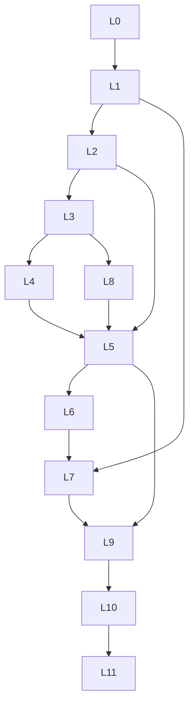

# MSS — APPLICATION DATA SEEDING (MASTER SPEC — COMPLETE)

**Status:** Documentation only. Old demo seed **deleted** (2026-05-20). App boots **empty** via `buildEmptyAppState()`. Next round: implement `src/data/seed/` per this document.

**Single source of truth:** This file only. Completion report: **Section 14** (fill after implementation).

---

## GOLDEN RULES (read first — non-negotiable)

1. **No “one exemplar” laziness.** If a feature applies to a **class** of projects (e.g. all `executionScope: full` EPC), you MUST seed that data on **every** project in that class that is `In Progress` or `Completed` — not on a single showcase row.
2. **Per project kind:** Seed **at least 2–3 projects per `projectKind`** (8 kinds × 2–3 = **16–24** projects minimum), each with the **full child bundle** defined in §16 (checklist, sites, transport tasks, ledger, timeline where applicable).
3. **Transport is not optional** on material-dispatch projects: every `materialsSent` issuance that moves panels/inverters/structure MUST produce a matching **Task** (`Panel Transport`, `Structure Transport`, `Inverter Transport`, or `Material Transport` per `src/lib/materialIssueTransportTask.ts`) plus optional **expense** `mainCategory` transport on the same project/site.
4. **Dual checklist model:** Every dispatch project needs **both** `project.siteChecklist[]` (BOQ) **and** `SiteRecord.checklistItems[]` (site dispatch / Need-to-Get).
5. **Time:** 4–5 months (**2026-01-01 → 2026-05-20**), weekday-heavy, **no** duplicate timestamps, **no** “Test User” / stock photos / lorem ipsum.
6. **Hydration:** Output MUST pass `normalizeAppState` + `applyAppStateHydrationPipeline` (quotation links, billing sanitize, agent accruals, enquiry history, CPR FIFO).
7. **Discover more from code** — this doc is a **floor**. If you find another collection, tab, filter, or validation in the repo, seed it.

---

## What was removed (do not restore)

| Deleted | Purpose |
|---------|---------|
| `src/data/seedData.ts` | Monolithic demo |
| `src/data/activeSitesSeed.ts`, `seedLayerOrder.ts`, `dummyData.ts`, `templatesData.ts`, `inventoryData.ts` | Shims / thin demo |
| `buildSequencedAppSeed()`, `loadDemoDataset()` | Runtime demo loader |
| 22 seed-dependent tests | Recreate under `src/tests/seed/` after implementation |

**Kept:** `src/data/appSeedBuilder.ts` (`buildEmptyAppState`, `normalizeAppState`, `normalizeQuotations`), `applyAppStateHydrationPipeline`, Settings reset.

---

## FILES YOU MUST CREATE

All seed under `src/data/seed/`. Public API: `buildBusinessSeed(profile?: "full" | "smoke")`.

### Orchestration

| File | Role |
|------|------|
| `index.ts` | Exports |
| `buildBusinessSeed.ts` | L0→L11 assemble + hydration |
| `seedLayerOrder.ts` | Layers, `smokeRoutes[]`, collection ownership |
| `seedTimeModel.ts` | Dates, jitter, weekday bias |
| `seedIdRegistry.ts` | `idFactory` batches |
| `seedHydration.ts` | All reconcile/migrate passes |
| `seedMastersSync.ts` | `masters_data` L1 |
| `seedVerification.ts` | FK matrix, FIFO, size budget |
| `seedProjectBundles.ts` | **Per-project child bundle builder** (§16 matrix) — central place enforcing checklist+tasks+transport |

### Layers

`L0_settingsTeam.ts`, `L1_catalog.ts`, `L2_network.ts`, `L3_customers.ts`, `L4_hr.ts`, `L8_crm.ts`, `L5_projectsSites.ts`, `L6_attendanceTasks.ts`, `L7_inventoryOps.ts`, `L9_finance.ts`, `L10_capital.ts`, `L11_auditBooks.ts`, `ops_scheduling.ts`, `ops_changeRequests.ts`, `ops_executionLineItems.ts`, `ops_transportTasks.ts` (**dedicated transport task generator**).

### Narratives (`narratives/` — each wires a full subgraph)

`stalledEnquiry.ts`, `quotationRevisionChain.ts`, `partialInvoice.ts`, `overpaidInvoice.ts`, `voidedDraftInvoice.ts`, `onHoldBlockage.ts`, `doubleBookInstall.ts`, `archivedCustomer.ts`, `highValueInvoice.ts`, `loanRepaymentLinks.ts`, `bankReconMixed.ts`, `needToGetDamage.ts`, `richTimeline.ts`, `directExceptionProject.ts`, `partnerSplitPayment.ts`, `customerBulkInflow.ts`, `reopenLostEnquiry.ts`, `rescheduledTask.ts`, `attendanceInconsistency.ts`, `lowStockProcurement.ts`, `vendorDelayBill.ts`, `changeRequestApproved.ts`, `changeRequestRejected.ts`, `workStatusApprovalPending.ts`, `materialDamageThreshold.ts`, `incGivenNoDispatch.ts`, `vendorshipOnlyFee.ts`.

### Runtime + tests

`AppDataContext.loadBusinessSeed()`, Settings button, `src/tests/seed/*.test.ts`, optional `src/tests/fixtures/minimalBusinessFixtures.ts` (unit tests only).

---

## Layer dependency

**Build order:** L0 → L1 → L2 → L3 → L4 → **L8** → L5 (+ ops_*) → L6 (+ ops_transportTasks) → L7 → L9 → L10 → L11 → hydration → verification.

---

## §1 Executive mandate

- **4–5 months** history ending ~**2026-05-20**.
- Full **business-flow simulation** across **47 AppState collections** + **masters_data**.
- Reverse-engineer from code; exceed examples in this doc.
- **No orphan FKs**; IDs via `src/lib/idFactory.ts`.
- Indian solar EPC realism (Hyderabad, Bangalore, Pune, tier-2/3); unique names; believable amounts.

---

## §2 Implementation anchor

- Only `buildBusinessSeed()` populates business rows.
- Fresh browser = **empty**; Settings = explicit **Load business seed** (`resetPrototype`).
- `SEED_PROFILE`: `full` (4–5 months) vs `smoke` (2 weeks dense for CI).
- Bump `APP_DATA_RESET_EPOCH` when seed schema version changes.

---

## §3 Time model

| Rule | Implementation |
|------|----------------|
| Window | 2026-01-01 → 2026-05-20 |
| Weekdays | More field ops Mon–Sat |
| Chains | enquiry.created → quotation.sent → approved → project.started → invoice.paid |
| Audit | `auditLogs.timestamp` = transition time |
| Ban | Same timestamp on unrelated rows; robotic ID sequences |

---

## §4 Complete AppState entity catalog (47 collections)

Every key on `AppState` (`src/contexts/AppDataContext.tsx`) — **full profile minimums**.

| # | Collection | Min rows | All states / variants | Parent FKs |
|---|------------|----------|----------------------|------------|
| 1 | `settingsTeamMembers` | 6–10 | active directory | — |
| 2 | `solarPackagePresets` | 3–5 | — | — |
| 3 | `holidays` | 8–12 | dates in window | — |
| 4 | `inventoryItems` | 25–40 | incl. low stock | — |
| 5 | `tools` | 15–25 | assigned + in-shop + movementHistory | employees, sites |
| 6 | `quotationTemplates` | 5–8 | segment variants | — |
| 7 | `siteChecklistTemplates` | 5–8 | incl. `subtype: solar_package` | — |
| 8 | `quotationVisibilityPresets` | 3–5 | — | — |
| 9 | `servicePresets` | 4–6 | SAC lines | — |
| 10 | `partners` | 6–10 | Profit/Fixed/Channel/Subcontractor | — |
| 11 | `agents` | 8–12 | commission rates | — |
| 12 | `vendors` | 10–15 | categories | — |
| 13 | `vendorshipCompanies` | 4–6 | DISCOM codes | — |
| 14 | `incGiverCompanies` | 3–5 | — | — |
| 15 | `customers` | 30–45 | active + **archived** | — |
| 16 | `employees` | 12–18 | active + left | — |
| 17 | `teams` | 4–6 | memberIds | employees |
| 18 | `enquiries` | 40–60 | **all 6** SM states | agents, customers |
| 19 | `quotations` | 35–50 | **all 6** + revisions | enquiries, customers |
| 20 | `projects` | **25–35** | **all 5 lifecycle** × **8 kinds** | quotations, customers, partners |
| 21 | `sites` | 20–28 | active, completed, on-hold | projects |
| 22 | `blockages` | 15–25 | active + resolved | projects |
| 23 | `operationalTickets` | 10–20 | all taskTypes + statuses | projects |
| 24 | `projectTimelineByProjectId` | **≥3 rich** + sparse on rest | 7 axes | projects |
| 25 | `attendanceRecords` | 400–800 | present, half-day, absent | employees |
| 26 | `tasks` | **80–120** | **all 5** statuses + overdue | projects, sites, employees/teams |
| 27 | `materialReservations` | 20–40 | manual + auto-from-checklist | projects, materials |
| 28 | `procurementNeedLines` | 30–50 | pending + acquired | vendors, projects, sites |
| 29 | `materialDamageRecords` | 8–12 | transport/installation/storage | projects, materials |
| 30 | `scheduledInstallations` | 20–30 | scheduled/in_progress/completed/cancelled | projects, teams |
| 31 | `siteVisits` | 25–35 | with items + blockers | projects, sites |
| 32 | `projectChangeRequests` | 10–15 | draft/approved/rejected | projects |
| 33 | `invoices` | 35–45 | all billing statuses | customers, projects |
| 34 | `saleBills` | 15–25 | same status set | customers, projects |
| 35 | `payments` | 40–60 | in/out directions | invoices, CPRs, loans |
| 36 | `clientPaymentRecords` | 40–60 | FIFO + split lines | projects, payments |
| 37 | `expenses` | 60–90 | site/company/employee payers, reimbursement | projects, employees |
| 38 | `incomes` | 15–25 | linked payments | — |
| 39 | `vendorBills` | 25–35 | draft/approved/disputed/pending/partial/paid | vendors, projects |
| 40 | `vendorPayments` | 20–30 | reconciled + unreconciled | vendorBills |
| 41 | `loans` | 8–12 | EMI, one-time, reminder-only | — |
| 42 | `loanRepayments` | 30–50 | payment/expense/vendor_payment/none links | loans |
| 43 | `partnerTransactions` | 20–30 | all transaction types | partners, projects |
| 44 | `ownerInvestments` | 5–10 | — | — |
| 45 | `employeePaidHolidays` | 1/employee/month in window | — | employees |
| 46 | `employeePayrollRecords` | 12–18 | monthly runs | employees |
| 47 | `employeeWalletLedger` | 25–40 | advance + recovery | employees |
| 48 | `agentCommissionAccruals` | 25–40 | pending/payable/paid | agents, quotations, projects |
| 49 | `agentCommissionPayments` | 15–25 | — | accruals |
| 50 | `auditLogs` | 200–400 | append-only | all entities |
| 51 | `accountingVouchers` | 40–60 | posted + draft | audit postings |
| 52 | `accountingReviewQueue` | 10–20 | pending + resolved | vouchers |
| 53 | `bankReconciliationStatements` | 6–10 | matched + unmatched | payments |

**Nested on `Project` (not separate keys):** `siteChecklist`, `materialsSent`, `siteMaterialLedger`, `executionLineItems`, `commercialBaseline`, `partners`, `teamAssignments`, `generatedDocuments`, `photoGallery`, `additionalWorkLines`, `partyPayments`, partner/channel/vendorship economics fields.

**Masters (`localStorage` `masters_data`):** HSN, SAC, expense categories, units, bank accounts, chart of accounts, default site checklist presets — sync in L1.

**Not persisted:** `DeletionRequest` (UI toast only). **Derived:** `lowStockItems`, `/notifications` alerts (`src/lib/businessAlerts.ts`).

---

## §5 Mandatory business flow chains

| Chain | Steps | Min count |
|-------|-------|-----------|
| Lead → cash | enquiry → quotation → approve → customer → project → start → invoice → CPR/payment → complete/close | 25+ full; 10+ stalled mid-chain |
| Direct exception | `directCreationReason`, no enquiry | 3+ projects |
| Partner / INC / vendorship | economics + billing directions per kind | 2–3 per kind |
| Procurement | need line → vendor bill → payment → stock movement → optional damage | 5+ full chains |
| Field | schedule → site visit → checklist dispatch → materials sent → transport task | **every** dispatch project (§17) |
| HR | attendance → reimbursable expense → wallet → payroll | 12+ employees × months |
| Loans | EMI + one-time + reminder; overdue for dashboard | 8+ loans |
| Agents | approve accrual → link project → payable → paid | per agent with quotes |
| Audit | vouchers aligned with P&L, GST, debtors/creditors, cash-bank | cross-check all audit routes |

---

## §6 Lifecycle & edge-case matrix (every exemplar required)

### Formal state machines

| SM | States (seed each ≥1) | Edge scenarios |
|----|----------------------|----------------|
| Enquiry | new, meeting_scheduled, quotation_sent, quotation_rejected, converted, lost | stalled in quotation_sent; lost→reopen (admin); re-quote via `quotationIds[]` |
| Quotation | draft, sent, approved, rejected, withdrawn, converted_to_project | withdrawn/rejected propagation; revision chain; commercial lock when approved |
| Project | New, In Progress, On Hold, Completed, Closed | On Hold + blockage; complete blocked vs passing; closed reopen (super_admin) |

### Informal lifecycles

| Domain | States to seed |
|--------|----------------|
| Invoice / sale bill | draft, pending, partial, paid, overdue, overpaid, voided |
| Vendor bill | draft, approved, disputed, pending, partial, paid |
| Task | created, sent, checked, started, done (+ overdue workDate) |
| Blockage | active, resolved (1–14d and >14d for stale alert) |
| Ticket | pending, in-progress, completed, cancelled; types work/call/meeting/visit/custom |
| Change request | draft, approved, rejected; types capacity/panels/addon-work |
| CPR | FIFO project; invoice_targeted; split settlement |
| Loan | Active overdue EMI; due ≤7d |
| Bank recon | matched, possible-match, unmatched |
| Customer | archived with completed projects only |
| Work status approval | `requested` on stage/sub-item (feeds notifications) |

### Validation edge catalog (code paths)

| ID | Rule | Source |
|----|------|--------|
| E1–E10 | Enquiry transitions, reopen, terminal reasons | `enquiryStateMachine.ts`, `registerEnquiryCommands.ts` |
| Q1–Q13 | Quotation send/approve/client/amount/payment type | `quotationStateMachine.ts`, `registerQuotationCommands.ts` |
| P1–P13 | Project lifecycle, start guard, completion invariants | `projectStateMachine.ts`, `ProjectInvariantService` |
| C1–C8 | Customer inflow paths, FIFO, bulk plan | `customerInflowWritePaths.ts` |
| A1–A7 | Agent commission accrual lifecycle | `agentCommissionAccrualPolicy.ts` |
| B1–B5 | Bank reconciliation back-links | `bankReconciliationLink.ts` |
| G1–G4 | Billing direction + high-value invoice justification | `BillingDirectionGuardService.ts` |
| N1–N18 | Need-to-Get, shortfall, reservations, damage | `NeedToGetService.ts`, `ProcurementShortfallService.ts` |
| S1–S7 | Schedule install conflict + override | `scheduledInstallationValidation.ts` |
| D1–D6 | Damage notes if qty>5 or cost>₹5000 | `materialDamageValidation.ts` |
| L1–L7 | Loan repayment cash link types | `loanRepaymentCashLink.ts` |
| CA1–CA8 | Customer auto-archive rules | `customerArchive.ts` |
| R1–R7 | Quotation revision history | `enquiryQuotationHistory.ts` |
| T1–T5 | Timeline mode strips for INC / non-MSS vendorship | `ProgressReportTab.tsx` |

---

## §7 Role activity map

| Role | userId seed | Must appear in auditLogs for |
|------|-------------|------------------------------|
| super_admin | SA-001 | reopen, delete payment/expense, closed reopen, past-date install override |
| admin | ADM-001 | quotation approve, project create, high-value invoice |
| ceo | CEO-001 | finance/audit views (read-heavy) |
| management | MGT-001 | commercial updates, analytics |
| salesperson | SAL-001 | enquiry/quotation create, convert |
| installation_team | INST-001 | attendance, tasks, materials, site visits — **no** finance mutate |

---

## §8 Route & UI coverage (51 registered routes)

**Static (41):** `/`, `/active-sites`, `/projects`, `/quotations`, `/enquiries`, `/agents`, `/customers`, `/invoices`, `/inventory`, `/inventory/materials`, `/inventory/tools`, `/templates`, `/employees`, `/teams`, `/attendance`, `/finance`, `/vendors`, `/loans`, `/partners`, `/vendorship-companies`, `/inc-work-sources`, `/timeline`, `/calendar`, `/analytics`, `/notifications`, `/settings`, `/settings/design-system`, `/audit`, `/audit/chart-of-accounts`, `/audit/profit-loss`, `/audit/inventory`, `/audit/debtors-creditors`, `/audit/gst`, `/audit/cash-bank`, `/audit/expenses`, `/audit/assets`, `/audit/logs`, `/audit/reports`, `/audit/data-flow`.

**Param (10):** `/projects/:id`, `/agents/:id`, `/customers/:id`, `/teams/:id`, `/employees/:id`, `/vendors/:id`, `/loans/person/:id`, `/partners/:id`, `/vendorship/:id`, `/inc-sources/:id`.

### Dashboard — 11 KPI tiles (admin) must be non-zero

| KPI | Deep link | Seed driver |
|-----|-----------|-------------|
| Open enquiries | `/enquiries?status=open` | enquiries not converted/lost |
| Follow-ups overdue | `?followUp=overdue` | past follow-up dates |
| Quotations in flight | `/quotations?pipeline=inflight` | draft + sent |
| Active projects | `/projects?status=Ongoing` | In Progress projects |
| Sites live | `/active-sites` | sites on ongoing projects |
| Overdue tasks | `/timeline?sections=people,office&tasks=overdue` | tasks past workDate, not done |
| Receivables | `/invoices?receivable=open` | open invoice balances |
| Procurement gaps | `/inventory/materials` | shortfall rows |
| Low stock | `?stock=low` | inventory below minStock |
| EMI due 7d | `/loans?status=Active&emi=due7d` | active loans |
| Blockages | `/projects?status=On%20Hold` | active blockages |

### ProjectDetail tabs (seed so each visible tab has data)

| Tab | Required data |
|-----|---------------|
| progress-report | `projectTimelineByProjectId`, blockages, tickets |
| document-creator | `generatedDocuments` (MSS vendorship) |
| materials-sent | siteChecklist, materialsSent, ledger, reservations, damage |
| financials | invoices, CPRs, payments, expenses |
| field-operations | scheduledInstallations, siteVisits, changeRequests |
| partner_economics / channel | partners, partnerTransactions |
| team-roster | teamAssignments, employees |

**≥1 project per `projectKind` with all visible tabs populated.**

### Other high-traffic routes

| Route | Pagination target | Key query params |
|-------|-------------------|------------------|
| `/enquiries` | 30+ | `status`, `followUp`, `priority`, `assignee`, `q` |
| `/invoices` | 30+ | `receivable`, `status`, `type`, `project`, `customer` |
| `/attendance` | 400+ | — |
| `/audit/logs` | 200+ | entity filters |
| `/inventory/materials` | 30+ | `stock=low`, `view=damage`; NeedToGet `flat\|project\|material` |
| `/analytics` | trends in year range | in-page month/quarter/year |
| `/calendar` | 8 event sources | tasks, installs, visits, EMI, bills, enquiries |
| `/notifications` | multiple alert types | derived — see §20 |

---

## §9 Volume guidelines (full profile)

| Area | Target |
|------|--------|
| Projects | **25–35** (16–24 across kinds + edge-only rows) |
| Sites | 20–28 (multi-site on ≥5 projects) |
| Tasks | **80–120** (includes **all transport tasks** from §17) |
| Attendance | 400–800 |
| Audit logs | 200–400 |
| Payments + CPRs | 80–120 combined |

---

## §10 Financial consistency

- `contractAmount` / `clientAgreedAmount` / invoices / CPR FIFO aligned.
- `reconcileProjectsAmountInvoiced` passes post-hydration.
- Partner economics on PARTNER_* projects.
- GST on invoices + vendor bills for `/audit/gst`.
- No negative stock without adjustment narrative.

---

## §11 Verification protocol

- `npm run typecheck` + `npm run test:run`
- `seedVerification.ts`: FK matrix, duplicate CPR keys, JSON size
- `seedProvenance.test.ts`, `buildBusinessSeed.test.ts`, `seedNarratives.test.ts`
- Manual smoke: every route in `seedLayerOrder.smokeRoutes`
- **Per-kind checklist:** §16 matrix 100% for `In Progress` + `Completed` projects

---

## §12 Non-goals

- Empty boot unchanged.
- No real PII / secrets.
- localStorage ~5–8 MB warn threshold.

---

## §13 Implementer tone

**You MUST** treat this as operations simulation, not demo rows. When in doubt, add **more** linked history, not less.

---

## §14 Implementation completion report (fill later)

| Field | Value |
|-------|-------|
| Date | _TBD_ |
| Profile | full / smoke |
| JSON size | _MB_ |
| Projects per kind | _8×count table_ |
| Transport tasks count | _N_ |
| Edge cases | _checklist §6_ |
| Routes smoked | _51_ |
| Tests | _pass/fail_ |

---

## §15 Field-level Project bundle (every dispatch-capable project)

For **each** project where `executionScope` is `full` or `service_only` AND `projectMode !== INC_GIVEN_TO_US` with material dispatch allowed:

| Field / child | Requirement |
|---------------|-------------|
| `commercialBaseline` | Frozen lines from quotation; totals match contract |
| `executionLineItems` | Same lines + `issuedQty` progression over time |
| `siteChecklist` | **≥4 line items** (panel, inverter, structure/civil, cable) with `qtyPlanned`, partial `qtySent` |
| `sites[]` | **≥1 SiteRecord** per project; **≥2 sites** on 5 multi-site projects |
| `SiteRecord.checklistItems` | Mirror materials with `requiresMaterial: true`, statuses pending/partially-dispatched/dispatched |
| `materialsSent` | **≥2 issuance events** per active project (different dates); triggers transport inference |
| `siteMaterialLedger` | Row per issued `itemId` with issued/returned/consumed |
| `materialMovementDedupeIds` | Set when movements recorded |
| `tasks` | See §17 transport matrix + **≥2** WORK_STATUS_STAGES tasks (structure/panel/wiring/…) in varied statuses |
| `expenses` | **≥1** site expense with transport category per project with physical dispatch |
| `teamAssignments` | **≥1** team on In Progress projects |
| `scheduledInstallations` | **≥1** per In Progress project |
| `siteVisits` | **≥1** pre-start visit with `items[]` |
| `blockages` | On Hold projects: **≥1 active** blockage linked to timeline stage |
| `operationalTickets` | **≥1** ticket (call/visit/work) on 50% of ongoing projects |
| `materialReservations` | Auto-from-checklist on 30% of lines |
| `procurementNeedLines` | Where shortfall exists |
| `materialDamageRecords` | **≥1** on 20% of dispatch projects (mix stages) |
| `projectChangeRequests` | **≥1** approved + **≥1** rejected across portfolio |
| `invoices` + CPRs | Match payment type (cash/loan/cash-and-loan) |
| `agentCommissionAccruals` | If `agentId` on quotation |
| `auditLogs` | Create/start/issue/pay transitions dated consistently |

---

## §16 Per `projectKind` mandatory matrix (8 kinds × 2–3 projects each)

| projectKind | Min projects | executionScope | siteChecklist + site checklistItems | materialsSent + ledger | Transport tasks (§17) | projectTimeline | Invoices to customer | Partner economics | Notes |
|-------------|-------------|----------------|--------------------------------------|------------------------|----------------------|-------------------|---------------------|-------------------|-------|
| **SOLO_EPC** | 3 | full | **YES** all 3 | **YES** ≥2 issues each | **YES** panel+structure min | **Rich** on 1, partial on 2 | YES | — | quotationId required |
| **PARTNER_EPC** | 3 | full | **YES** | **YES** | **YES** | Rich on 1 | YES | partners[] + transactions | partner_to_customer billing optional |
| **FIXED_EPC** | 2 | full | **YES** | **YES** | **YES** | partial | YES | mssBackendAmount / partnerCustomerSellAmount | fixed_margin |
| **VENDOR_NETWORK** | 2 | full | **YES** | **YES** | **YES** | partial | external billing refs | channel fees | completion may not require customer invoice |
| **INC** | 2 | service_only | checklist **lighter** (no full BOM) | optional minimal | tasks for service visits | timeline **lighter** | YES | — | no full EPC doc set |
| **OUTSOURCED_INC** | 2 | full + outsource | **NO** material dispatch | **NO** | **NO** transport | partial | YES | subcontractor | `outsource` block required |
| **INC_GIVEN** | 2 | full | **NO** dispatch | **NO** | field tasks only | **stripped** timeline (no fileLogin/DISCOM/DCR) | collections focus | — | incGiverCompany FK |
| **VENDORSHIP_ONLY** | 2 | none | **NO** | **NO** | **NO** | **NO** work timeline | vendorship fees only | vendorship fee receivable | forbid materials_sent tab |

**INC_GIVEN_TO_US / PARTNER_NETWORK / DIRECT_CLIENT (`projectMode`):** ensure **≥2 projects per mode** with correct `resolveProjectCapabilities` tabs.

---

## §17 Transport & work-status tasks (MANDATORY coverage)

### Auto-transport from material issue (`src/lib/materialIssueTransportTask.ts`)

When seeding `materialsSent`, **always** add a Task:

| Material issued contains | workType | stageKey / milestoneId |
|--------------------------|----------|-------------------------|
| panel / module | Panel Transport | panel-transport |
| inverter | Inverter Transport | inverter-transport |
| structure / leg / raftor | Structure Transport | structure-transport |
| other | Material Transport | structure-transport |

**Rule:** For **each** of the 16–24 dispatch projects, seed **≥2 materialsSent rows** → **≥2 transport tasks** minimum. Across portfolio, cover **all four** workType variants above.

### Manual WORK_STATUS_STAGES tasks (`src/types/blockage.ts`)

7 stages: structure, panel, wiring, earthing, inverter, civil, meter — each with sub-items including **structure-transport**, **panel-transport**, **civil-material-transport**.

| Coverage target | Count |
|-----------------|-------|
| Projects with ≥3 stages represented in `workStatusChecks` | ≥10 projects |
| Projects with inverter stage (video-required) | ≥3 |
| Tasks with `workItems[]` mirroring sub-items | ≥20 tasks |
| Overdue tasks (`workDate` < today, status ≠ done) | ≥15 |
| Tasks in each status created/sent/checked/started/done | ≥5 each |

### Expense transport category

**≥1** `expenses` row per dispatch project with site payer + transport/mainCategory — dates aligned with materialsSent.

---

## §18 `projectTimelineByProjectId` — seven axes (≥3 rich projects)

| Axis | Fields to populate | Variants to cover |
|------|-------------------|-------------------|
| File Login | fileLogin, fileLoginComplete | pending → complete |
| Subsidy | subsidyType | center-78k, state-17k, both, not-applicable |
| Bank/Cash | bankFileType, loanStage, loanStatus | cash, loan, cash-and-loan |
| Work Status | workStatusChecks, workStatusApprovals, workStatusComplete | partial + complete; **requested** approvals for notifications |
| DISCOM | discomChecks, discomSubsidyStatus | pending, approved, rejected |
| Payment | paymentType, instalments | cash-to-mahi vs instalments |
| DCR | dcrStatus, dcrComplete | mid + complete |

**Blockages:** link to `BLOCKAGE_TIMELINE_STAGES` (file-login, subsidy, bank-file, work-status, discom, payment, dcr, something-else).

---

## §19 Derived `/notifications` requirements

Populate `src/lib/businessAlerts.ts` inputs:

| Alert | Seed driver |
|-------|-------------|
| invoice overdue | pending/partial + past due |
| loan EMI | Active + overdue or ≤7d |
| low stock | inventoryItems below minStock |
| blockage stale | active >14d |
| quotation stale | sent >7d |
| vendor bill due | unpaid + due date |
| work status approval | workStatusApprovals.status === requested |

---

## §20 Audit log — `AppAction` coverage

Each action in `src/domain/policies/permissionMatrix.ts` → **≥1** `auditLogs` row when seed simulates that operation:

`enquiry:create`, `customer:create`, `quotation:create`, `quotation:confirm`, `project:create_from_quote`, `project:create_direct_exception`, `project:update_commercial`, `project:update_execution`, `inventory:material_movement`, `finance:create_invoice`, `finance:record_payment`, `finance:update_payment`, `finance:delete_payment`, `finance:record_expense_income`, `finance:update_expense`, `finance:delete_expense`, `finance:update_income`, `finance:delete_income`, `partner:update`, `partner:delete`, `partner:add_transaction`, `loan:update`, `loan:delete`, `loan:add_repayment`, `vendor:record_bill`, `vendor:record_payment`, `vendor:update_payment`, `vendor:delete_payment`, `hr:release_payroll`, `hr:record_wallet`, `hr:mark_holiday`, `hr:update_employee`, `approval:resolve`.

Also log: installation scheduled, site visit, damage, blockage resolve, change request, bank recon match (via context handlers).

---

## Appendix A — `WORK_STATUS_STAGES` sub-items (seed checks across portfolio)

structure: procurement, cutting, **transport**, installation  
panel: procurement, **transport**, setup  
wiring: ac, dc  
earthing: rod, hole-chemical, la, wiring  
inverter: ac, dc, cable-tray (**video required**)  
civil: **material-transport**, pharma-supports  
meter: installation  

---

## Appendix B — Quotation & enquiry fields

| Entity | Critical fields |
|--------|-----------------|
| Enquiry | status, quotationId, quotationIds[], followUpDate, agentId, customerId, priority |
| Quotation | status, presetSnapshot/customItems, paymentType, agentId, customerId, approvedAt, revision chain |

---

## Appendix C — Invoice & CPR

| Status | Seed count (min) |
|--------|------------------|
| draft | 5+ |
| pending | 10+ |
| partial | 8+ |
| paid | 15+ |
| overdue | 8+ |
| overpaid | 3+ |
| voided | 2+ |

CPR: unique `id`; payment synthetic `cpr:{id}`; split lines on partner projects.

---

## Appendix D — Sequential build checklist

- [ ] L0 → L1 (+ masters) → L2 → L3 → L4 → L8 → L5
- [ ] `seedProjectBundles.ts` for **every** dispatch project (§15–§17)
- [ ] L6 attendance + tasks (transport + work-status)
- [ ] L7 inventory, reservations, procurement, damage
- [ ] ops_scheduling, ops_changeRequests, ops_transportTasks
- [ ] L9 finance + CPRs
- [ ] L10 capital + commissions
- [ ] L11 audit + bank recon
- [ ] Hydration + verification
- [ ] All 28 narratives
- [ ] Settings load + tests
- [ ] §14 report complete

---

## Appendix E — Every page file → data dependencies (54 page modules)

You MUST seed enough rows so **each** page renders dense UI (not empty states), except `NotFound`, `DesignSystem`, `AuditDataFlow` (static).

| Page file | Primary collections | Sheets / modals that need rows |
|-----------|---------------------|--------------------------------|
| `Dashboard.tsx` | All KPI sources (§8) | KPI drill sheets, NeedToGet sheet |
| `Enquiries.tsx` | enquiries, quotations, customers, agents | Create enquiry, convert, follow-up |
| `Quotations.tsx` | quotations, enquiries, templates | Send, approve, reject, withdraw, convert, revision |
| `Projects.tsx` | projects, customers, quotations | Create from quote, direct exception, filters |
| `ProjectDetail.tsx` | **full project bundle §15** | ProgressReport, MaterialsSent, ScheduleInstallation, SiteVisit, ChangeRequest, MaterialDamage, ClientPaymentHistory, TeamRoster, DocumentsStudio, AdditionalWork, expense/income sheets |
| `Customers.tsx` | customers, projects, invoices | Archive filter, bulk inflow entry |
| `CustomerDetail.tsx` | customer, invoices, payments, projects | Payment history, plan bulk inflow |
| `Invoices.tsx` | invoices, saleBills, payments, CPRs | Create, record payment, partner split, void |
| `Finance.tsx` | expenses, incomes, payments, invoices, review queue | Unified expense/income sheets |
| `Agents.tsx` | agents, enquiries | Commission summary |
| `AgentDetail.tsx` | agent, accruals, payments, CRM links | Pay commission |
| `Partners.tsx` | partners, projects | — |
| `PartnerDetail.tsx` | partner, partnerTransactions | Record payment `?action=` |
| `Vendors.tsx` | vendors, vendorBills | — |
| `VendorDetail.tsx` | vendor, bills, payments, procurementNeedLines | Record bill `?action=record-bill` |
| `Materials.tsx` | inventoryItems, reservations, damage, tasks, projects, sites | Issue material → transport task, damage view |
| `Tools.tsx` | tools, employees, sites | Tool movements |
| `TemplatesPage.tsx` | quotationTemplates, siteChecklistTemplates | — |
| `Employees.tsx` | employees, attendance, teams | Payroll/wallet entry points |
| `EmployeeProfile.tsx` | employee, attendance, tasks, wallet, payroll, expenses | All tabs |
| `Teams.tsx` | teams, employees | — |
| `TeamDetail.tsx` | team, scheduledInstallations | — |
| `Attendance.tsx` | attendanceRecords, holidays, paidHolidays | Month grid 400+ cells |
| `Loans.tsx` | loans, repayments | EMI filters |
| `LoanPersonDetail.tsx` | loan, repayments, projects | Cash link types |
| `ActiveSites.tsx` | blockages, tickets, timelines, sites, projects | Filters: fileLogin, subsidy, workStatus |
| `Timeline.tsx` | tasks, expenses, invoices, payments | `?tasks=overdue`, sections |
| `Calendar.tsx` | 8 event sources | Toggle each source on |
| `Analytics.tsx` | cross-module metrics | Year/quarter/month ranges |
| `Notifications.tsx` | derived alerts §19 | — |
| `Settings.tsx` | settingsTeamMembers, masters, presets | Load business seed (future) |
| `VendorshipCompanies.tsx` | vendorshipCompanies, projects | — |
| `VendorshipCompanyDetail.tsx` | company, projects, expenses | — |
| `INCWorkSources.tsx` | incGiverCompanies, projects | — |
| `INCWorkSourceDetail.tsx` | inc giver, projects | — |
| `audit/AuditDashboard.tsx` | finance + inventory summary | Period |
| `audit/ChartOfAccounts.tsx` | all ledger sources | — |
| `audit/ProfitLoss.tsx` | P&L inputs | Revenue basis |
| `audit/InventoryAudit.tsx` | inventoryItems, vendorBills, damage | — |
| `audit/DebtorsCreditors.tsx` | AR/AP open items | — |
| `audit/GSTCompliance.tsx` | GST splits on bills | — |
| `audit/CashBankLedger.tsx` | payments, expenses, incomes, vendorPayments, loanRepayments | Account filter |
| `audit/ExpenseAudit.tsx` | expenses by category | — |
| `audit/FixedAssets.tsx` | tools | — |
| `audit/AuditLogs.tsx` | auditLogs | Entity/action filters |
| `audit/AuditReports.tsx` | export-grade density | — |

### ProjectDetail component-level requirements

| Component | Minimum seeded inputs |
|-----------|----------------------|
| `ProgressReportTab.tsx` | Full `ProjectTimelineStatus` + blockages + tickets + workStatusApprovals |
| `MaterialsSentTab.tsx` | siteChecklist, materialsSent, ledger, templates, inventoryItems |
| `ScheduleInstallationSheet.tsx` | scheduledInstallations + teams/employees; one double-book override |
| `SiteVisitSheet.tsx` | siteVisits with checklist reconciliation |
| `ChangeRequestSheet.tsx` | projectChangeRequests (capacity + addon) |
| `MaterialDamageSheet.tsx` | damage above/below notes threshold |
| `ClientPaymentHistory.tsx` | CPRs + payments FIFO |
| `TeamRosterTab.tsx` | teamAssignments |
| `FoodOthersExpenseTable.tsx` | site expenses on project |
| `AdditionalWorkSheet.tsx` | additionalWorkLines (INC_GIVEN) |
| `ProjectStartActions.tsx` | siteReadiness + startedAt |
| `CreateProjectSheet.tsx` | exemplar paths: from quote, direct exception, partner, INC |

---

## Appendix F — `Project` field seeding matrix (every field)

For **dispatch EPC projects** (SOLO, PARTNER, FIXED, VENDOR_NETWORK in Progress/Completed), populate **all applicable** columns:

| Field | Seed? | Notes |
|-------|-------|-------|
| id, name | YES | idFactory |
| projectKind, projectMode, vendorshipOwner, partnerRole, executionScope | YES | consistent triple |
| projectKindConfigSnapshot | YES | from `resolveProjectCapabilities` at create |
| siteChecklist | YES | §15 |
| outsource | IF OUTSOURCED_INC | rateBasis, total, attachedAt |
| type, projectType, projectCategory | YES | mix Residential/Commercial/Industrial |
| scope | OPTIONAL | legacy modular |
| lifecycleStatus, status, progressStage, executionPhase, executionNotes | YES | aligned dates |
| client, clientAddress, state, clientPhone, clientEmail, clientGstin | YES | realistic |
| customerId | YES | FK |
| commercialBaseline, executionLineItems | YES | BOQ |
| directCreationReason | IF direct exception | ≥10 chars |
| capacity, location | YES | kW strings |
| assignees, teamAssignments, onSite | YES | |
| contractAmount, totalCost, amountInvoiced, amountReceived | YES | consistent math |
| paymentType, bankDocumentationAmount, fundingLoanId | IF loan paths | |
| partners, totalPartnerInvestment | IF partner kinds | |
| partyName, partyPayments, amountToParty | IF outsourced party | |
| quotationId, quotationType, presetId | IF from quote | |
| invoiceId, invoiceIds | YES | 1–many |
| materialMovementDedupeIds | IF movements | |
| agentId, commissionRate, commissionAmount, commissionPaid | IF agent | |
| partnershipModel, mssBackendAmount, partnerCustomerSellAmount | IF FIXED_EPC | |
| vendorNetwork* + channelPartnerIdRef + loanReceiptHandling + cashHandling | IF VENDOR_NETWORK | |
| vendorshipCodeOwner, externalVendorshipEntity, vendorshipFee* | ALL types where applicable | |
| incScope | IF INC | labour vs labour_and_materials |
| materialsSent, siteMaterialLedger | YES dispatch | §17 |
| photos, photoGallery, documents, generatedDocuments | YES on 40% projects | |
| startDate, endDate, createdAt, startedAt, siteReadiness | YES | chronological |
| additionalWorkLines | IF INC_GIVEN | |
| archivedAt | 0–1 archived projects | |

---

## Appendix G — Expense / income / payment variants

### Expense (`src/types/finance.ts`)

| Variant | Min rows | Fields |
|---------|----------|--------|
| mainCategory `site` + projectId | 30+ | transport, materials, food, labour |
| mainCategory `company` / `office` | 15+ | |
| mainCategory `employee` + reimbursement | 10+ | paidBy employee, reimbursement flag |
| mainCategory `partner` | 5+ | partner settlements |
| Interest/principal split | 5+ | loan-linked expenses |

### Payment

| direction | counterpartyType | Min |
|-----------|------------------|-----|
| in | customer | 25+ |
| out | vendor / employee / partner | 15+ |
| paymentSource split | partner network | 5+ |

### Inventory movement (on `InventoryItem.movementHistory`)

| type | Min events |
|------|------------|
| purchase / issue-to-project / return / adjustment | 50+ total across catalog |
| issue linked to projectId + siteId | per materialsSent |

---

## Appendix H — Masters (`masters_data`) — L1 required keys

Sync via `seedMastersSync.ts` — **not** optional:

- HSN codes (used on quotation materials)
- SAC codes (service presets)
- Expense categories (including **transport**)
- Units (kW, sqft, nos, m)
- Bank accounts (cash-bank ledger filters)
- Chart of accounts groups (audit COA page)
- Default site checklist preset items (templates merge)

---

## Appendix I — Narrative file → edge ID cross-reference

| Narrative | Edge IDs |
|-----------|----------|
| `stalledEnquiry.ts` | E3, §5.1 |
| `quotationRevisionChain.ts` | R1–R3 |
| `partialInvoice.ts` / `overpaidInvoice.ts` / `voidedDraftInvoice.ts` | C8, Appendix C |
| `onHoldBlockage.ts` | P2, P9 |
| `doubleBookInstall.ts` | S3–S4 |
| `archivedCustomer.ts` | CA1–CA8 |
| `highValueInvoice.ts` | G3 |
| `loanRepaymentLinks.ts` | L1–L3 |
| `bankReconMixed.ts` | B1–B5 |
| `needToGetDamage.ts` | N12, D1–D3 |
| `richTimeline.ts` | T1–T5, §18 |
| `directExceptionProject.ts` | P11, §5.2 |
| `partnerSplitPayment.ts` | C7, §5.3 |
| `customerBulkInflow.ts` | C3 |
| `reopenLostEnquiry.ts` | E6 |
| `rescheduledTask.ts` | delayHistory on Task |
| `attendanceInconsistency.ts` | half-day + absent same week |
| `lowStockProcurement.ts` | N1–N6 |
| `vendorDelayBill.ts` | overdue vendor bill |
| `changeRequestApproved.ts` / `changeRequestRejected.ts` | change request SM |
| `workStatusApprovalPending.ts` | §19 approval alert |
| `materialDamageThreshold.ts` | D1–D2 |
| `incGivenNoDispatch.ts` | §16 INC_GIVEN |
| `vendorshipOnlyFee.ts` | §16 VENDORSHIP_ONLY |

---

## Appendix J — Coverage proof checklist (implementer signs off)

- [ ] **8 projectKinds × ≥2 projects** each with §16 bundle
- [ ] **Every** dispatch project: siteChecklist + site checklistItems + ≥2 materialsSent + ≥2 transport tasks + ledger
- [ ] **All four** transport workTypes present portfolio-wide
- [ ] **All 5** task statuses + **15** overdue tasks
- [ ] **All 6** enquiry + quotation SM states
- [ ] **All 5** project lifecycle states
- [ ] **All 7** invoice statuses + sale bills
- [ ] **All** vendor bill statuses used in UI
- [ ] **51 routes** manually opened — no crash, no empty critical tabs
- [ ] **11/11** dashboard KPIs non-zero (admin)
- [ ] **Notifications** page shows ≥6 alert types
- [ ] **3+** rich timelines; **10+** partial timelines
- [ ] **masters_data** populated
- [ ] **§14** report filled

---

*End of master spec — version 3 (full codebase traversal: entities, pages, edges, per-kind bundles, transport mandate).*
