# Application Overview — Mahi Solar Solutions

---

## Part 1: Business Context and Architecture Reference

## 1. What The Business Does

The company manages solar-related business from initial customer interest through quotation, project execution, inventory use, team work, milestone payment collection and financial settlement.

Work can arrive through:

- A direct customer enquiry
- An existing customer directly requesting a quotation
- A project created directly without an enquiry or quotation
- An agent referring work
- A partner providing work
- A person or partner using the company's vendorship code

The application must manage:

- Customers and their locations
- Enquiries, scheduled calls, site visits and follow-ups
- Quotations, negotiation, approval, revisions and conversion
- Projects and multiple physical sites
- Documentation responsibility and progress
- Installation execution stages
- Materials, tools, warehouses, vendors and purchasing
- Employees, attendance, leave, salary and site team assignment
- Agents and commission
- Partners, agreements and settlement
- Milestone payments, approved project costs and profitability

---

## 2. Overall Business Flow

The usual full-customer journey is:

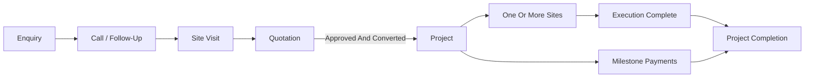

Enquiry and quotation are optional:

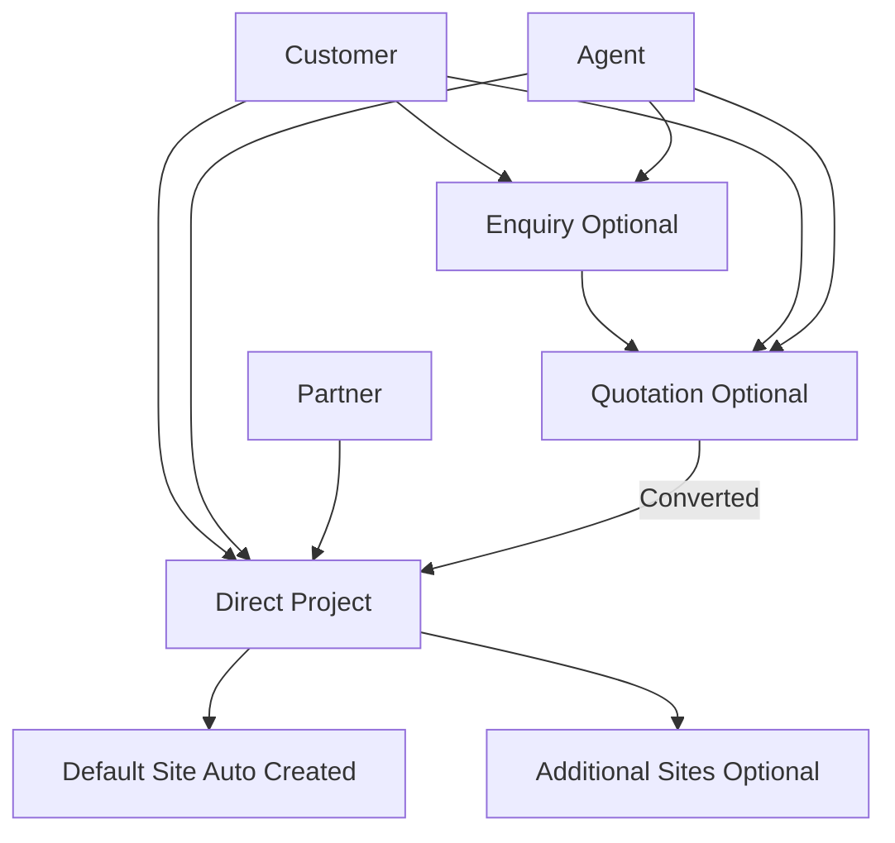

---

## 3. Confirmed Business Rules

1. An enquiry is optional. A quotation or project can be created without an enquiry.
2. A quotation is an independent commercial record.
3. One quotation can convert into at most one project.
4. A quotation covers the complete expected project, not a separate individual site.
5. A quotation can be revised until a project is created from it.
6. When a project is created from a quotation, the selected quotation version becomes the final commercial reference for that project.
7. If a quotation came from an enquiry and it converts into a project, the enquiry also becomes converted.
8. A project can be created directly without any quotation.
9. A project automatically creates one default site using the location/address entered during project creation.
10. Additional sites may be added to the same project later.
11. Sites are measured in `kW`; project capacity is the total capacity of its sites.
12. Documentation is tracked where the company is responsible for it, including work using the company's vendorship code.
13. Materials supplied by a customer or partner during installation-only work are still tracked at the site.
14. Project material cost is manually approved for profitability; it is not automatically determined by warehouse purchase cost.
15. Tools are tracked by quantity rather than separate serial or tag numbers.
16. Payments happen through project milestones.
17. Salary is calculated from attendance, leave rules and applicable deductions.
18. Agents and partners are separate business entities with different financial handling.
19. Agent commission is variable and can be configured according to the business deal.
20. Vendors and procurement are needed for material and tool inventory.

---

## 4. Enquiry

An enquiry is a potential business lead. It is used when a customer first contacts the company before a confirmed commercial proposal or project exists.

An enquiry records:

- Customer
- Initial requirement
- Proposed location, if known
- Required solar capacity, if known
- Calls and follow-ups
- Scheduled/completed site visits
- Notes
- Status
- Quotations generated from it

Suggested enquiry journey:

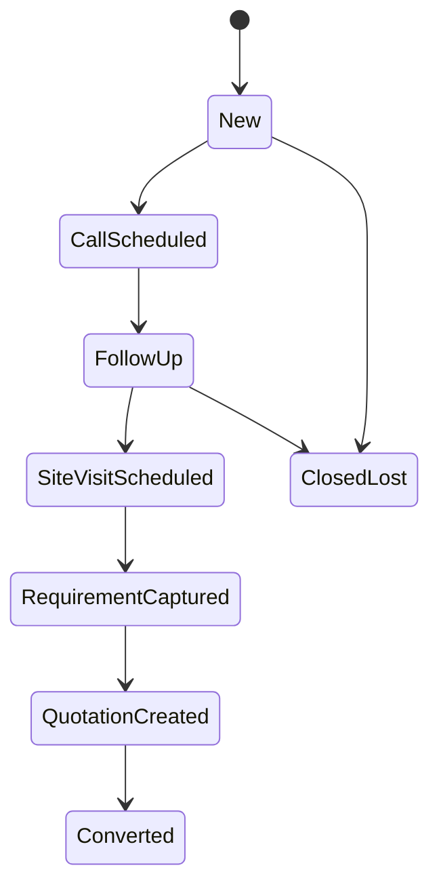

An enquiry is marked converted only when its business results in a project, normally through an approved/converting quotation.

---

## 5. Quotation

A quotation is the commercial offer sent to a customer. It is independent from an enquiry and can exist for a customer directly.

### Quotation Contains

| Category | Examples |
| --- | --- |
| Material | Panels, inverter, mounting structure, cable |
| Labour | Installation, wiring and related labour |
| Service | Documentation, design, testing, consultancy |
| Transport | Delivery or movement charges |
| Tax | GST or other applicable tax |
| Discount | Negotiated reduction |
| Other | Additional commercial items |

### Quotation Version Rule

A quotation can be revised throughout negotiation, including after an initial approval, until the project is created from it.

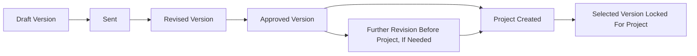

### Quotation Statuses

| Status | Meaning |
| --- | --- |
| `DRAFT` | Prepared internally |
| `SENT` | Sent to customer |
| `NEGOTIATING` | Commercial revision in progress |
| `APPROVED` | Customer accepts current version, still revisable before project creation |
| `REJECTED` | Customer rejects the business offer |
| `CONVERTED` | A project was created using a selected version |
| `CANCELLED` | Withdrawn internally |

Actual material use, labour cost and expenses after execution belong to project costing; they do not rewrite the selected quotation version.

---

## 6. Project

A project is the complete operational and commercial job.

A project may be created from:

| Origin | Enquiry Needed | Quotation Needed |
| --- | ---: | ---: |
| Approved/converting quotation | No | Yes |
| Direct customer instruction | No | No |
| Agent-referred direct project | No | No |
| Partner-provided work | No | No |
| Vendorship-related work | No | No |

### Project Records

| Information | Meaning |
| --- | --- |
| Customer | Person/company receiving the work |
| Origin | Direct, quotation, enquiry, agent or partner context |
| Scope | Type of work company performs |
| Commercial model | How money is calculated |
| Total capacity | Sum of site capacity in `kW` |
| Revenue/agreed amount | Customer quotation amount or partner-agreed amount |
| Documentation applicability | Whether documentation workflow is required |
| Sites | Physical places of delivery/installation |
| Milestone payments | Expected and received payments |
| Approved actual costs | Cost used for profitability |
| Commission/settlement | Agent or partner financial obligation |

### Project Progress

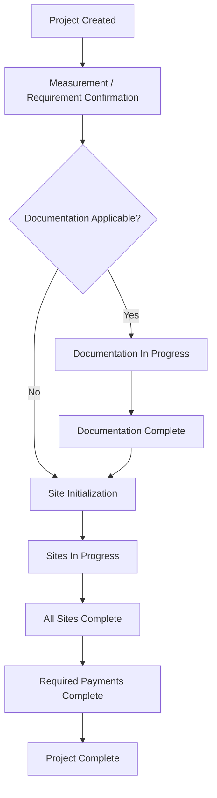

Documentation is applicable for:

- Full company-managed `EPC` work
- Work that uses the company's vendorship code
- Any contract where the company accepts documentation responsibility

---

## 7. Project Scope, Source And Commercial Model

These are separate concepts and should not be merged in database design.

### Work Scope

Scope means what the company will perform.

| Scope | Understanding |
| --- | --- |
| `EPC` | Company handles the full journey, including required documentation, material, installation and completion |
| `INC` | Installation-only work; material may belong to customer or partner |
| `BOS` | Company supplies materials only |
| `INC_BOS` | Company supplies material and performs installation; documentation may or may not be included |
| `VENDORSHIP` | Company supports work using its vendorship code, including documentation responsibility where applicable |
| `OUTSOURCED_INC` | Company manages the project but subcontracts all labour to an external subcontractor. A `Subcontractor` record is linked to the project. Material dispatch is not applicable. Documentation responsibility depends on the originating scope. [ADDED: absent from original table; confirmed in `src/domain/projectTypes/types.ts` `PROJECT_KINDS` and `AppState.subcontractors` collection] |

[ADDED: As of the current codebase build, the work scope axes have been separated into distinct project attributes rather than a single enum value: `projectType` (DIRECT_CLIENT / PARTNER_NETWORK / INC_GIVEN_TO_US), `vendorshipOwner` (MSS / partner / none), `executionScope` (full / service_only / none), and an optional `outsource` block that attaches a subcontractor record. The legacy single-value `ProjectKind` (8 values: SOLO_EPC, PARTNER_EPC, FIXED_EPC, VENDOR_NETWORK, INC, INC_GIVEN, OUTSOURCED_INC, VENDORSHIP_ONLY) is retained for migration compatibility and maps to the new shape via `LEGACY_KIND_TO_TYPE` in `src/domain/projectTypes/types.ts`.]

### Business Source

Source means where the business came from.

| Source | Understanding |
| --- | --- |
| `DIRECT` | Business acquired directly from customer |
| `ENQUIRY` | Business originated through a recorded lead |
| `AGENT` | An agent referred business |
| `PARTNER` | A partner provided work or contractual business |

### Commercial Model

Commercial model means how revenue or settlement is calculated.

| Model | Understanding |
| --- | --- |
| `DIRECT_CUSTOMER` | Revenue follows quotation or direct agreed customer amount |
| `FIXED_RATE` | Company receives a fixed agreed amount |
| `PER_WATT` | Amount is calculated by capacity; capacity stored as `kW` and converted when applying per-watt rate |
| `PROFIT_SHARE` | Settlement is based on agreed percentage of net profit |
| `VENDORSHIP_PER_WATT` | Vendorship user pays an agreed per-watt amount |

---

## 8. Sites

A site is a physical location within a project. A single project may cover multiple sites, for example one rooftop site and one farm site.

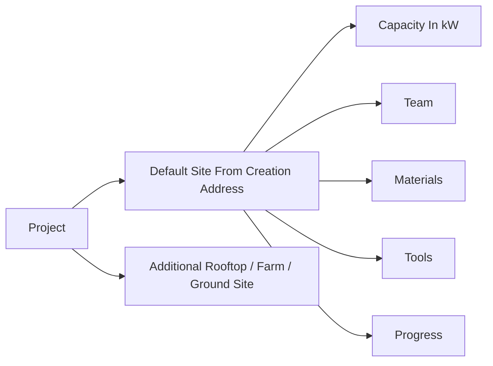

### Site Records

| Information | Meaning |
| --- | --- |
| Address | Physical work location |
| Type | Rooftop, farm, ground-mounted, commercial, etc. |
| Planned capacity | Expected site capacity in `kW` |
| Installed capacity | Completed/actual site capacity in `kW` |
| Assigned team | Employees doing site work |
| Progress | Execution stage |
| Material records | Planned/received/issued/used/returned material |
| Tool movements | Issued/returned/damaged/lost quantities |

### Installation Site Progress

For installation work, site progress generally follows:

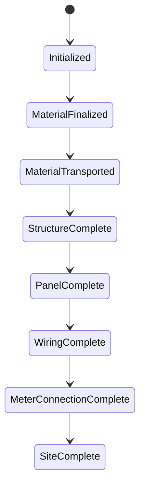

Scope may change the applicable steps:

| Scope | Site Execution Difference |
| --- | --- |
| `EPC` | Full execution stages apply |
| `INC` | External material is received/tracked, then installation stages apply |
| `BOS` | Material reserve, dispatch and delivery confirmation may complete the site work |
| `INC_BOS` | Material and installation stages apply; documentation depends on contract |

---

## 9. Materials, Tools, Vendors And Warehouse

### Materials

Materials are items installed or consumed during project work, such as:

- Solar panels
- Inverters
- Mounting structures
- Cables and wiring items
- Meter boxes and installation accessories

Material movement:

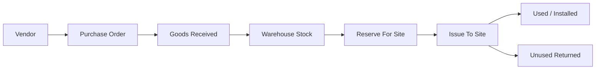

### Material Ownership

Material installed by the team is tracked even when the company does not own or supply it.

| Ownership | Inventory Effect | Profit Cost Effect |
| --- | --- | --- |
| `COMPANY_OWNED` | Leaves company warehouse when issued | Included if approved for the project |
| `CUSTOMER_OWNED` | Received/used record only | Not company material cost |
| `PARTNER_OWNED` | Received/used record only | Not company material cost |
| `PURCHASED_FOR_PROJECT` | Purchased or issued specifically for job | Included if approved |

### Tools

Tools are reusable items taken to sites and returned after work. Tools are quantity-tracked, not individually serialized.

| Movement | Example |
| --- | --- |
| Issue | `3` drills issued to Site A |
| Return | `2` drills returned from Site A |
| Damaged | `1` drill returned damaged |
| Lost | Quantity recorded lost and handled as expense/recovery if approved |

### Vendor And Procurement Needs

The system must manage:

- Vendor profiles
- Purchase orders
- Purchase order items
- Goods receipt
- Warehouses
- Current and reserved stock
- Site issue and returns
- Stock transaction audit history

---

## 10. Project Cost And Profit

The company wants project profitability to use manually approved project costs.

This means:

- Vendor/purchase price is stored for stock and purchase analysis.
- Material usage at a project/site is recorded.
- A proposed project cost can be entered.
- An authorized person approves the cost counted for the project.
- Profit reporting uses approved costs.


Conceptual profit calculation:

```
Net Profit =
Project Revenue
- Approved Material Cost
- Approved Labour Cost
- Transport And Other Project Expenses
- Approved Tool Loss Or Damage Expense
- Agent Commission
- Partner Settlement Or Profit Share
```

The accounting basis for project revenue in final profit reporting is still to be confirmed.

---

## 11. Payments

Payments occur through project milestones instead of a single final collection.

Example:

| Milestone | Example Expected Payment |
| --- | ---: |
| Advance | 20% |
| Material Dispatch / Delivery | 40% |
| Installation Completion | 30% |
| Final Handover / Completion | 10% |

Each milestone should store:

| Information | Meaning |
| --- | --- |
| Name | Advance, material dispatch, installation completed, final payment, etc. |
| Expected amount/percentage | Amount due at that milestone |
| Due trigger/date | Event or date for collection |
| Received amount | Collection made against it |
| Status | Pending, partial, paid, overdue or waived |
| Receipts | One or more payments received against milestone |

Open detail: whether a milestone can optionally be tied to a particular site in a multi-site project.

---

## 12. Employees, Site Teams And Salary

The system manages employees and the installation teams assigned to sites.

Required employee management:

- Employee profiles
- Salary structure
- Daily attendance
- Monthly paid leave entitlement
- Paid and unpaid leave records
- Standard deductions
- Monthly salary calculation and payment status
- Site/team assignment

Confirmed salary rule:

```
Payable Salary =
Salary Calculated From Attendance
+ Allowed Paid Leave Treatment
- Unpaid Leave Deduction
- Other Applicable Deductions
```

Employees or teams are assigned to sites to execute work:

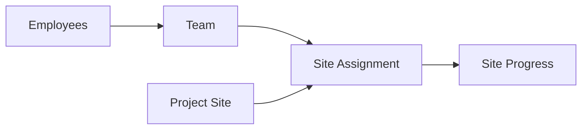

Open accounting detail: whether calculated employee labour/salary cost should be allocated automatically to the particular projects/sites where attendance or assignments occurred.

---

## 13. Agents

An agent refers business. An agent can lead to:

- An enquiry
- A quotation directly
- A project directly

An agent receives commission when referred business meets the configured eligibility condition.

Agent commission can be variable:

| Commission Type | Example |
| --- | --- |
| `FIXED_AMOUNT` | Fixed amount for converted project |
| `PERCENTAGE_REVENUE` | Percentage of project revenue |
| `PER_WATT` | Rate applied by capacity |
| `PERCENTAGE_NET_PROFIT` | Percentage of calculated project profit |


An agent is not a partner. Agent records and commission must remain separate from partner agreements and settlement.

---

## 14. Partners And Vendorship

A partner has a contractual/commercial working relationship with the company. The partner can provide:

- `EPC` work
- `INC` installation-only work
- `INC_BOS` material plus installation work
- Work using the company's vendorship code

### Partner Arrangement Models

| Arrangement | Meaning |
| --- | --- |
| Fixed-rate work | Company performs agreed work for fixed amount regardless of partner's client price |
| Installation fixed/per watt | Company provides installation for fixed amount or capacity-based rate |
| Profit sharing | Settlement is based on net profit percentage |
| Vendorship per watt | Another party uses company vendorship code and pays agreed capacity-based amount |

Partner agreements should contain the agreed scope, commercial model, rates/amounts, documentation responsibility and validity.

### Vendorship

When company vendorship code is used, documentation work is tracked because the company handles the applicable documentation creation/process. Vendorship work may have payment calculated per watt based on the agreement.

---

## 15. Application Modules

| Module | Responsibility |
| --- | --- |
| Dashboard | Leads, active projects, site delays, pending payments and stock alerts |
| Customers | Customer profiles, addresses and history |
| Enquiries | Lead intake, calls, follow-ups and site visits |
| Quotations | Versions, line items, approval/rejection and conversion |
| Projects | Scope, source, documentation, costs, milestones and profitability |
| Sites | Site execution, capacity, team, material and tool records |
| Inventory | Item catalogue, warehouse stock and movements |
| Procurement | Vendors, purchase orders and goods receipts |
| Employees / Payroll | Employee records, attendance, leave and salary |
| Agents | Referrals, commission terms and payments |
| Partners | Agreements, assigned projects, vendorship and settlement |
| Accounts | Payments, cost approvals, expenses and profit |
| Reports | Sales conversion, site progress, stock, payroll and project profit |
| Administration | Users, roles, settings and audit history |
| Subcontractors | Subcontractor profiles, work orders, payment transactions and project linkage [ADDED] |
| Finance / Accounting | Chart of accounts, bank and cash ledger, bank reconciliation, debtors-creditors aging and profit and loss by period [ADDED] |
| Audit | Audit dashboard, audit logs, audit reports, data-flow trace, inventory audit, expense audit and fixed assets [ADDED] |
| Loans | Loans to/from employees and other counterparties, repayment schedule and outstanding balance [ADDED] |
| INC Work Sources | Companies that award INC installation contracts to the company; transaction and settlement records [ADDED] |
| Vendorship Companies | Registry of DISCOM and scheme operators whose vendorship codes the company holds; per-company transaction records [ADDED] |
| Timeline | Gantt-style project and resource scheduling; installation schedules per project [ADDED] |
| Calendar | Event calendar; site visit scheduling; milestone and payment due date view [ADDED] |
| After-Sales / AMC | Annual maintenance contracts; post-project service items tracked via service presets and sale bills [ADDED] |

---

## 16. Initial Entity Map

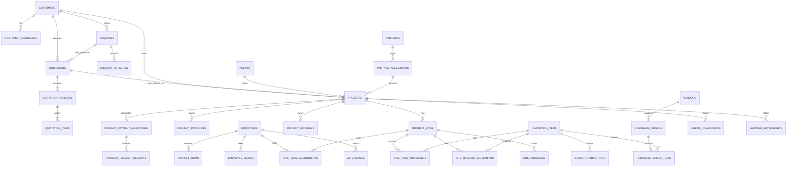

[ADDED: The following entities are present in the current application state but absent from the diagram above: `subcontractors`, `subcontractor_transactions`, `inc_giver_companies`, `inc_giver_transactions`, `vendorship_companies`, `vendorship_company_transactions`, `loans`, `loan_repayments`, `accounting_vouchers`, `bank_reconciliation_statements`, `material_reservations`, `scheduled_installations`, `site_visits`, `project_change_requests`, `material_damage_records`, `agent_commission_accruals`, `procurement_need_lines`, `owner_investments`, `deletion_requests`. These are covered in Part 2.]

---

## 17. Initial Table Groups

| Area | Suggested Tables |
| --- | --- |
| CRM | `customers`, `customer_addresses`, `enquiries`, `enquiry_activities` |
| Quotation | `quotations`, `quotation_versions`, `quotation_items` |
| Projects | `projects`, `project_sites`, `project_progress`, `site_progress`, `project_documents` |
| Payments/Costs | `project_payment_milestones`, `project_payment_receipts`, `project_expenses`, `project_cost_approvals` |
| Inventory | `inventory_items`, `warehouses`, `stock_transactions`, `site_material_movements`, `site_tool_movements`, `material_reservations` [ADDED] |
| Procurement | `vendors`, `purchase_orders`, `purchase_order_items`, `goods_receipts`, `procurement_need_lines` [ADDED] |
| Employees | `employees`, `attendance`, `employee_leaves`, `site_team_assignments`, `payroll_runs`, `payroll_items`, `employee_wallet_ledger` [ADDED] |
| Agents | `agents`, `agent_commission_terms`, `agent_commissions`, `agent_commission_accruals` [ADDED] |
| Partners | `partners`, `partner_agreements`, `partner_settlements` |
| Partners And External | `subcontractors`, `subcontractor_transactions`, `inc_giver_companies`, `inc_giver_transactions`, `vendorship_companies`, `vendorship_company_transactions` [ADDED] |
| Finance/Accounts | `invoices`, `sale_bills`, `payments`, `incomes`, `expenses`, `vendor_bills`, `vendor_payments`, `loans`, `loan_repayments`, `accounting_vouchers`, `bank_reconciliation_statements`, `owner_investments` [ADDED] |
| Operations | `project_change_requests`, `material_damage_records`, `scheduled_installations`, `site_visits`, `blockages`, `operational_tickets` [ADDED] |
| Administration | `users`, `roles`, `permissions`, `audit_logs`, `deletion_requests`, `quotation_share_details`, `accounting_review_queue` [ADDED] |

This table list is an initial domain map, not the final column-level database schema.

---

## 18. Suggested User Roles

| Role | Main Responsibility |
| --- | --- |
| Admin / Owner | Full business oversight and approvals |
| Sales Staff | Customer, enquiry and quotation management |
| Project Manager | Projects, sites, execution and team assignments |
| Store Manager | Warehouse material and tool movements |
| Procurement Staff | Vendors and purchases |
| HR / Payroll | Employees, attendance, leaves and salary |
| Accountant | Milestone payments, expenses, settlements and reports |
| Site Supervisor | Assigned site work, material/tool use and progress |

---

## 19. Decisions Still Needed

The following rules have not yet been confirmed:

1. Can a single project ever involve both an agent and a partner, or must it be linked to only one of them?
2. Can a payment milestone relate to a specific site in a multi-site project, or is every milestone always at full-project level?
3. Should employee salary/labour cost be allocated to specific projects/sites for profitability reporting in addition to attendance-based salary calculation?
4. Exactly when is agent commission payable: at project creation, after advance receipt, at a milestone, or after completion?
5. For final net profit, should revenue be counted from agreed contract amount, invoices raised or payments actually received?
6. Should project/site workflows be configurable using templates, or fixed according to scope type?
7. Is customer invoicing/GST invoicing/vendor bill management needed in the first application version?

---

## 20. Next Design Stage

After confirming the remaining rules, the next design work is:

1. Screen-by-screen application design.
2. Exact database schema with fields, types, indexes and relationships.
3. Status transition and approval rules.
4. User permissions.
5. API endpoint design.
6. Technology stack and phased backend implementation.

---

## Part 2: Additional Modules and Domain

## 21. Subcontractors

A subcontractor is an external company or individual hired to perform labour on a project site when the company does not deploy its own installation team. A subcontractor is not an agent and not a partner. Agents refer business; partners share commercial risk or revenue. A subcontractor is a labour provider paid by the company for work performed.

### Subcontractor Records

| Information | Meaning |
| --- | --- |
| Name | Subcontractor company or individual name |
| Contact | Primary contact person, phone and email |
| Trade / Skill | Type of work: electrical, civil, mounting, full installation |
| Bank details | Account and IFSC for payment |
| GST / PAN | Tax registration details |
| Active projects | Projects currently linked to this subcontractor |

### Project Link

A project links a subcontractor via an `outsource` block when the execution scope is `OUTSOURCED_INC`. One project links at most one subcontractor at a time. The link stores the agreed work scope, rate terms and document references for the subcontract.

A `subcontractor_agreement` document must be generated before site work begins on an outsourced project.

### Transactions

`SubcontractorTransaction` records each payment made to the subcontractor against a project. Each transaction stores the amount, date, payment reference and the project it relates to.

The total paid to the subcontractor for a project is a project cost item. It enters profitability calculation as an approved expense when the appropriate approver confirms it.


---

## 22. INC Work Sources

An INC work source is a company that awards installation-only contracts (`INC_GIVEN_TO_US` projects) to the company. The INC giver owns the customer relationship and typically supplies the material. The company provides the installation team and execution.

This is distinct from:

| Entity | Role |
| --- | --- |
| Agent | Refers a customer; receives commission |
| Partner | Shares commercial risk or revenue; has an agreement |
| INC Work Source | Awards a labour contract; pays the company directly |

### INC Giver Records

| Information | Meaning |
| --- | --- |
| Company name | The awarding organisation |
| Contact | Primary contact for assignment of work |
| Rate terms | Per-watt or fixed-rate basis for payment |
| Active projects | Projects currently assigned by this INC giver |

### Transactions

`INCGiverTransaction` records amounts received from the INC giver per project. Revenue on an `INC_GIVEN_TO_US` project flows from the INC giver to the company, not from an end customer.


---

## 23. Vendorship Companies Registry

The company holds vendorship empanelment with DISCOMs, government bodies and scheme operators. The vendorship companies registry records each operator whose code the company is registered under.

This registry is separate from the commercial vendorship concept in partner agreements. Partner agreements describe financial terms for work done under a vendorship arrangement. This registry holds the registration records themselves.

### Vendorship Company Records

| Information | Meaning |
| --- | --- |
| Operator name | DISCOM, scheme or government body name |
| Registration number | Empanelment or vendor code number |
| Scheme | PM Surya Ghar, MNRE scheme, state DISCOM scheme, etc. |
| Validity | Registration start and expiry dates |
| Applicable capacity | Minimum and maximum capacity range for the registration |
| Documentation set | List of documents submitted for empanelment |

### Transactions

`VendorshipCompanyTransaction` records fees paid to the operator or income received for vendorship-code-based project work. A project that uses a vendorship code references the relevant `VendorshipCompany` record so that costs and income are attributed correctly.

---

## 24. Document Management

For projects where documentation is applicable, the system generates and tracks a defined set of documents. The company takes documentation responsibility when it performs EPC work, uses a vendorship code or accepts documentation obligations in the contract.

### Document Types

| Document Key | Description |
| --- | --- |
| `proposal` | Commercial proposal / offer letter |
| `agreement` | EPC or work order agreement |
| `feasibility` | Feasibility / shadow analysis workbook |
| `meter_application` | DISCOM net metering and rooftop connection application |
| `dcr` | Drawing change register |
| `wcr` | Work completion request |
| `handover` | Customer acceptance and O&M handover dossier |
| `external_invoice_ref` | External OEM invoice reconciliation reference |
| `commission_doc` | Channel / partner commission acknowledgement letter |
| `site_photo` | Site photo pack for INC scope |
| `work_completion` | Work completion certificate for INC scope |
| `full_epc_document_set` | Master index — full EPC document dossier |

### Document Lifecycle

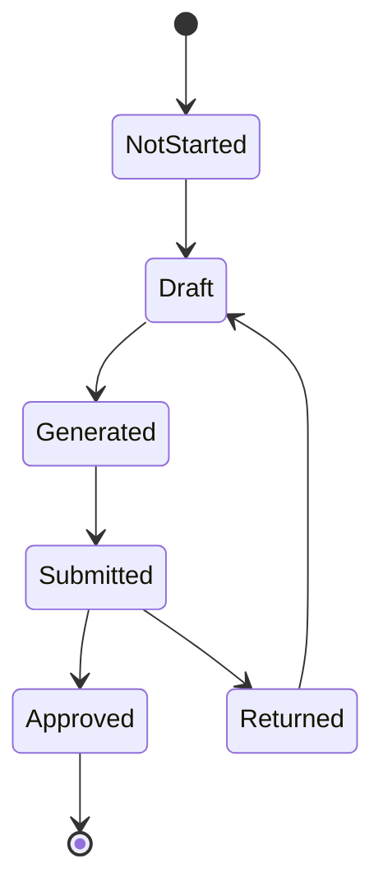

The set of required documents for a project is determined by its scope, vendorship owner and partner role. `resolveProjectCapabilities` in `src/domain/projectTypes/config.ts` returns the `requiredDocuments` list for a given project configuration.

---

## 25. Change Requests

A change request records a mid-project modification to agreed scope, capacity or add-on work after the original project was confirmed. It preserves the original contract terms while tracking what changed and why.

### Change Request Types

| Type | Meaning |
| --- | --- |
| Capacity change | Agreed installed capacity increases or decreases |
| Panel count change | Number of panels changes independently of capacity |
| Add-on work | Additional scope item added after project start |

### Status Lifecycle

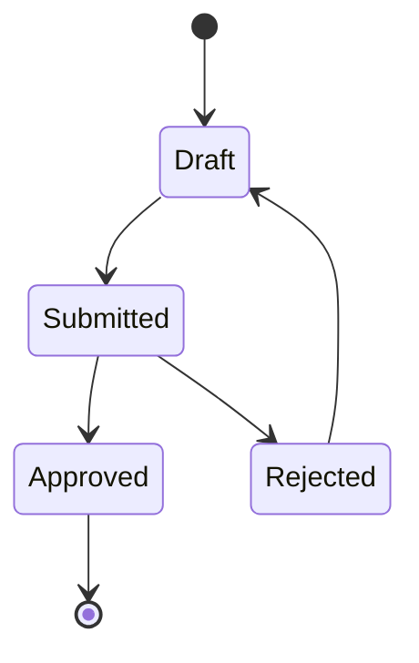

### Approval Effects

When a change request is approved:

- `contractAmount` on the project is recalculated
- Milestone amounts or percentages that are proportion-based are scaled
- A delta invoice is raised for the difference if the contract amount increased
- Agent commission accruals linked to the project are scaled to reflect the new contract amount
- Material reservations from the original checklist are re-evaluated against the revised scope

---

## 26. Quality Control And Material Damage

Material damage events are recorded separately from normal movement records. A damage record captures items found to be damaged at any stage of the project lifecycle.

### Damage Record Fields

| Field | Meaning |
| --- | --- |
| Item | Inventory item that was damaged |
| Quantity | Number of units damaged |
| Stage | `transport` / `installation` / `storage` |
| Date | When the damage was discovered |
| Description | Nature of damage |
| Photo URLs | One or more evidence photo references |
| Project | Project where the damage occurred |
| Site | Specific site if applicable |
| Cost impact | Estimated replacement or repair cost |
| Approved | Whether the cost impact has been approved for project costing |

### Cost Treatment

A damage event does not automatically enter project cost. An authorised approver reviews the record and approves the cost impact amount. Once approved, the cost is included in the project's actual cost and reduces net profit accordingly.

---

## 27. Material Reservations

A material reservation holds a quantity of a stock item against a specific project and site before the physical issue movement occurs. Reservations prevent the same stock from being committed to two concurrent projects.

### Reservation Lifecycle

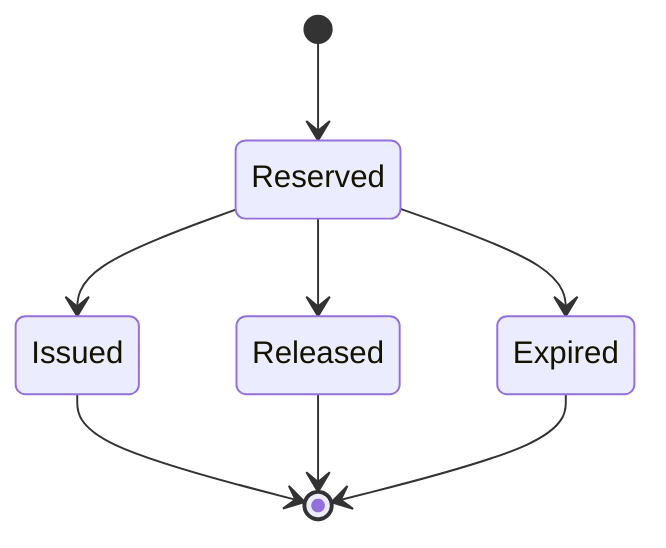

### Reservation Records

| Field | Meaning |
| --- | --- |
| Item | Inventory item reserved |
| Quantity | Reserved quantity |
| Project | Project the reservation is held for |
| Site | Specific site within the project |
| Source | `auto` (from site checklist dispatch) or `manual` (store staff) |
| Status | Reserved / Issued / Released / Expired |

A reservation transitions to `Issued` when the matching physical issue movement is created. A reservation transitions to `Released` when a change request removes the item from scope or the reservation is manually cancelled. Expired reservations release quantity back to available stock after the configured expiry window.

---

## 28. Expense Management And Reimbursements

Expenses cover all outgoings that are not material purchases or salary calculations. This includes travel, fuel, food allowances, site petty cash, office overheads, owner drawings and partner-related costs.

### Expense Categories

| Main Category | Examples |
| --- | --- |
| `company` | Vehicle fuel, office supplies, site transport using company vehicle |
| `employee` | Employee personal vehicle use, travel advances, food |
| `office` | Rent, utilities, software subscriptions |
| `site` | Site petty cash, local labour day rates, site consumables |
| `owner` | Owner drawings, personal expenses charged to the business |
| `partner` | Costs incurred in relation to a partner arrangement |

### Vehicle Expense

Transport expenses carry a `vehicleType` field: `company` (company-owned vehicle), `employee` (employee's personal vehicle reimbursed), or `outsource` (hired transport). This distinction is used in profitability and reimbursement reporting.

### Reimbursement Workflow

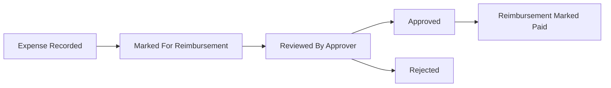

Expenses linked to a specific project are included in the project's actual cost calculation when approved. Attachment URL stores a photo of the receipt or supporting document.

---

## 29. Notifications And Alerts

The application generates business alerts for conditions that require attention from users. Alerts are dismissible per session and categorised by kind.

### Alert Kinds

| Kind | Trigger |
| --- | --- |
| `invoice` | Customer invoice overdue or unpaid beyond the configured threshold |
| `loan` | Loan EMI due date approaching or already overdue |
| `stock` | Inventory item quantity below configured minimum level |
| `blockage` | A project blockage is open and unresolved |
| `quotation` | Quotation approaching expiry or awaiting internal approval |
| `vendor_bill` | Vendor bill payment overdue |
| `approval` | A project cost, expense or change request is awaiting approval |
| `deletion_request` | An admin deletion request is pending review |

Alerts are evaluated at application load and on relevant state changes. Each alert carries a severity level and a link to the relevant record. Dismissed alerts are not re-shown in the same session.

---

## 30. File Attachments And Media

Photos and documents are attached to records as stored URL or path references. No binary content is held in application state. The reference model allows any storage backend (local file system, cloud bucket, document service) to be used without changing entity structure.

### Attachment Points

| Entity | Field | Use |
| --- | --- | --- |
| Project | `photoGallery[]`, `photos` count | Site before/after progress photos |
| MaterialDamage | `photoUrls[]` | Damage evidence photos |
| SiteVisit | `photos[]` | Pre-installation assessment photos |
| Expense | `attachmentUrl` | Receipt or bill scan |
| VendorBill | `documentUrl` | Vendor invoice scan |

---

## 31. After-Sales, Warranty And AMC

Post-project obligations are managed through the existing service and billing infrastructure rather than a separate entity. Annual maintenance contracts are a service category in the item catalogue and are invoiced through sale bills.

### AMC And Warranty Tracking

- `AMC` is a recognised category in `ITEM_CATEGORIES`; service presets for annual maintenance are configured in the Templates module
- A sale bill raised after project handover with AMC line items creates the ongoing service income record and revenue recognition for that period
- Warranty period, OEM registration details and O&M handover checklist are recorded in the project's `handover` document
- Scheduled maintenance visits are tracked as calendar events and timeline entries; they appear in the Calendar module under the `installation` or `task` source type

---

## 32. Timeline, Calendar And Scheduling

The timeline provides a Gantt-style view of projects, sites and resource assignments across time. The calendar provides an event-centric day/week/month view across the same operational data.

### Timeline Tabs

| Tab | Content |
| --- | --- |
| Sites | Project and site progress bars across a date range; overdue sites highlighted |
| People | Employee and team assignments per project; attendance-linked utilisation |
| Office | Internal tasks, quotation deadlines and milestone due dates |

### Calendar Event Sources

| Source | Example Event |
| --- | --- |
| `task` | Internal task due date |
| `installation` | Scheduled site installation start or end |
| `enquiry` | Follow-up call or site visit |
| `invoice` | Invoice due date |
| `vendor-bill` | Vendor bill payment due |
| `loan-emi` | Loan repayment instalment date |
| `site-visit` | Pre-installation site assessment visit |
| `milestone` | Project payment milestone trigger date |

### Scheduled Installation

`ScheduledInstallation` links a project to a planned installation date range. It stores the assigned team or employee list, notes and current status. Multiple scheduled installations can exist per project to represent phase-wise deployment.

### Site Visit

`SiteVisit` is a pre-start assessment by the installation team to inspect the physical site before the material checklist is finalised. It records visit date, findings, photo references and the employee who conducted it.

---

## 33. Analytics And Business Intelligence

The analytics module provides computed metrics and trend views across the full business. It is separate from the transactional export reports in the Audit module. Analytics aggregates data across all entities to surface operational and financial trends.

### Metric Groups

| Group | Example Metrics |
| --- | --- |
| Pipeline | Enquiry-to-project conversion rate, average days to convert, open leads by source agent |
| Operations | Active site count, sites overdue by stage, project completion rate by month |
| Finance | Revenue collected vs target, outstanding receivables, month-on-month net income |
| Inventory | Stock turnover rate, items below minimum level, pending purchase order value |
| Customers | Top customers by revenue, repeat project rate, average project size |
| People | Attendance rate, payroll cost by month, team utilisation across active sites |

### Date Range

All analytics views support a selectable date range: current month, quarter, year or all-time. Comparative periods are shown where relevant.

---

## 34. Loans Management

Loans covers money the company has borrowed from external sources and money lent to employees or other counterparties.

### Loan Records

| Field | Meaning |
| --- | --- |
| Source type | `bank` / `person` / `partner` / `nbfc` / `other` |
| Direction | `borrowed` (company owes) / `lent` (company is owed) |
| Principal | Original loan amount |
| Interest rate | Annual percentage rate |
| Start date | Disbursement date |
| Repayment type | `EMI` (equal monthly instalments) / `one-time` / `reminder-only` |
| Outstanding balance | Remaining principal |

### Repayments

`LoanRepayment` records each instalment: principal portion, interest portion, date paid and a linked expense or payment record.

The principal and interest portions are split on the linked `Expense` row so that the profit and loss statement correctly separates financing cost (interest) from capital repayment (principal reduction).

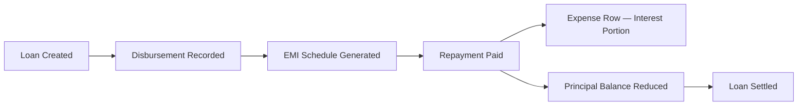

---

## 35. GST Compliance And Tax Management

GST is tracked at the individual item and service line level. This allows the application to produce sales and purchase registers that align with GST filing periods.

### Item-Level Tax Setup

- `MasterItem.gstRate` stores the applicable GST percentage for each inventory item in the catalogue
- HSN codes are assigned to inventory items; SAC codes are assigned to service lines
- `InvoiceItem.hsn` and `InvoiceService.sac` carry the codes onto every invoice line, so the register can be broken down by code

### Reporting

- `computeGstSummary` aggregates output tax (from sales invoices and sale bills) and input tax (from vendor bills) by month
- `computeHsnSacBreakdown` groups taxable value and tax amount by code for a selected period
- A 24-month rolling period selector is available in the Audit module GST view
- The sales register and purchase register are available as exports for use in GST filing

---

## 36. Finance And Accounting

The finance module covers accounting-level records that sit above project-level costing. Project cost and revenue tracking (described in Section 10) records what happened on a specific job. The finance module records the accounting treatment of those transactions using a double-entry structure.

### Components

| Component | Description |
| --- | --- |
| Chart of accounts | Hierarchical account groups and ledger accounts; defines the double-entry structure for the business |
| Accounting vouchers | Journal entries posting debits and credits across ledger accounts; auto-generated when invoices, bills, payments and expenses are created |
| Bank and cash ledger | Running balance per bank or cash account; transaction list with date, counterparty and amount |
| Bank reconciliation | Upload a bank statement; match statement lines to accounting voucher entries; track unmatched items on either side |
| Debtors / creditors aging | Outstanding receivables and payables grouped by age bucket (current, 30, 60, 90+ days) |
| Profit and loss | Period income vs expense summary across all categories; does not require project-level cost approvals |
| Owner investments | Capital injected by owners recorded separately from operating income to preserve accurate equity tracking |

### Voucher Posting

`VoucherPostingService` creates an `AccountingVoucher` record automatically when key financial events occur: invoice raised, payment received, vendor bill entered, expense approved, salary paid. Each voucher carries the account codes for the debit and credit legs, the amount and the source document reference.

---

## 37. Templates And Presets

Templates allow standard work types to be set up quickly with pre-filled material lists, service lines and site dispatch items. They reduce data entry for recurring project configurations such as a standard 5 kW rooftop EPC or a 100 kW farm INC_BOS installation.

### Template Types

| Template | Purpose |
| --- | --- |
| `QuotationTemplate` | Pre-filled material and service lines for a standard quotation. Includes line items, quantities, unit prices and applicable tax. Applied at quotation creation to populate the initial version. |
| `SiteChecklistTemplate` | Pre-filled bill of materials for a standard site dispatch. Sub-types: `generic` (any material set) or `solar_package` (structured panel + inverter + BOM). Populates the site material checklist when dispatched. |
| `ServicePreset` | Reusable single service line — AMC, design fee, commissioning charge, documentation charge — inserted into quotations or sale bills without requiring a full template. |
| `SolarPackagePreset` | Settings-level system configuration combining panel model, inverter model, capacity and price per watt. Used as a quick-fill reference when creating quotations or site checklists. |

`QuotationVisibilityPreset` controls which columns are shown or hidden on a printed or shared quotation. Different visibility configurations can be saved for different customer types or deal contexts.

---

## 38. Technology Stack

The current application is a frontend prototype client. The domain, application and repository layers are structured so that the localStorage backend can be replaced with an API-backed implementation without modifying business logic.

### Frontend

| Layer | Technology |
| --- | --- |
| Framework | React 18.3 + TypeScript 5.8 |
| Bundler | Vite 5.4 |
| Styling | TailwindCSS 3.4 + Radix UI component primitives |
| Forms | React Hook Form 7 + Zod 3.25 schema validation |
| State management | Zustand 5 (global app state) |
| Server-state layer | TanStack React Query 5 (ready for API integration) |
| Routing | React Router 6.30 |
| Charts | Recharts 2.15 |
| PDF export | jsPDF + html2canvas |
| Testing | Vitest 4.1 (unit), Playwright 1.60 (end-to-end), Testing Library |

### Architecture

| Layer | Description |
| --- | --- |
| `domain/` | Business entities, rules and capability resolution; no framework dependencies |
| `application/` | Commands and command handlers via `CommandBus`; orchestrates domain logic |
| `infrastructure/` | Repository implementations; current storage: `localStorage` (key: `mahi_solar_app_data`) |
| `contexts/` | React context that exposes `AppState` and all CRUD operations to the UI |
| `pages/` and `components/` | React UI; reads state via context and dispatches commands |

### Current Storage Backend

All application data is persisted to `localStorage` under a single versioned key. `applyAppStateHydrationPipeline` runs migrations on load when the stored version is behind the current `APP_DATA_STORAGE_VERSION`. Repository interfaces in `src/infrastructure/repositories/` are defined against abstract contracts so the storage layer can be replaced with a REST or GraphQL API backend without modifying domain or application code.

### Authentication

The current implementation uses a demo login against a hardcoded user list. Session is stored in `localStorage`. Role-based access is enforced via `PermissionService` which maps `UserRole` values to allowed actions and route access. This is a prototype mechanism intended to be replaced with a server-issued session or JWT when the backend is built.

---

## Part 3: Operational Subsystems and Admin Infrastructure

## 39. Blockages And Operational Tickets

A blockage is a recorded obstruction that prevents a project or site from progressing. A ticket is a service-style work item raised against the operations team. Both feed the same Active Sites and notification flows.

### Blockage Records

| Field | Meaning |
| --- | --- |
| Project | Project the blockage relates to |
| Site | Specific site if applicable |
| Category | Material shortage, customer delay, weather, documentation, payment, other |
| Description | What is blocked and why |
| Raised by | User who logged the blockage |
| Raised on | Date the blockage was identified |
| Severity | Low / medium / high — drives notification urgency |
| Status | Open / in-progress / resolved / waived |
| Resolution | Description of how the blockage was cleared |

A site cannot transition to its next progress stage while a high-severity blockage is open against it. Open blockages generate `blockage` alerts in the notifications module.

### Operational Tickets

`Ticket` records internal service requests: a customer issue raised post-handover, an internal facility request, a documentation correction request. Tickets have an assignee, due date and status (open / in-progress / closed). Tickets are not blockages — they do not stop site progress.

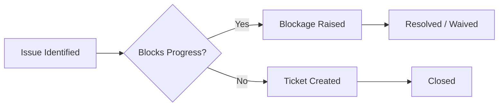

---

## 40. Active Sites And Project Timeline Status

The Active Sites view is the operational dashboard for all currently running site work. It draws from a per-project timeline status record that is kept in sync as site progress, blockages and milestone events occur.

### Project Timeline Status

`ProjectTimelineStatus` is a denormalised summary per project that the Active Sites and Progress Report views read directly. It holds:

| Field | Meaning |
| --- | --- |
| Current stage | Most advanced stage reached across the project's sites |
| Stage entered at | Date the project entered the current stage |
| Open blockages | Count of unresolved blockages on the project |
| Last activity | Most recent timeline-relevant event date |
| Next milestone | Upcoming payment or progress milestone |
| Health | Computed health indicator: on-track / at-risk / delayed |

The timeline status record is updated when:

- A site progress stage changes
- A blockage is opened or resolved
- A milestone payment is received
- A task linked to the project is completed
- A change request is approved

---

## 41. Client Payment Records And FIFO Invoice Allocation

A customer often pays a lump sum amount that covers multiple outstanding invoices. The `ClientPaymentRecord` captures the received amount as a single receipt, then allocates it across open invoices using FIFO order (oldest invoice first) until the receipt is fully consumed.

### Allocation Flow

```mermaid
flowchart LR
    REC[Client Payment Received] --> CPR[ClientPaymentRecord Created]
    CPR --> OPEN[Find Open Invoices For Customer]
    OPEN --> SORT[Sort By Invoice Date Ascending]
    SORT --> APPLY[Apply Receipt FIFO To Each Invoice]
    APPLY --> PAYROW[Generate Payment Row Per Invoice Allocation]
    PAYROW --> UPDATE[Invoice Outstanding Balance Reduced]
```

### Allocation Behaviour

- Each invoice consumed in full produces a `Payment` row tagged with the originating `ClientPaymentRecord`
- The final partially-consumed invoice (if any) receives the remaining amount and stays open with reduced balance
- If the received amount exceeds total outstanding, the residual is held as customer credit against future invoices
- Deleting a `ClientPaymentRecord` reverses every payment row it generated and restores the original invoice balances

The allocation logic is implemented in `fifoApplyClientPaymentToInvoices` and `reconcileClientPaymentLedger`.

---

## 42. Vendor Bills And Vendor Payments

The vendor side mirrors the customer side. A `VendorBill` is a purchase invoice received from a vendor; a `VendorPayment` is an outgoing payment against one or more bills.

### Vendor Bill Records

| Field | Meaning |
| --- | --- |
| Vendor | Vendor who issued the bill |
| Bill number | Vendor's invoice reference |
| Bill date | Date issued by vendor |
| Due date | Payment due date based on agreed terms |
| Line items | Materials, services or expenses billed |
| Tax breakup | CGST, SGST, IGST split per applicable rule |
| Total amount | Final billed amount |
| Outstanding | Unpaid balance |
| Document URL | Scan or photo of the vendor's bill |
| Status | Draft / approved / partially-paid / paid / disputed |

### Vendor Payments

A `VendorPayment` records an outgoing payment that settles one or more vendor bills. A single payment can span multiple bills from the same vendor; the allocation per bill is stored on the payment record.

Vendor bills past their due date generate `vendor_bill` notifications. Aging is reported in the Debtors / Creditors view in the Audit module.

---

## 43. Procurement Need-To-Get Workflow

When a project's material checklist identifies items that are not in stock or not yet committed, those items enter the Need-to-Get queue. Each line in the queue is a `ProcurementNeedLine` representing one item that must be acquired before site dispatch.

### Need Line States

```mermaid
stateDiagram-v2
    [*] --> Identified
    Identified --> VendorAssigned
    VendorAssigned --> Ordered
    Ordered --> PartiallyReceived
    PartiallyReceived --> Received
    Ordered --> Received
    Identified --> Cancelled
    VendorAssigned --> Cancelled
```

### Need Line Fields

| Field | Meaning |
| --- | --- |
| Project | Project that needs the item |
| Site | Site within the project |
| Item | Inventory item required |
| Quantity needed | Outstanding quantity to acquire |
| Assigned vendor | Vendor selected to supply this line |
| Linked purchase order | PO that fulfils this line, once raised |
| Acquire state | Identified / vendor-assigned / ordered / partially-received / received |
| Acquired quantity | Quantity already received against this need |

A demo data generator can populate the Need-to-Get queue from project checklists for testing the workflow end-to-end.

---

## 44. Agent Commission Accruals

Agent commission is recognised in two stages: an accrual is created when commission becomes earnable, and a payment is recorded when it is actually paid. `AgentCommissionAccrual` and `AgentCommissionPayment` are distinct records — the accrual represents the company's obligation; the payment represents settlement of that obligation.

### Accrual Lifecycle

```mermaid
stateDiagram-v2
    [*] --> Pending
    Pending --> Payable
    Payable --> Paid
    Pending --> Cancelled
    Payable --> Cancelled
```

| State | Meaning |
| --- | --- |
| `Pending` | Project started; commission earning conditions not yet fully met |
| `Payable` | Commission earned and approved for payment |
| `Paid` | An `AgentCommissionPayment` has been issued against this accrual |
| `Cancelled` | Project cancelled or commission rule revoked before payment |

### Recalculation On Change Request

When an approved change request modifies the project's contract amount, existing accruals for that project are scaled proportionally by `scaleAgentAccrualsForContractChange`. This ensures the agent's earning reflects the revised project value without losing the audit trail of the original accrual.

Accruals are appended on project approval, marked payable on completion or milestone trigger (per agent rule), and matched against payment records as commission is paid out.

---

## 45. Owner Investments And Capital Tracking

Owner investments record capital injected into the business by one or more owners. These records sit outside operating income and operating expense so that the equity position of each owner can be reported separately.

### Investment Records

| Field | Meaning |
| --- | --- |
| Owner | Named owner contributing the capital |
| Date | Date of contribution |
| Amount | Contribution amount |
| Mode | Cash / bank transfer / asset transfer |
| Purpose | Working capital, asset purchase, business expansion |
| Linked account | Bank or cash ledger account that received the funds |

Owner drawings (capital taken out) are recorded as `Expense` records with `mainCategory: owner`. The combination of investments and drawings forms the owner's equity movement for the period.

The chart of accounts holds an Owner's Capital account group; `VoucherPostingService` posts the corresponding double-entry when an investment or drawing is recorded.

---

## 46. Employee Wallet Ledger

The employee wallet ledger tracks advances and recoveries that sit outside the monthly payroll cycle. A salary advance issued mid-month, a personal expense recovered from upcoming salary, or a payroll correction all flow through this ledger.

### Wallet Ledger Entries

| Field | Meaning |
| --- | --- |
| Employee | Employee the entry belongs to |
| Date | Entry date |
| Type | `advance` / `recovery` / `adjustment` |
| Amount | Signed amount (positive = paid to employee, negative = recovered) |
| Reason | Free text explanation |
| Linked payroll | Payroll run that absorbs this entry if any |
| Linked expense or payment | Cash-side movement that posted this entry |

When the monthly payroll runs, outstanding advances and recoveries from the wallet ledger are netted into the employee's payable salary. The wallet ledger continues to track the running balance independently so corrections do not lose history.

---

## 47. Company Holidays And Employee Paid Holidays

Company holidays and employee paid holidays are separate concepts that both affect attendance and salary calculation.

### Company Holidays

A company holiday is a day the company has declared closed. It applies to all employees and removes the day from attendance requirements.

| Field | Meaning |
| --- | --- |
| Date | Holiday date |
| Name | National holiday, festival, observance, etc. |
| Scope | All employees / specific team / specific role |
| Paid | Whether employees are paid for the day |

Named company holidays support per-team scope where some teams (e.g., site work) may operate on a day that office staff have off.

### Employee Paid Holidays

`EmployeePaidHoliday` allocates one paid holiday per employee per month, separate from the company-wide holiday list. An employee can choose a day in the month to mark as paid leave without it counting as unpaid absence. Unused entitlements expire at month end.

The salary calculation:

- Treats company holidays as worked days if paid, or as zero-impact days if unpaid
- Treats the employee's monthly paid holiday as worked for salary purposes
- Treats any further leave as either paid (against allowed entitlement) or unpaid (deducted from payable salary)

---

## 48. Tasks And Internal Work

Tasks are internal work items that do not fit the project / site / blockage model — internal admin work, follow-up reminders, document corrections, supplier coordination.

### Task Records

| Field | Meaning |
| --- | --- |
| Title | Short description |
| Description | Detail of the work to be done |
| Assignee | Employee or team responsible |
| Linked entity | Optional reference to a project, customer, vendor or quotation |
| Due date | When the task must be completed |
| Status | Open / in-progress / completed / cancelled |
| Priority | Low / medium / high |
| Completed by | User who marked it complete |
| Completed on | Completion date |

Tasks appear in the Timeline (Office tab), the Calendar (`task` event source) and the Dashboard's pending items list. Completing a task that is linked to a project triggers an update to the project's timeline status and may release the next stage.

---

## 49. Customer Lifecycle And Auto-Archive

Customers move through a lifecycle from active prospect to active customer to dormant. The system auto-archives customers based on configurable inactivity rules so that the active customer list does not accumulate stale records.

### Auto-Archive Evaluation

`evaluateAutoArchive` examines a customer record and returns whether it qualifies for archival based on:

- No enquiry, quotation or project activity within the configured inactivity window
- No outstanding receivables
- No active project or open ticket
- No upcoming AMC or scheduled service

`applyAutoArchive` then sets the customer to archived state. An archived customer is excluded from default lists but remains discoverable through search and is restored to active state automatically if any new activity is recorded against them.

Archive status is never destructive — historical records remain linked to the customer and are accessible in audit views and historical reports.

---

## 50. Audit Trail And Field-Level Diff

The application records an `AuditLogEntry` for every state-changing action. Each entry captures who acted, when, on which entity and what changed at the field level.

### Audit Entry Fields

| Field | Meaning |
| --- | --- |
| Timestamp | When the action occurred |
| Actor user id | The acting user |
| Actor user name | Resolved display name for the actor at action time |
| Action | Created / updated / deleted / approved / rejected / state-transitioned |
| Entity type | The collection name affected (project, invoice, quotation, etc.) |
| Entity id | The specific record affected |
| Field changes | Array of `{field, before, after}` triples for updated fields |
| Reason | Optional free-text reason supplied by the actor |
| Context | Linked records affected as a side-effect of this action |

### Field Diff

`auditFieldDiff` compares the before and after entity state and emits one change entry per field whose value changed. Nested fields are flattened using dot notation. This makes the audit log queryable by field name across history.

The Audit module exposes the log via `AuditLogs` view with filters by actor, action, entity type, date range and field name.

---

## 51. Deletion Requests And Admin Approvals

Protected entities — projects, invoices, vendor bills, payments, vouchers — cannot be deleted directly by ordinary users. A deletion request must be raised and reviewed by an admin before the deletion is applied.

### Deletion Request Flow

```mermaid
flowchart LR
    USER[User Requests Delete] --> DR[DeletionRequest Created]
    DR --> Q[Admin Approval Queue]
    Q --> REV[Admin Reviews]
    REV -->|Approve| APPLY[Cascade Delete Applied]
    REV -->|Reject| RJ[Request Rejected With Reason]
    APPLY --> AUDIT[Audit Log Entry Recorded]
```

### Deletion Request Records

| Field | Meaning |
| --- | --- |
| Requested by | User who raised the request |
| Requested on | Date raised |
| Entity type | Type of record to delete |
| Entity id | Specific record id |
| Display name | Resolved human-readable label for the record at request time |
| Reason | Why deletion is needed |
| Status | Pending / approved / rejected |
| Reviewed by | Admin who acted on the request |
| Reviewed on | Date of decision |
| Decision note | Admin's reason for approve or reject |

Approval triggers a cascade deletion that handles linked records correctly — for a project this includes sites, payment milestones, expense allocations, document references and timeline status. The `applyProjectDeletionToState` and `buildProjectDeletionAuditEntry` helpers carry this out and record a single audit entry summarising the cascade.

---

## 52. Quotation Sharing And Share History

A quotation can be shared with the customer multiple times — initial proposal, revised version, final approved version — across different channels. Each share event is logged in the quotation share history so the company knows what was sent, to whom and when.

### Share Details Record

`QuotationShareDetails` is the canonical share log. The quotation entity carries a denormalised `shareHistory` summary derived from this log for fast display, but the share details collection is the source of truth.

| Field | Meaning |
| --- | --- |
| Quotation id | Quotation being shared |
| Version | Specific version that was shared |
| Channel | Email / WhatsApp / shareable link / printed copy |
| Recipient | Customer contact who received the share |
| Shared by | Internal user who performed the share |
| Shared on | Date and time of share |
| Share link | If applicable, the link generated for online viewing |
| Viewed on | If the link was opened, the most recent view timestamp |
| Note | Free text comment recorded with the share event |

Share details are kept across all versions so that revising a quotation does not erase the record of what was originally sent.

---

## 53. Permissions And Role-Based Access Control

Access to features and routes is governed by a role-based permission system. Each user is assigned one role; the role determines which actions the user can perform and which routes they can access.

### Roles And Action Mapping

| Role | Example Allowed Actions |
| --- | --- |
| Admin / Owner | All actions including settings, deletion approvals, user management, data engine |
| Sales Staff | Create and edit customers, enquiries, quotations; view assigned projects |
| Project Manager | Create and edit projects, sites, scheduled installations; assign teams; approve change requests |
| Store Manager | Material movements, tool movements, reservations, goods receipts |
| Procurement Staff | Vendor management, purchase orders, vendor bills |
| HR / Payroll | Employee records, attendance, leaves, payroll runs, wallet ledger |
| Accountant | Invoices, payments, vendor bills, vendor payments, vouchers, reconciliation |
| Site Supervisor | View assigned sites, record progress, log material use, raise blockages |

### Enforcement Points

- `PermissionService.can(userRole, action)` returns whether the role allows the action; called by command handlers before applying any state change
- `AuthGate` wraps the application root and redirects unauthenticated users to login
- `RouteAccessGate` wraps each route and redirects users without the necessary action permission for that route
- UI elements (buttons, menu items) are conditionally rendered using the same permission checks so disallowed actions are hidden rather than failing on click

---

## 54. Settings And Configuration

The Settings module holds application-wide configuration that affects how other modules behave.

### Settings Areas

| Area | Content |
| --- | --- |
| Solar package presets | Standard panel + inverter + capacity combinations with default pricing |
| Team directory | Settings-level team member entries used in assignments and document attribution |
| Quotation visibility presets | Column show/hide configurations applied when printing or sharing a quotation |
| Company profile | Company name, registration details, addresses, logo, GST and PAN |
| Document headers | Boilerplate text and styling used on generated documents |
| Holiday calendar | Named company holidays for the year |
| Salary policy | Paid leave entitlement per month, overtime rules, deduction rules |
| Commission terms | Default agent commission rules and approval thresholds |
| Numbering series | Prefix and starting number for quotations, invoices, projects, vouchers |

### Settings Team Members

`SettingsTeamMember` entries are distinct from `Employee` records. The Employee record is operational — it drives attendance, payroll and team assignment. The settings team member is presentational — it provides the named people who appear on quotations, documents and the public team directory. A single person can have both kinds of record linked.

---

## 55. Master Data And Item Catalogue

The inventory item catalogue is the master data spine for materials, tools, services and AMC items. Every quotation line, invoice line, stock movement and damage record references a catalogue item.

### Master Item Fields

| Field | Meaning |
| --- | --- |
| Item code | Internal short code |
| Display name | Customer-facing name |
| Category | Panel, inverter, structure, cable, accessory, service, tool, AMC |
| Unit | kW, watt, metre, piece, set, hour |
| Default unit price | Standard sale price |
| Default purchase price | Standard purchase price |
| HSN or SAC code | Tax code for invoicing |
| GST rate | Applicable GST percentage |
| Minimum stock level | Threshold below which a stock alert fires |
| Reorder quantity | Suggested quantity for replenishment |
| Solar attributes | Wattage, voltage, panel type, inverter phase — present on solar-specific categories |
| Active | Whether the item is available for selection in new records |

### Catalogue Use

- A quotation line picks a catalogue item to populate name, unit, default price and tax code
- A stock movement debits or credits the item's warehouse balance
- A material reservation holds quantity on the item against a project
- A damage record references the item to compute replacement cost
- GST reports group by HSN / SAC code from the catalogue

---

## 56. Workspace Modes And Super Admin Data Engine

The application supports multiple workspace modes that change how data is seeded, persisted and presented for development, demo and live use.

### Workspace Modes

| Mode | Behaviour |
| --- | --- |
| Empty | Fresh empty state; no seed data; suitable for live first-use |
| Seeded | Pre-populated with realistic demo data for showcasing flows |
| Live | Production mode; data persisted across reloads; demo helpers hidden |

The mode is set via `setWorkspaceMode` and is itself persisted so subsequent app loads continue in the same mode.

### Super Admin Data Engine

The Super Admin Data Engine is an admin-only tool that bootstraps, resets or seeds the application data. It is accessed at `/super-admin/data-engine`.

| Action | Effect |
| --- | --- |
| Bootstrap empty workspace | Wipe all data, install seed records required for the app to function (default settings, item categories, default roles) |
| Seed demo data | Populate realistic customers, enquiries, quotations, projects, sites, vendors, materials and historical transactions |
| Reset to empty | Clear all stored data and return to the empty workspace mode |
| Re-seed selected module | Restore demo data for one module without affecting others |
| Export workspace snapshot | Download the current state for backup or transfer |
| Import workspace snapshot | Replace the current state with an uploaded snapshot |

Bootstrap and seed routines run through `bootstrapSessionAfterReset` and `bootstrapSessionAfterSeed` to ensure dependent collections (audit logs, voucher posting, timeline status) are recomputed consistently after a data change.

---

## 57. Data Migrations And Storage Hydration

The application state is persisted under a single versioned key in `localStorage`. Every change to the state shape ships with a migration step so existing users continue to load successfully after an update.

### Hydration Pipeline

```mermaid
flowchart LR
    LOAD[App Load] --> READ[Read Persisted Blob]
    READ --> VCHECK{Version Match?}
    VCHECK -->|Yes| HYDRATE[Hydrate State]
    VCHECK -->|No| MIGRATE[Run Migration Steps]
    MIGRATE --> HYDRATE
    HYDRATE --> RECONCILE[Reconcile Derived State]
    RECONCILE --> READY[App Ready]
```

### Pipeline Components

| Component | Responsibility |
| --- | --- |
| `APP_DATA_STORAGE_KEY` | The single key under which the state blob is stored |
| `APP_DATA_STORAGE_VERSION` | The current schema version number |
| `readPersistedAppState` | Loads and parses the blob from storage |
| `applyAppStateHydrationPipeline` | Applies sequential migrations from the stored version up to current |
| `serializeAppState` | Serialises the state back to storage on every change |
| `syncPrototypeRepositoriesFromAppState` | Synchronises repository-backed views derived from the app state |

### Reconciliation On Load

Several derived collections are rebuilt on every load to guarantee consistency after a migration:

- `reconcileEnquiriesConvertedOnProjectLink` ensures enquiry conversion state matches actual project links
- `reconcileDeletionRequests` removes stale deletion requests whose target no longer exists
- `reconcileQuotationShareDetails` keeps the denormalised share history on the quotation aligned with the canonical log
- `reconcileClientPaymentLedger` rebuilds FIFO payment allocations from the source payment records
- `syncProjectsSiteReadinessFromChecklist` recomputes site readiness flags from the underlying checklist state
- `syncBankReconciliationLinks` re-links accounting vouchers to bank statement lines after a state change

This reconciliation layer is what allows the application to recover gracefully from partial state — a corrupted derived view never blocks loading, because it is rebuilt on next hydration.

---

## 58. Sale Bills, Invoices And Income Records

The application keeps three distinct revenue record types because each represents a different commercial document with different downstream effects.

| Record | Use | Voucher Effect |
| --- | --- | --- |
| `Invoice` | Tax invoice to a customer for project work; carries GST line items and HSN/SAC codes | Debits Debtors, credits Income, credits GST output |
| `SaleBill` | Sale of materials or service outside a project (counter sale, AMC charge, replacement part) | Debits Debtors or Cash, credits Income, credits GST output |
| `Income` | Other income not tied to a customer transaction — interest received, scrap sale, miscellaneous receipts | Credits an Income account, debits Cash or Bank |

A customer-facing tax invoice and an over-the-counter sale bill both carry GST but follow different document templates and numbering series. An `Income` record bypasses the customer ledger entirely.

Each record posts an `AccountingVoucher` through `VoucherPostingService` so the three streams reconcile correctly in the profit and loss view.

---

## 59. Quotation-To-Project Conversion Policy

The transition from quotation to project is governed by a strict policy that protects historical commercial records and the conversion audit trail.

### Conversion Rules

- A quotation can convert into at most one project; once converted, the link is permanent
- The specific version of the quotation chosen at conversion is locked as the project's commercial reference
- The quotation is marked `CONVERTED` and its status cannot be reverted to a pre-converted state
- If the source quotation came from an enquiry, that enquiry is automatically marked as converted
- A new project can still be created without a quotation; the policy applies only when a link is being established

### Deletion And Unlinking

`canDeleteQuotationRecord` returns whether a quotation can be deleted based on its current links:

| Condition | Deletion Allowed |
| --- | :---: |
| Quotation has converted to a project | No |
| Quotation is referenced by an open invoice or sale bill | No |
| Quotation is the latest in its share history within retention window | No |
| Quotation is in `DRAFT` or `CANCELLED` state with no linkage | Yes |

`unlinkQuotationFromEnquiries` reverses the enquiry-to-quotation linkage when a quotation is being removed, restoring the enquiry to its prior status.

---

## 60. Site Checklist Dispatch And Auto-Reservation

When a site is ready for material dispatch, the site's checklist drives an atomic operation that reserves the required quantities, creates the dispatch movement and updates site readiness.

### Dispatch Flow

```mermaid
flowchart LR
    READY[Site Marked Ready] --> CHECK[Resolve Checklist Items]
    CHECK --> COMPARE[Compare Required vs Available]
    COMPARE --> RES[Auto-Create Material Reservations]
    RES --> DISP[Dispatch Movement Created]
    DISP --> SITE[Site Marked Dispatched]
    SITE --> NEED[Outstanding Items Pushed To Need-To-Get]
```

### Behaviour

- `applyProjectSiteChecklistDispatch` consumes the checklist and produces reservation + movement records in a single transition
- Items with insufficient stock generate `ProcurementNeedLine` entries instead of reservations, pushing the gap into the Need-to-Get queue
- `syncSitesChecklistFromProjects` keeps the site's checklist in sync when the project's quotation version or change request modifies the agreed BOM
- `findUnknownChecklistInventoryIds` and `stripOrphanChecklistInventoryRefs` clean up references to deleted catalogue items so dispatch never fails on stale ids
- `syncProjectsSiteReadinessFromChecklist` flips a site's `siteReady` flag once every required item is either reserved or sourced

---

## 61. Customer Addresses And Multi-Location Customers

A customer can have more than one address. Each enquiry, quotation, project and site can reference a specific address rather than the customer's default. This supports commercial customers with multiple installation locations and individuals with separate billing and installation addresses.

### Address Records

| Field | Meaning |
| --- | --- |
| Customer | Customer the address belongs to |
| Label | Home, office, factory, warehouse, billing, installation site |
| Type | Billing / installation / both |
| Full address | Door, street, city, state, postcode |
| GST state code | Two-digit state code used for tax place-of-supply determination |
| Contact at address | Site contact person if different from primary customer contact |
| Default | Whether this is the customer's default address |

A project's default site is auto-created using the project address selection; a subsequent site can pick a different stored address or accept a fresh one-off address.

---

## 62. Inventory Audit And Cycle Count

The inventory audit module provides physical-stock verification independent of the day-to-day movement records. Cycle counts catch shrinkage, mis-postings and damage that did not flow through a movement record.

### Cycle Count Flow

| Step | Action |
| --- | --- |
| Plan | Select items, warehouse and counting window |
| Freeze | Suspend movements on selected items for the count window |
| Count | Record physical quantities item by item |
| Variance | Compare counted vs system quantities |
| Adjust | Approve variance adjustments; post compensating stock transactions |
| Close | Release the freeze and record the count outcome |

Variance entries are posted as `STOCK_ADJUSTMENT` movements with a reason code (shrinkage, found, damaged-not-recorded, mis-posting). The Audit module's Inventory Audit view shows historical counts, variance trends per item and the running adjusted balance.

---

## 63. Expense Audit Review Workflow

Expense audit allows a senior reviewer to sample, scrutinise and re-classify approved expenses after the fact. This is distinct from the initial approval that authorises a single expense before payment.

### Audit Actions

| Action | Effect |
| --- | --- |
| Sample | Pull a random or rule-based subset of expenses for a period |
| Flag | Mark an expense for follow-up without changing it |
| Reclassify | Move an expense to a different category or project allocation |
| Reverse | Reverse the expense; post a compensating voucher |
| Lock | Mark the expense as audited; further edits require admin override |

Reclassification triggers `VoucherPostingService` to back-post and re-post the affected voucher so the chart of accounts remains accurate. All audit actions are recorded in the audit log with the reviewer's identity and reason.

---

## 64. Fixed Assets Register

Fixed assets are long-life items the business owns — vehicles, office equipment, computers, tools that exceed the inventory expense threshold, leasehold improvements. They are separate from inventory because they capitalise rather than expense.

### Fixed Asset Records

| Field | Meaning |
| --- | --- |
| Asset code | Internal identifier |
| Description | Asset name and detail |
| Category | Vehicle, equipment, computer, furniture, leasehold improvement |
| Acquisition date | Date of purchase or capitalisation |
| Acquisition cost | Initial capitalised value |
| Useful life | Years over which the asset is depreciated |
| Depreciation method | Straight line / written down value |
| Accumulated depreciation | Total depreciation booked to date |
| Net book value | Acquisition cost less accumulated depreciation |
| Disposal date | Date sold or written off if applicable |
| Disposal proceeds | Amount realised on disposal |
| Status | Active / disposed / fully depreciated |

Periodic depreciation runs post `AccountingVoucher` entries against the depreciation expense and accumulated depreciation accounts. Disposal posts the gain or loss to the appropriate income or expense head.

---

## 65. Data Flow Tracing

The Audit module's Data Flow view shows how a single source event propagates through downstream collections. It is a diagnostic tool for understanding why a derived view shows a particular number.

### Flow Examples

| Source Event | Downstream Effects |
| --- | --- |
| Customer payment received | `Payment` row → FIFO `ClientPaymentRecord` allocation → invoice outstanding update → debtor ledger update → cash ledger update → accounting voucher → audit log |
| Vendor bill approved | `VendorBill` row → procurement need line closure → vendor ledger update → expense allocation to project → accounting voucher → GST input register → audit log |
| Project change request approved | Contract amount recalculation → milestone scaling → delta invoice → agent accrual rescale → material reservation re-evaluation → audit log |
| Site checklist dispatched | Material reservation → stock movement → site readiness flag → need-to-get push for shortfall → audit log |

The Data Flow view renders these as a navigable graph: click any node to inspect the underlying record and continue tracing.

---

## 66. Partner Transactions And Settlement Distinction

`PartnerTransaction` records individual money movements between the company and a partner. `PartnerSettlement` records the periodic reconciliation that closes out a set of transactions for a defined period.

| Record | Frequency | Content |
| --- | --- | --- |
| `PartnerTransaction` | One per movement | Single payment, advance, recovery or share transfer |
| `PartnerSettlement` | Periodic | Period start and end, all transactions included, computed net position, status (draft / approved / paid) |

A transaction is created whenever money changes hands with a partner. A settlement is created on a defined cadence (monthly, quarterly, per project) and groups transactions to produce a net amount payable or receivable. The settlement view shows the running ledger position and signs off the period as closed.

---

## 67. Inventory Movement Reversal Policy

Stock movements are recorded as immutable transactions. Reversing a movement creates a compensating opposite-direction transaction rather than editing or deleting the original.

### Reversal Conditions

`canReverseInventoryMovement` and `canReverseToolMovement` return whether a given movement is eligible for reversal:

| Condition | Reversal Allowed |
| --- | :---: |
| Movement is the most recent for the item at the site | Yes |
| Movement has been consumed by a downstream movement (e.g., issue followed by use) | No |
| Movement is locked by an audited expense or invoice posting | No |
| Movement was part of a cycle count adjustment | Yes, with admin override |
| Movement crosses a closed accounting period | No |

A reversal carries a reason and links to the original movement, preserving the audit trail. The original movement's effect is undone by the compensating entry, not by deletion.

---

## 68. Tax Breakup, Place Of Supply And Reverse Charge

GST on each invoice line is split into CGST, SGST or IGST based on the place of supply.

### Determination Rule

| Supplier State | Recipient State | Tax Split |
| --- | --- | --- |
| Same | Same | CGST + SGST in equal halves |
| Different | Different | IGST at full rate |
| Different (export) | Outside India | Zero-rated |
| Recipient under reverse charge | Any | Tax payable by recipient; supplier invoice shows nil tax with reverse charge flag |

### Stored Per Line

| Field | Meaning |
| --- | --- |
| Taxable value | Pre-tax line amount |
| GST rate | Applicable percentage from the master item |
| CGST amount | Computed central component |
| SGST amount | Computed state component |
| IGST amount | Computed inter-state component |
| Cess | If applicable |
| Reverse charge | Boolean flag |
| Place of supply | Resolved state code used for the determination |

The place of supply is resolved from the customer's billing address state code. Composite supplies (a project line that includes both goods and services) follow the principal supply rule.

---

## 69. Customer Touchpoint And Communication Log

Every interaction with a customer is logged so that the next person engaging with the customer has the full history. The log spans calls, follow-ups, site visits, document shares, payment reminders and informal notes.

### Touchpoint Record

| Field | Meaning |
| --- | --- |
| Customer | Customer the touchpoint relates to |
| Linked entity | Optional reference to enquiry, quotation, project or invoice |
| Date and time | When the touchpoint occurred |
| Channel | Phone, in-person, email, WhatsApp, video call, site visit |
| Direction | Inbound / outbound |
| Participants | Internal staff involved; customer contacts involved |
| Subject | Short label |
| Summary | Notes captured by the staff member |
| Outcome | Action item, next step, follow-up date |
| Attachments | Photos or documents recorded during the touchpoint |

Enquiry activities, quotation share history and site visit records all feed into the consolidated customer touchpoint view. A search by customer returns the unified timeline across the lifecycle.

---

## 70. Print, PDF Export And Document Rendering

Generated documents — quotations, invoices, sale bills, agreements, completion certificates — are rendered into HTML using a shared template engine and exported to PDF via `jsPDF` and `html2canvas`.

### Rendering Pipeline

```mermaid
flowchart LR
    SRC[Source Record] --> RES[Resolve Template]
    RES --> CTX[Build Render Context]
    CTX --> HTML[Render HTML]
    HTML --> PREV[Preview In App]
    HTML --> CAP[Capture To Canvas]
    CAP --> PDF[Generate PDF]
    PDF --> DL[Download Or Share]
```

### Render Context

The render context carries the source record plus computed values that the template uses: company profile, customer details, line items with computed totals, GST split, applicable terms and conditions, signature blocks, numbering series prefix and document footer notes.

Quotation visibility presets are applied at this stage so different audiences see different column sets while sharing the same underlying record.

The same pipeline drives email and WhatsApp share — the HTML is converted to a PDF attachment or an inline preview link.

---

## 71. Numbering Series And Sequential Identifiers

Each document type has its own numbering series so document references are unique and sequential within their category.

### Series Configuration

| Document | Prefix Example | Sequence Reset |
| --- | --- | --- |
| Quotation | `QTN-2026-` | Financial year |
| Invoice | `INV-2026-` | Financial year |
| Sale bill | `SB-2026-` | Financial year |
| Vendor bill (internal ref) | `VB-` | Continuous |
| Voucher | `JV-` | Continuous |
| Project | `PRJ-` | Continuous |
| Customer | `CUST-` | Continuous |
| Receipt | `RCPT-2026-` | Financial year |

### Sequential Customer ID

`createNextCustomerId` issues a new sequential customer identifier; `ensureSequentialCustomerId` reconciles imported or legacy records so they slot into the sequence without gaps. A customer id, once issued, is never re-used even if the customer is deleted.

A failed save (validation error, conflict) does not consume the next number — the sequence advances only on successful persistence.

---

## 72. Payment Modes And Mode-Aware Voucher Posting

Every receipt and payment carries a mode that determines which ledger account is debited or credited.

### Supported Modes

| Mode | Ledger Account |
| --- | --- |
| Cash | Cash on hand |
| Bank transfer | Bank account (specific account selected) |
| UPI | UPI account (mapped to a bank) |
| Cheque | Bank account with `cheque-in-clearing` sub-state until cleared |
| Card | Bank account with merchant settlement timing |
| Adjustment | Internal contra; no cash movement |

### Mode-Aware Posting

`VoucherPostingService` selects the correct ledger leg based on the mode. A cheque receipt posts to a clearing account first and migrates to the destination bank account when cleared; if the cheque bounces, the migration is reversed and a bounce fee voucher is posted.

The Cash Ledger and Bank Ledger views in the Audit module filter by mode so each account's transaction list reflects only the relevant movements.

---

## 73. Solar Package Preset Detailed BOM

A solar package preset is a structured bill of materials for a complete system rather than a flat list of items. It captures the relationships between system components so a quotation or site checklist can be generated with one click.

### Package Structure

| Section | Content |
| --- | --- |
| System capacity | Total kW rating of the package |
| Panel | Model, wattage, count, panel type (mono / poly / bifacial) |
| Inverter | Model, kW rating, phase (single / three), MPPT count |
| Mounting structure | Type (railed / penetrating / ballasted), per-kW quantity |
| Cables and accessories | DC cable lengths, AC cable lengths, junction boxes, fuses |
| Earthing and lightning | Earthing pits, lightning arrestors per system size |
| Meter and ACDB | Meter type, ACDB rating, DCDB rating |
| Optional add-ons | Net meter applied for, monitoring app subscription, AMC year one |

Applying a package preset to a quotation expands the package into individual line items with quantities scaled by the configured system size. The user can then adjust any line before saving.

---

## 74. Project Photo Gallery

Each project carries a photo gallery that records the project visually from initial site survey through commissioning. Photos are stored as URL references; binary content is held outside the application state.

### Gallery Structure

| Field | Meaning |
| --- | --- |
| Photo URL | Reference to the stored image |
| Caption | Optional description |
| Stage | Survey / pre-installation / mid-installation / commissioning / handover / post-handover |
| Site | Specific site if the project has multiple |
| Captured by | User who uploaded the photo |
| Captured on | Date the photo was taken |
| Tags | Free tags for searchability |

The `photoGallery` array on the project carries the full record; the denormalised `photos` count is used for list-view summaries. Site visit photos and material damage photos are kept on their own records but surface in the consolidated project gallery view.

---

## 75. Status Reconciliation Across Linked Entities

Multiple entities share status meaning — an enquiry's converted state depends on whether one of its quotations became a project; a quotation's converted state depends on whether a project references it. Reconciliation routines keep these denormalised states aligned with the canonical link records.

### Reconciliation Functions

| Function | Reconciles |
| --- | --- |
| `reconcileEnquiriesConvertedOnProjectLink` | Marks an enquiry as converted when any of its quotations is referenced by a project; reverts the marker if the link is removed |
| `unlinkQuotationFromEnquiries` | Removes the quotation-to-enquiry reference when a quotation is being deleted, restoring the enquiry to its prior status |
| `applyTaskCompletionToTimeline` | Reflects task completion in the project timeline status without requiring an explicit second action |
| `applyCommissionAccrualsOnProjectStart` | Creates pending agent commission accruals when a project transitions out of draft, derived from the project's commission rule |
| `markProjectAccrualsPayable` | Transitions agent accruals from pending to payable when their earning condition is met |
| `linkAccrualsToProject` | Re-links existing accruals to a project after a data import or migration |

Reconciliation runs on every state change that could affect a derived status, and again on application load through the hydration pipeline. The canonical link records (project's `quotationId`, quotation's `enquiryId`, accrual's `projectId`) remain the source of truth; the derived `status` and `converted` flags are kept consistent with them.
