# Application Overview — Mahi Solar Solutions

---

## Part 1: Business Context and Architecture Reference

## 1. What The Business Does

The company manages solar-related business from initial customer interest through quotation, project execution, inventory use, team work, milestone payment collection and financial settlement.

Work can arrive through:

- A direct customer enquiry
- An existing customer directly requesting a quotation
- A project created directly without an enquiry or quotation
- An agent referring work
- A partner providing work
- A person or partner using the company's vendorship code

The application must manage:

- Customers and their locations
- Enquiries, scheduled calls, site visits and follow-ups
- Quotations, negotiation, approval, revisions and conversion
- Projects and multiple physical sites
- Documentation responsibility and progress
- Installation execution stages
- Materials, tools, warehouses, vendors and purchasing
- Employees, attendance, leave, salary and site team assignment
- Agents and commission
- Partners, agreements and settlement
- Milestone payments, approved project costs and profitability

---

## 2. Overall Business Flow

The usual full-customer journey is:

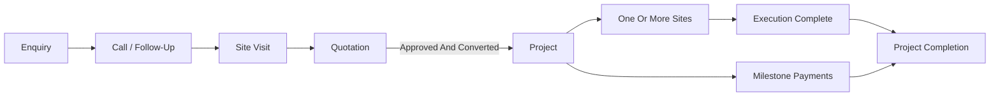

Enquiry and quotation are optional:

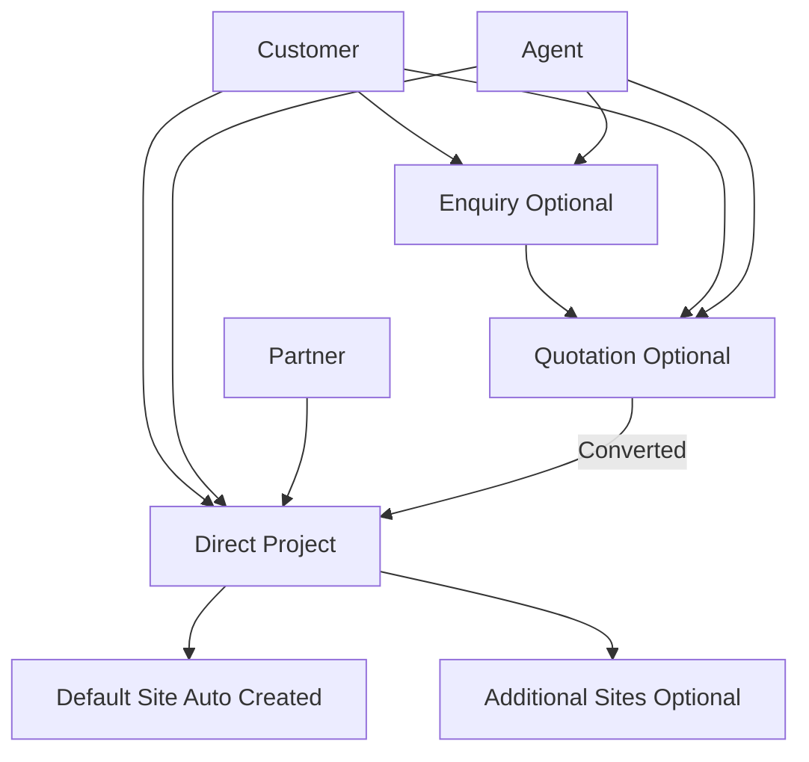

---

## 3. Confirmed Business Rules

1. An enquiry is optional. A quotation or project can be created without an enquiry.
2. A quotation is an independent commercial record.
3. One quotation can convert into at most one project.
4. A quotation covers the complete expected project, not a separate individual site.
5. A quotation can be revised until a project is created from it.
6. When a project is created from a quotation, the selected quotation version becomes the final commercial reference for that project.
7. If a quotation came from an enquiry and it converts into a project, the enquiry also becomes converted.
8. A project can be created directly without any quotation.
9. A project automatically creates one default site using the location/address entered during project creation.
10. Additional sites may be added to the same project later.
11. Sites are measured in `kW`; project capacity is the total capacity of its sites.
12. Documentation is tracked where the company is responsible for it, including work using the company's vendorship code.
13. Materials supplied by a customer or partner during installation-only work are still tracked at the site.
14. Project material cost is manually approved for profitability; it is not automatically determined by warehouse purchase cost.
15. Tools are tracked by quantity rather than separate serial or tag numbers.
16. Payments happen through project milestones.
17. Salary is calculated from attendance, leave rules and applicable deductions.
18. Agents and partners are separate business entities with different financial handling.
19. Agent commission is variable and can be configured according to the business deal.
20. Vendors and procurement are needed for material and tool inventory.

---

## 4. Enquiry

An enquiry is a potential business lead. It is used when a customer first contacts the company before a confirmed commercial proposal or project exists.

An enquiry records:

- Customer
- Initial requirement
- Proposed location, if known
- Required solar capacity, if known
- Calls and follow-ups
- Scheduled/completed site visits
- Notes
- Status
- Quotations generated from it

Suggested enquiry journey:

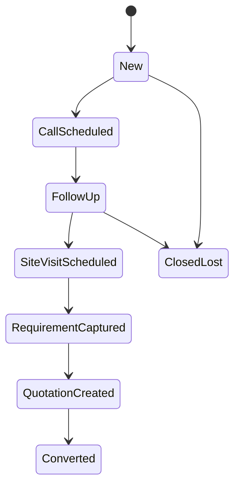

An enquiry is marked converted only when its business results in a project, normally through an approved/converting quotation.

---

## 5. Quotation

A quotation is the commercial offer sent to a customer. It is independent from an enquiry and can exist for a customer directly.

### Quotation Contains

| Category | Examples |
| --- | --- |
| Material | Panels, inverter, mounting structure, cable |
| Labour | Installation, wiring and related labour |
| Service | Documentation, design, testing, consultancy |
| Transport | Delivery or movement charges |
| Tax | GST or other applicable tax |
| Discount | Negotiated reduction |
| Other | Additional commercial items |

### Quotation Version Rule

A quotation can be revised throughout negotiation, including after an initial approval, until the project is created from it.

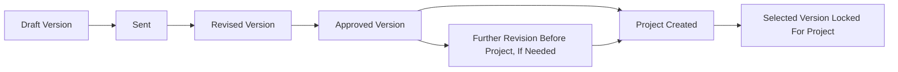

### Quotation Statuses

| Status | Meaning |
| --- | --- |
| `DRAFT` | Prepared internally |
| `SENT` | Sent to customer |
| `NEGOTIATING` | Commercial revision in progress |
| `APPROVED` | Customer accepts current version, still revisable before project creation |
| `REJECTED` | Customer rejects the business offer |
| `CONVERTED` | A project was created using a selected version |
| `CANCELLED` | Withdrawn internally |

Actual material use, labour cost and expenses after execution belong to project costing; they do not rewrite the selected quotation version.

---

## 6. Project

A project is the complete operational and commercial job.

A project may be created from:

| Origin | Enquiry Needed | Quotation Needed |
| --- | ---: | ---: |
| Approved/converting quotation | No | Yes |
| Direct customer instruction | No | No |
| Agent-referred direct project | No | No |
| Partner-provided work | No | No |
| Vendorship-related work | No | No |

### Project Records

| Information | Meaning |
| --- | --- |
| Customer | Person/company receiving the work |
| Origin | Direct, quotation, enquiry, agent or partner context |
| Scope | Type of work company performs |
| Commercial model | How money is calculated |
| Total capacity | Sum of site capacity in `kW` |
| Revenue/agreed amount | Customer quotation amount or partner-agreed amount |
| Documentation applicability | Whether documentation workflow is required |
| Sites | Physical places of delivery/installation |
| Milestone payments | Expected and received payments |
| Approved actual costs | Cost used for profitability |
| Commission/settlement | Agent or partner financial obligation |

### Project Progress

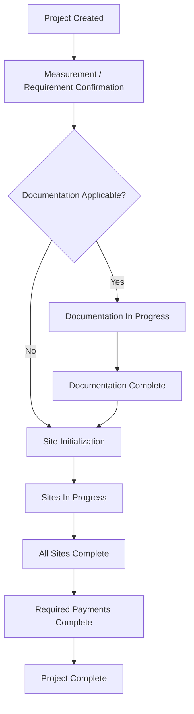

Documentation is applicable for:

- Full company-managed `EPC` work
- Work that uses the company's vendorship code
- Any contract where the company accepts documentation responsibility

---

## 7. Project Scope, Source And Commercial Model

These are separate concepts and should not be merged in database design.

### Work Scope

Scope means what the company will perform.

| Scope | Understanding |
| --- | --- |
| `EPC` | Company handles the full journey, including required documentation, material, installation and completion |
| `INC` | Installation-only work; material may belong to customer or partner |
| `BOS` | Company supplies materials only |
| `INC_BOS` | Company supplies material and performs installation; documentation may or may not be included |
| `VENDORSHIP` | Company supports work using its vendorship code, including documentation responsibility where applicable |
| `OUTSOURCED_INC` | Company manages the project but subcontracts all labour to an external subcontractor. A `Subcontractor` record is linked to the project. Material dispatch is not applicable. Documentation responsibility depends on the originating scope. [ADDED: absent from original table; confirmed in `src/domain/projectTypes/types.ts` `PROJECT_KINDS` and `AppState.subcontractors` collection] |

[ADDED: As of the current codebase build, the work scope axes have been separated into distinct project attributes rather than a single enum value: `projectType` (DIRECT_CLIENT / PARTNER_NETWORK / INC_GIVEN_TO_US), `vendorshipOwner` (MSS / partner / none), `executionScope` (full / service_only / none), and an optional `outsource` block that attaches a subcontractor record. The legacy single-value `ProjectKind` (8 values: SOLO_EPC, PARTNER_EPC, FIXED_EPC, VENDOR_NETWORK, INC, INC_GIVEN, OUTSOURCED_INC, VENDORSHIP_ONLY) is retained for migration compatibility and maps to the new shape via `LEGACY_KIND_TO_TYPE` in `src/domain/projectTypes/types.ts`.]

### Business Source

Source means where the business came from.

| Source | Understanding |
| --- | --- |
| `DIRECT` | Business acquired directly from customer |
| `ENQUIRY` | Business originated through a recorded lead |
| `AGENT` | An agent referred business |
| `PARTNER` | A partner provided work or contractual business |

### Commercial Model

Commercial model means how revenue or settlement is calculated.

| Model | Understanding |
| --- | --- |
| `DIRECT_CUSTOMER` | Revenue follows quotation or direct agreed customer amount |
| `FIXED_RATE` | Company receives a fixed agreed amount |
| `PER_WATT` | Amount is calculated by capacity; capacity stored as `kW` and converted when applying per-watt rate |
| `PROFIT_SHARE` | Settlement is based on agreed percentage of net profit |
| `VENDORSHIP_PER_WATT` | Vendorship user pays an agreed per-watt amount |

---

## 8. Sites

A site is a physical location within a project. A single project may cover multiple sites, for example one rooftop site and one farm site.

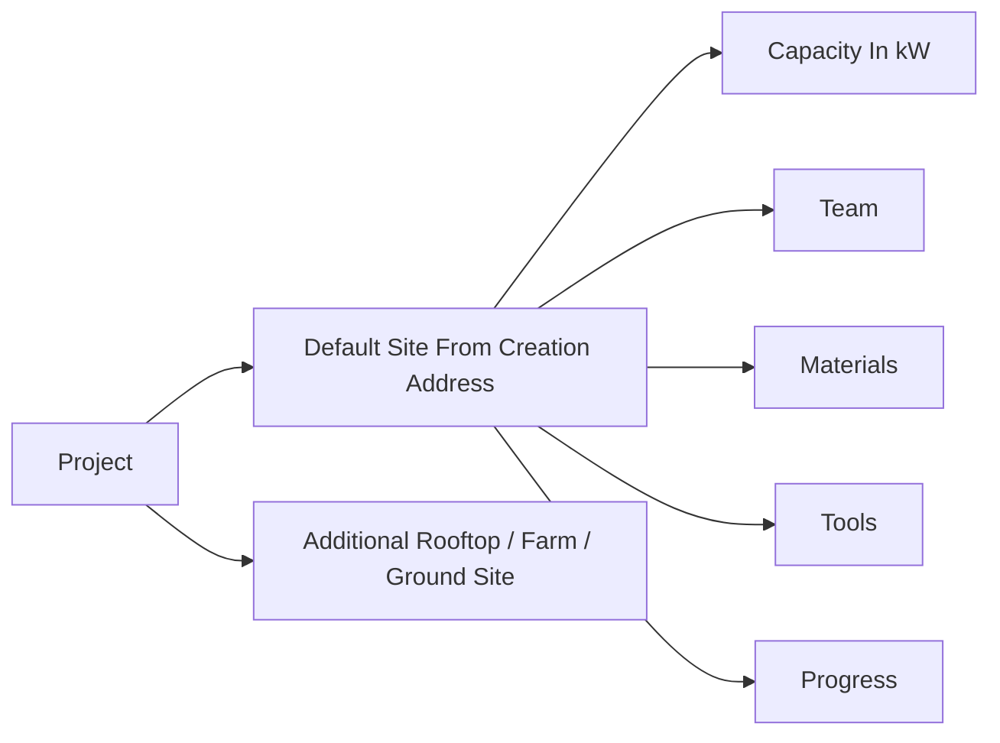

### Site Records

| Information | Meaning |
| --- | --- |
| Address | Physical work location |
| Type | Rooftop, farm, ground-mounted, commercial, etc. |
| Planned capacity | Expected site capacity in `kW` |
| Installed capacity | Completed/actual site capacity in `kW` |
| Assigned team | Employees doing site work |
| Progress | Execution stage |
| Material records | Planned/received/issued/used/returned material |
| Tool movements | Issued/returned/damaged/lost quantities |

### Installation Site Progress

For installation work, site progress generally follows:

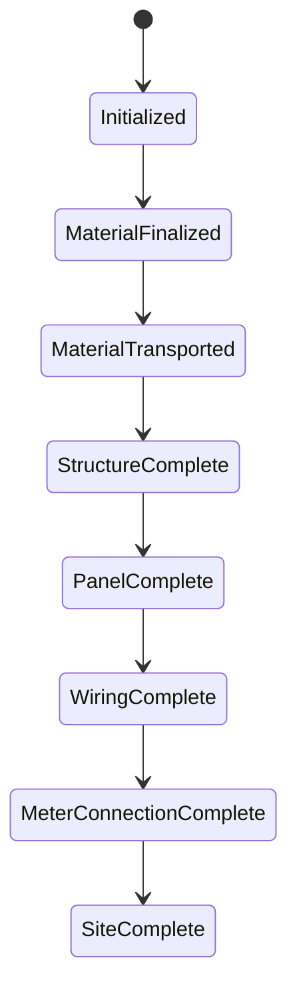

Scope may change the applicable steps:

| Scope | Site Execution Difference |
| --- | --- |
| `EPC` | Full execution stages apply |
| `INC` | External material is received/tracked, then installation stages apply |
| `BOS` | Material reserve, dispatch and delivery confirmation may complete the site work |
| `INC_BOS` | Material and installation stages apply; documentation depends on contract |

---

## 9. Materials, Tools, Vendors And Warehouse

### Materials

Materials are items installed or consumed during project work, such as:

- Solar panels
- Inverters
- Mounting structures
- Cables and wiring items
- Meter boxes and installation accessories

Material movement:

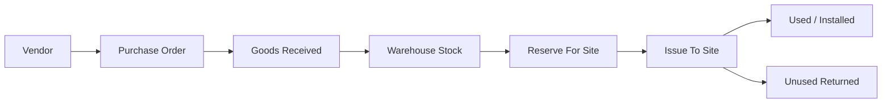

### Material Ownership

Material installed by the team is tracked even when the company does not own or supply it.

| Ownership | Inventory Effect | Profit Cost Effect |
| --- | --- | --- |
| `COMPANY_OWNED` | Leaves company warehouse when issued | Included if approved for the project |
| `CUSTOMER_OWNED` | Received/used record only | Not company material cost |
| `PARTNER_OWNED` | Received/used record only | Not company material cost |
| `PURCHASED_FOR_PROJECT` | Purchased or issued specifically for job | Included if approved |

### Tools

Tools are reusable items taken to sites and returned after work. Tools are quantity-tracked, not individually serialized.

| Movement | Example |
| --- | --- |
| Issue | `3` drills issued to Site A |
| Return | `2` drills returned from Site A |
| Damaged | `1` drill returned damaged |
| Lost | Quantity recorded lost and handled as expense/recovery if approved |

### Vendor And Procurement Needs

The system must manage:

- Vendor profiles
- Purchase orders
- Purchase order items
- Goods receipt
- Warehouses
- Current and reserved stock
- Site issue and returns
- Stock transaction audit history

---

## 10. Project Cost And Profit

The company wants project profitability to use manually approved project costs.

This means:

- Vendor/purchase price is stored for stock and purchase analysis.
- Material usage at a project/site is recorded.
- A proposed project cost can be entered.
- An authorized person approves the cost counted for the project.
- Profit reporting uses approved costs.


Conceptual profit calculation:

```
Net Profit =
Project Revenue
- Approved Material Cost
- Approved Labour Cost
- Transport And Other Project Expenses
- Approved Tool Loss Or Damage Expense
- Agent Commission
- Partner Settlement Or Profit Share
```

The accounting basis for project revenue in final profit reporting is still to be confirmed.

---

## 11. Payments

Payments occur through project milestones instead of a single final collection.

Example:

| Milestone | Example Expected Payment |
| --- | ---: |
| Advance | 20% |
| Material Dispatch / Delivery | 40% |
| Installation Completion | 30% |
| Final Handover / Completion | 10% |

Each milestone should store:

| Information | Meaning |
| --- | --- |
| Name | Advance, material dispatch, installation completed, final payment, etc. |
| Expected amount/percentage | Amount due at that milestone |
| Due trigger/date | Event or date for collection |
| Received amount | Collection made against it |
| Status | Pending, partial, paid, overdue or waived |
| Receipts | One or more payments received against milestone |

Open detail: whether a milestone can optionally be tied to a particular site in a multi-site project.

---

## 12. Employees, Site Teams And Salary

The system manages employees and the installation teams assigned to sites.

Required employee management:

- Employee profiles
- Salary structure
- Daily attendance
- Monthly paid leave entitlement
- Paid and unpaid leave records
- Standard deductions
- Monthly salary calculation and payment status
- Site/team assignment

Confirmed salary rule:

```
Payable Salary =
Salary Calculated From Attendance
+ Allowed Paid Leave Treatment
- Unpaid Leave Deduction
- Other Applicable Deductions
```

Employees or teams are assigned to sites to execute work:

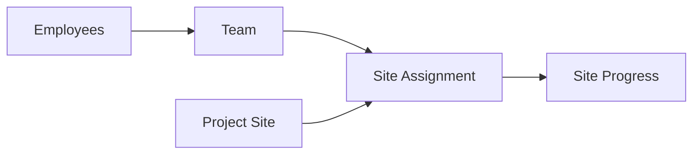

Open accounting detail: whether calculated employee labour/salary cost should be allocated automatically to the particular projects/sites where attendance or assignments occurred.

---

## 13. Agents

An agent refers business. An agent can lead to:

- An enquiry
- A quotation directly
- A project directly

An agent receives commission when referred business meets the configured eligibility condition.

Agent commission can be variable:

| Commission Type | Example |
| --- | --- |
| `FIXED_AMOUNT` | Fixed amount for converted project |
| `PERCENTAGE_REVENUE` | Percentage of project revenue |
| `PER_WATT` | Rate applied by capacity |
| `PERCENTAGE_NET_PROFIT` | Percentage of calculated project profit |


An agent is not a partner. Agent records and commission must remain separate from partner agreements and settlement.

---

## 14. Partners And Vendorship

A partner has a contractual/commercial working relationship with the company. The partner can provide:

- `EPC` work
- `INC` installation-only work
- `INC_BOS` material plus installation work
- Work using the company's vendorship code

### Partner Arrangement Models

| Arrangement | Meaning |
| --- | --- |
| Fixed-rate work | Company performs agreed work for fixed amount regardless of partner's client price |
| Installation fixed/per watt | Company provides installation for fixed amount or capacity-based rate |
| Profit sharing | Settlement is based on net profit percentage |
| Vendorship per watt | Another party uses company vendorship code and pays agreed capacity-based amount |

Partner agreements should contain the agreed scope, commercial model, rates/amounts, documentation responsibility and validity.

### Vendorship

When company vendorship code is used, documentation work is tracked because the company handles the applicable documentation creation/process. Vendorship work may have payment calculated per watt based on the agreement.

---

## 15. Application Modules

| Module | Responsibility |
| --- | --- |
| Dashboard | Leads, active projects, site delays, pending payments and stock alerts |
| Customers | Customer profiles, addresses and history |
| Enquiries | Lead intake, calls, follow-ups and site visits |
| Quotations | Versions, line items, approval/rejection and conversion |
| Projects | Scope, source, documentation, costs, milestones and profitability |
| Sites | Site execution, capacity, team, material and tool records |
| Inventory | Item catalogue, warehouse stock and movements |
| Procurement | Vendors, purchase orders and goods receipts |
| Employees / Payroll | Employee records, attendance, leave and salary |
| Agents | Referrals, commission terms and payments |
| Partners | Agreements, assigned projects, vendorship and settlement |
| Accounts | Payments, cost approvals, expenses and profit |
| Reports | Sales conversion, site progress, stock, payroll and project profit |
| Administration | Users, roles, settings and audit history |
| Subcontractors | Subcontractor profiles, work orders, payment transactions and project linkage [ADDED] |
| Finance / Accounting | Chart of accounts, bank and cash ledger, bank reconciliation, debtors-creditors aging and profit and loss by period [ADDED] |
| Audit | Audit dashboard, audit logs, audit reports, data-flow trace, inventory audit, expense audit and fixed assets [ADDED] |
| Loans | Loans to/from employees and other counterparties, repayment schedule and outstanding balance [ADDED] |
| INC Work Sources | Companies that award INC installation contracts to the company; transaction and settlement records [ADDED] |
| Vendorship Companies | Registry of DISCOM and scheme operators whose vendorship codes the company holds; per-company transaction records [ADDED] |
| Timeline | Gantt-style project and resource scheduling; installation schedules per project [ADDED] |
| Calendar | Event calendar; site visit scheduling; milestone and payment due date view [ADDED] |
| After-Sales / AMC | Annual maintenance contracts; post-project service items tracked via service presets and sale bills [ADDED] |

---

## 16. Initial Entity Map

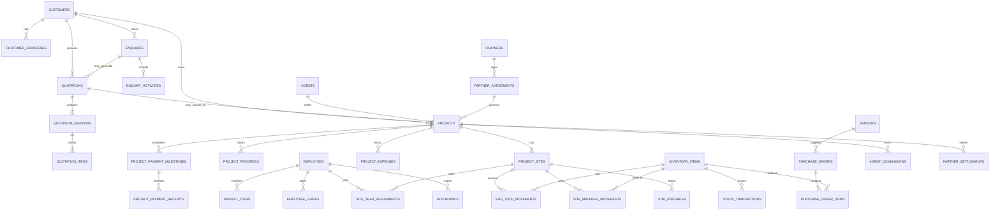

[ADDED: The following entities are present in the current application state but absent from the diagram above: `subcontractors`, `subcontractor_transactions`, `inc_giver_companies`, `inc_giver_transactions`, `vendorship_companies`, `vendorship_company_transactions`, `loans`, `loan_repayments`, `accounting_vouchers`, `bank_reconciliation_statements`, `material_reservations`, `scheduled_installations`, `site_visits`, `project_change_requests`, `material_damage_records`, `agent_commission_accruals`, `procurement_need_lines`, `owner_investments`, `deletion_requests`. These are covered in Part 2.]

---

## 17. Initial Table Groups

| Area | Suggested Tables |
| --- | --- |
| CRM | `customers`, `customer_addresses`, `enquiries`, `enquiry_activities` |
| Quotation | `quotations`, `quotation_versions`, `quotation_items` |
| Projects | `projects`, `project_sites`, `project_progress`, `site_progress`, `project_documents` |
| Payments/Costs | `project_payment_milestones`, `project_payment_receipts`, `project_expenses`, `project_cost_approvals` |
| Inventory | `inventory_items`, `warehouses`, `stock_transactions`, `site_material_movements`, `site_tool_movements`, `material_reservations` [ADDED] |
| Procurement | `vendors`, `purchase_orders`, `purchase_order_items`, `goods_receipts`, `procurement_need_lines` [ADDED] |
| Employees | `employees`, `attendance`, `employee_leaves`, `site_team_assignments`, `payroll_runs`, `payroll_items`, `employee_wallet_ledger` [ADDED] |
| Agents | `agents`, `agent_commission_terms`, `agent_commissions`, `agent_commission_accruals` [ADDED] |
| Partners | `partners`, `partner_agreements`, `partner_settlements` |
| Partners And External | `subcontractors`, `subcontractor_transactions`, `inc_giver_companies`, `inc_giver_transactions`, `vendorship_companies`, `vendorship_company_transactions` [ADDED] |
| Finance/Accounts | `invoices`, `sale_bills`, `payments`, `incomes`, `expenses`, `vendor_bills`, `vendor_payments`, `loans`, `loan_repayments`, `accounting_vouchers`, `bank_reconciliation_statements`, `owner_investments` [ADDED] |
| Operations | `project_change_requests`, `material_damage_records`, `scheduled_installations`, `site_visits`, `blockages`, `operational_tickets` [ADDED] |
| Administration | `users`, `roles`, `permissions`, `audit_logs`, `deletion_requests`, `quotation_share_details`, `accounting_review_queue` [ADDED] |

This table list is an initial domain map, not the final column-level database schema.

---

## 18. Suggested User Roles

| Role | Main Responsibility |
| --- | --- |
| Admin / Owner | Full business oversight and approvals |
| Sales Staff | Customer, enquiry and quotation management |
| Project Manager | Projects, sites, execution and team assignments |
| Store Manager | Warehouse material and tool movements |
| Procurement Staff | Vendors and purchases |
| HR / Payroll | Employees, attendance, leaves and salary |
| Accountant | Milestone payments, expenses, settlements and reports |
| Site Supervisor | Assigned site work, material/tool use and progress |

---

## 19. Decisions Still Needed

The following rules have not yet been confirmed:

1. Can a single project ever involve both an agent and a partner, or must it be linked to only one of them?
2. Can a payment milestone relate to a specific site in a multi-site project, or is every milestone always at full-project level?
3. Should employee salary/labour cost be allocated to specific projects/sites for profitability reporting in addition to attendance-based salary calculation?
4. Exactly when is agent commission payable: at project creation, after advance receipt, at a milestone, or after completion?
5. For final net profit, should revenue be counted from agreed contract amount, invoices raised or payments actually received?
6. Should project/site workflows be configurable using templates, or fixed according to scope type?
7. Is customer invoicing/GST invoicing/vendor bill management needed in the first application version?

---

## 20. Next Design Stage

After confirming the remaining rules, the next design work is:

1. Screen-by-screen application design.
2. Exact database schema with fields, types, indexes and relationships.
3. Status transition and approval rules.
4. User permissions.
5. API endpoint design.
6. Technology stack and phased backend implementation.

---

## Part 2: Additional Modules and Domain

## 21. Subcontractors

A subcontractor is an external company or individual hired to perform labour on a project site when the company does not deploy its own installation team. A subcontractor is not an agent and not a partner. Agents refer business; partners share commercial risk or revenue. A subcontractor is a labour provider paid by the company for work performed.

### Subcontractor Records

| Information | Meaning |
| --- | --- |
| Name | Subcontractor company or individual name |
| Contact | Primary contact person, phone and email |
| Trade / Skill | Type of work: electrical, civil, mounting, full installation |
| Bank details | Account and IFSC for payment |
| GST / PAN | Tax registration details |
| Active projects | Projects currently linked to this subcontractor |

### Project Link

A project links a subcontractor via an `outsource` block when the execution scope is `OUTSOURCED_INC`. One project links at most one subcontractor at a time. The link stores the agreed work scope, rate terms and document references for the subcontract.

A `subcontractor_agreement` document must be generated before site work begins on an outsourced project.

### Transactions

`SubcontractorTransaction` records each payment made to the subcontractor against a project. Each transaction stores the amount, date, payment reference and the project it relates to.

The total paid to the subcontractor for a project is a project cost item. It enters profitability calculation as an approved expense when the appropriate approver confirms it.


---

## 22. INC Work Sources

An INC work source is a company that awards installation-only contracts (`INC_GIVEN_TO_US` projects) to the company. The INC giver owns the customer relationship and typically supplies the material. The company provides the installation team and execution.

This is distinct from:

| Entity | Role |
| --- | --- |
| Agent | Refers a customer; receives commission |
| Partner | Shares commercial risk or revenue; has an agreement |
| INC Work Source | Awards a labour contract; pays the company directly |

### INC Giver Records

| Information | Meaning |
| --- | --- |
| Company name | The awarding organisation |
| Contact | Primary contact for assignment of work |
| Rate terms | Per-watt or fixed-rate basis for payment |
| Active projects | Projects currently assigned by this INC giver |

### Transactions

`INCGiverTransaction` records amounts received from the INC giver per project. Revenue on an `INC_GIVEN_TO_US` project flows from the INC giver to the company, not from an end customer.


---

## 23. Vendorship Companies Registry

The company holds vendorship empanelment with DISCOMs, government bodies and scheme operators. The vendorship companies registry records each operator whose code the company is registered under.

This registry is separate from the commercial vendorship concept in partner agreements. Partner agreements describe financial terms for work done under a vendorship arrangement. This registry holds the registration records themselves.

### Vendorship Company Records

| Information | Meaning |
| --- | --- |
| Operator name | DISCOM, scheme or government body name |
| Registration number | Empanelment or vendor code number |
| Scheme | PM Surya Ghar, MNRE scheme, state DISCOM scheme, etc. |
| Validity | Registration start and expiry dates |
| Applicable capacity | Minimum and maximum capacity range for the registration |
| Documentation set | List of documents submitted for empanelment |

### Transactions

`VendorshipCompanyTransaction` records fees paid to the operator or income received for vendorship-code-based project work. A project that uses a vendorship code references the relevant `VendorshipCompany` record so that costs and income are attributed correctly.

---

## 24. Document Management

For projects where documentation is applicable, the system generates and tracks a defined set of documents. The company takes documentation responsibility when it performs EPC work, uses a vendorship code or accepts documentation obligations in the contract.

### Document Types

| Document Key | Description |
| --- | --- |
| `proposal` | Commercial proposal / offer letter |
| `agreement` | EPC or work order agreement |
| `feasibility` | Feasibility / shadow analysis workbook |
| `meter_application` | DISCOM net metering and rooftop connection application |
| `dcr` | Drawing change register |
| `wcr` | Work completion request |
| `handover` | Customer acceptance and O&M handover dossier |
| `external_invoice_ref` | External OEM invoice reconciliation reference |
| `commission_doc` | Channel / partner commission acknowledgement letter |
| `site_photo` | Site photo pack for INC scope |
| `work_completion` | Work completion certificate for INC scope |
| `full_epc_document_set` | Master index — full EPC document dossier |

### Document Lifecycle

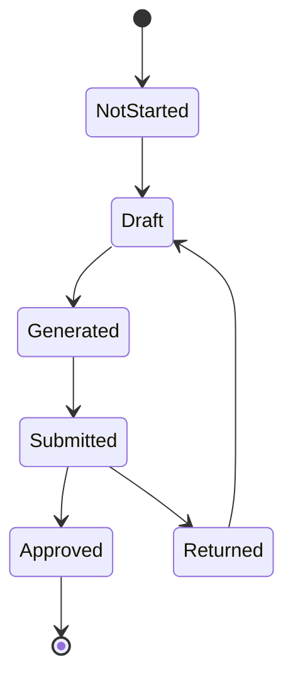

The set of required documents for a project is determined by its scope, vendorship owner and partner role. `resolveProjectCapabilities` in `src/domain/projectTypes/config.ts` returns the `requiredDocuments` list for a given project configuration.

---

## 25. Change Requests

A change request records a mid-project modification to agreed scope, capacity or add-on work after the original project was confirmed. It preserves the original contract terms while tracking what changed and why.

### Change Request Types

| Type | Meaning |
| --- | --- |
| Capacity change | Agreed installed capacity increases or decreases |
| Panel count change | Number of panels changes independently of capacity |
| Add-on work | Additional scope item added after project start |

### Status Lifecycle

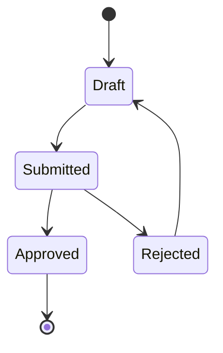

### Approval Effects

When a change request is approved:

- `contractAmount` on the project is recalculated
- Milestone amounts or percentages that are proportion-based are scaled
- A delta invoice is raised for the difference if the contract amount increased
- Agent commission accruals linked to the project are scaled to reflect the new contract amount
- Material reservations from the original checklist are re-evaluated against the revised scope

---

## 26. Quality Control And Material Damage

Material damage events are recorded separately from normal movement records. A damage record captures items found to be damaged at any stage of the project lifecycle.

### Damage Record Fields

| Field | Meaning |
| --- | --- |
| Item | Inventory item that was damaged |
| Quantity | Number of units damaged |
| Stage | `transport` / `installation` / `storage` |
| Date | When the damage was discovered |
| Description | Nature of damage |
| Photo URLs | One or more evidence photo references |
| Project | Project where the damage occurred |
| Site | Specific site if applicable |
| Cost impact | Estimated replacement or repair cost |
| Approved | Whether the cost impact has been approved for project costing |

### Cost Treatment

A damage event does not automatically enter project cost. An authorised approver reviews the record and approves the cost impact amount. Once approved, the cost is included in the project's actual cost and reduces net profit accordingly.

---

## 27. Material Reservations

A material reservation holds a quantity of a stock item against a specific project and site before the physical issue movement occurs. Reservations prevent the same stock from being committed to two concurrent projects.

### Reservation Lifecycle

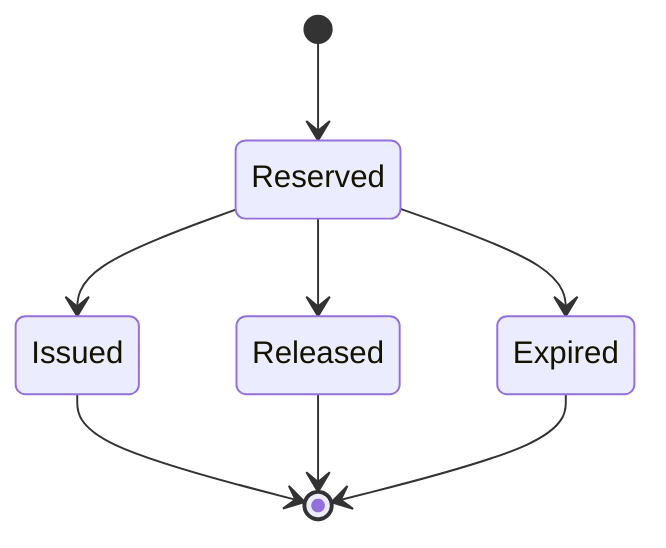

### Reservation Records

| Field | Meaning |
| --- | --- |
| Item | Inventory item reserved |
| Quantity | Reserved quantity |
| Project | Project the reservation is held for |
| Site | Specific site within the project |
| Source | `auto` (from site checklist dispatch) or `manual` (store staff) |
| Status | Reserved / Issued / Released / Expired |

A reservation transitions to `Issued` when the matching physical issue movement is created. A reservation transitions to `Released` when a change request removes the item from scope or the reservation is manually cancelled. Expired reservations release quantity back to available stock after the configured expiry window.

---

## 28. Expense Management And Reimbursements

Expenses cover all outgoings that are not material purchases or salary calculations. This includes travel, fuel, food allowances, site petty cash, office overheads, owner drawings and partner-related costs.

### Expense Categories

| Main Category | Examples |
| --- | --- |
| `company` | Vehicle fuel, office supplies, site transport using company vehicle |
| `employee` | Employee personal vehicle use, travel advances, food |
| `office` | Rent, utilities, software subscriptions |
| `site` | Site petty cash, local labour day rates, site consumables |
| `owner` | Owner drawings, personal expenses charged to the business |
| `partner` | Costs incurred in relation to a partner arrangement |

### Vehicle Expense

Transport expenses carry a `vehicleType` field: `company` (company-owned vehicle), `employee` (employee's personal vehicle reimbursed), or `outsource` (hired transport). This distinction is used in profitability and reimbursement reporting.

### Reimbursement Workflow

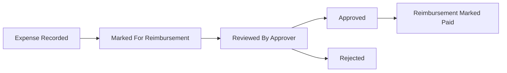

Expenses linked to a specific project are included in the project's actual cost calculation when approved. Attachment URL stores a photo of the receipt or supporting document.

---

## 29. Notifications And Alerts

The application generates business alerts for conditions that require attention from users. Alerts are dismissible per session and categorised by kind.

### Alert Kinds

| Kind | Trigger |
| --- | --- |
| `invoice` | Customer invoice overdue or unpaid beyond the configured threshold |
| `loan` | Loan EMI due date approaching or already overdue |
| `stock` | Inventory item quantity below configured minimum level |
| `blockage` | A project blockage is open and unresolved |
| `quotation` | Quotation approaching expiry or awaiting internal approval |
| `vendor_bill` | Vendor bill payment overdue |
| `approval` | A project cost, expense or change request is awaiting approval |
| `deletion_request` | An admin deletion request is pending review |

Alerts are evaluated at application load and on relevant state changes. Each alert carries a severity level and a link to the relevant record. Dismissed alerts are not re-shown in the same session.

---

## 30. File Attachments And Media

Photos and documents are attached to records as stored URL or path references. No binary content is held in application state. The reference model allows any storage backend (local file system, cloud bucket, document service) to be used without changing entity structure.

### Attachment Points

| Entity | Field | Use |
| --- | --- | --- |
| Project | `photoGallery[]`, `photos` count | Site before/after progress photos |
| MaterialDamage | `photoUrls[]` | Damage evidence photos |
| SiteVisit | `photos[]` | Pre-installation assessment photos |
| Expense | `attachmentUrl` | Receipt or bill scan |
| VendorBill | `documentUrl` | Vendor invoice scan |

---

## 31. After-Sales, Warranty And AMC

Post-project obligations are managed through the existing service and billing infrastructure rather than a separate entity. Annual maintenance contracts are a service category in the item catalogue and are invoiced through sale bills.

### AMC And Warranty Tracking

- `AMC` is a recognised category in `ITEM_CATEGORIES`; service presets for annual maintenance are configured in the Templates module
- A sale bill raised after project handover with AMC line items creates the ongoing service income record and revenue recognition for that period
- Warranty period, OEM registration details and O&M handover checklist are recorded in the project's `handover` document
- Scheduled maintenance visits are tracked as calendar events and timeline entries; they appear in the Calendar module under the `installation` or `task` source type

---

## 32. Timeline, Calendar And Scheduling

The timeline provides a Gantt-style view of projects, sites and resource assignments across time. The calendar provides an event-centric day/week/month view across the same operational data.

### Timeline Tabs

| Tab | Content |
| --- | --- |
| Sites | Project and site progress bars across a date range; overdue sites highlighted |
| People | Employee and team assignments per project; attendance-linked utilisation |
| Office | Internal tasks, quotation deadlines and milestone due dates |

### Calendar Event Sources

| Source | Example Event |
| --- | --- |
| `task` | Internal task due date |
| `installation` | Scheduled site installation start or end |
| `enquiry` | Follow-up call or site visit |
| `invoice` | Invoice due date |
| `vendor-bill` | Vendor bill payment due |
| `loan-emi` | Loan repayment instalment date |
| `site-visit` | Pre-installation site assessment visit |
| `milestone` | Project payment milestone trigger date |

### Scheduled Installation

`ScheduledInstallation` links a project to a planned installation date range. It stores the assigned team or employee list, notes and current status. Multiple scheduled installations can exist per project to represent phase-wise deployment.

### Site Visit

`SiteVisit` is a pre-start assessment by the installation team to inspect the physical site before the material checklist is finalised. It records visit date, findings, photo references and the employee who conducted it.

---

## 33. Analytics And Business Intelligence

The analytics module provides computed metrics and trend views across the full business. It is separate from the transactional export reports in the Audit module. Analytics aggregates data across all entities to surface operational and financial trends.

### Metric Groups

| Group | Example Metrics |
| --- | --- |
| Pipeline | Enquiry-to-project conversion rate, average days to convert, open leads by source agent |
| Operations | Active site count, sites overdue by stage, project completion rate by month |
| Finance | Revenue collected vs target, outstanding receivables, month-on-month net income |
| Inventory | Stock turnover rate, items below minimum level, pending purchase order value |
| Customers | Top customers by revenue, repeat project rate, average project size |
| People | Attendance rate, payroll cost by month, team utilisation across active sites |

### Date Range

All analytics views support a selectable date range: current month, quarter, year or all-time. Comparative periods are shown where relevant.

---

## 34. Loans Management

Loans covers money the company has borrowed from external sources and money lent to employees or other counterparties.

### Loan Records

| Field | Meaning |
| --- | --- |
| Source type | `bank` / `person` / `partner` / `nbfc` / `other` |
| Direction | `borrowed` (company owes) / `lent` (company is owed) |
| Principal | Original loan amount |
| Interest rate | Annual percentage rate |
| Start date | Disbursement date |
| Repayment type | `EMI` (equal monthly instalments) / `one-time` / `reminder-only` |
| Outstanding balance | Remaining principal |

### Repayments

`LoanRepayment` records each instalment: principal portion, interest portion, date paid and a linked expense or payment record.

The principal and interest portions are split on the linked `Expense` row so that the profit and loss statement correctly separates financing cost (interest) from capital repayment (principal reduction).

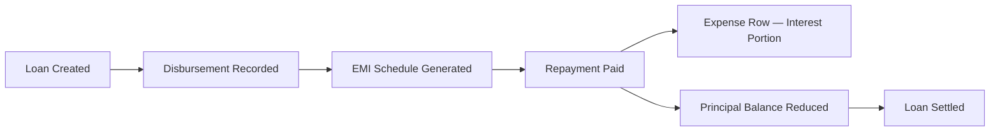

---

## 35. GST Compliance And Tax Management

GST is tracked at the individual item and service line level. This allows the application to produce sales and purchase registers that align with GST filing periods.

### Item-Level Tax Setup

- `MasterItem.gstRate` stores the applicable GST percentage for each inventory item in the catalogue
- HSN codes are assigned to inventory items; SAC codes are assigned to service lines
- `InvoiceItem.hsn` and `InvoiceService.sac` carry the codes onto every invoice line, so the register can be broken down by code

### Reporting

- `computeGstSummary` aggregates output tax (from sales invoices and sale bills) and input tax (from vendor bills) by month
- `computeHsnSacBreakdown` groups taxable value and tax amount by code for a selected period
- A 24-month rolling period selector is available in the Audit module GST view
- The sales register and purchase register are available as exports for use in GST filing

---

## 36. Finance And Accounting

The finance module covers accounting-level records that sit above project-level costing. Project cost and revenue tracking (described in Section 10) records what happened on a specific job. The finance module records the accounting treatment of those transactions using a double-entry structure.

### Components

| Component | Description |
| --- | --- |
| Chart of accounts | Hierarchical account groups and ledger accounts; defines the double-entry structure for the business |
| Accounting vouchers | Journal entries posting debits and credits across ledger accounts; auto-generated when invoices, bills, payments and expenses are created |
| Bank and cash ledger | Running balance per bank or cash account; transaction list with date, counterparty and amount |
| Bank reconciliation | Upload a bank statement; match statement lines to accounting voucher entries; track unmatched items on either side |
| Debtors / creditors aging | Outstanding receivables and payables grouped by age bucket (current, 30, 60, 90+ days) |
| Profit and loss | Period income vs expense summary across all categories; does not require project-level cost approvals |
| Owner investments | Capital injected by owners recorded separately from operating income to preserve accurate equity tracking |

### Voucher Posting

`VoucherPostingService` creates an `AccountingVoucher` record automatically when key financial events occur: invoice raised, payment received, vendor bill entered, expense approved, salary paid. Each voucher carries the account codes for the debit and credit legs, the amount and the source document reference.

---

## 37. Templates And Presets

Templates allow standard work types to be set up quickly with pre-filled material lists, service lines and site dispatch items. They reduce data entry for recurring project configurations such as a standard 5 kW rooftop EPC or a 100 kW farm INC_BOS installation.

### Template Types

| Template | Purpose |
| --- | --- |
| `QuotationTemplate` | Pre-filled material and service lines for a standard quotation. Includes line items, quantities, unit prices and applicable tax. Applied at quotation creation to populate the initial version. |
| `SiteChecklistTemplate` | Pre-filled bill of materials for a standard site dispatch. Sub-types: `generic` (any material set) or `solar_package` (structured panel + inverter + BOM). Populates the site material checklist when dispatched. |
| `ServicePreset` | Reusable single service line — AMC, design fee, commissioning charge, documentation charge — inserted into quotations or sale bills without requiring a full template. |
| `SolarPackagePreset` | Settings-level system configuration combining panel model, inverter model, capacity and price per watt. Used as a quick-fill reference when creating quotations or site checklists. |

`QuotationVisibilityPreset` controls which columns are shown or hidden on a printed or shared quotation. Different visibility configurations can be saved for different customer types or deal contexts.

---

## 38. Technology Stack

The current application is a frontend prototype client. The domain, application and repository layers are structured so that the localStorage backend can be replaced with an API-backed implementation without modifying business logic.

### Frontend

| Layer | Technology |
| --- | --- |
| Framework | React 18.3 + TypeScript 5.8 |
| Bundler | Vite 5.4 |
| Styling | TailwindCSS 3.4 + Radix UI component primitives |
| Forms | React Hook Form 7 + Zod 3.25 schema validation |
| State management | Zustand 5 (global app state) |
| Server-state layer | TanStack React Query 5 (ready for API integration) |
| Routing | React Router 6.30 |
| Charts | Recharts 2.15 |
| PDF export | jsPDF + html2canvas |
| Testing | Vitest 4.1 (unit), Playwright 1.60 (end-to-end), Testing Library |

### Architecture

| Layer | Description |
| --- | --- |
| `domain/` | Business entities, rules and capability resolution; no framework dependencies |
| `application/` | Commands and command handlers via `CommandBus`; orchestrates domain logic |
| `infrastructure/` | Repository implementations; current storage: `localStorage` (key: `mahi_solar_app_data`) |
| `contexts/` | React context that exposes `AppState` and all CRUD operations to the UI |
| `pages/` and `components/` | React UI; reads state via context and dispatches commands |

### Current Storage Backend

All application data is persisted to `localStorage` under a single versioned key. `applyAppStateHydrationPipeline` runs migrations on load when the stored version is behind the current `APP_DATA_STORAGE_VERSION`. Repository interfaces in `src/infrastructure/repositories/` are defined against abstract contracts so the storage layer can be replaced with a REST or GraphQL API backend without modifying domain or application code.

### Authentication

The current implementation uses a demo login against a hardcoded user list. Session is stored in `localStorage`. Role-based access is enforced via `PermissionService` which maps `UserRole` values to allowed actions and route access. This is a prototype mechanism intended to be replaced with a server-issued session or JWT when the backend is built.
