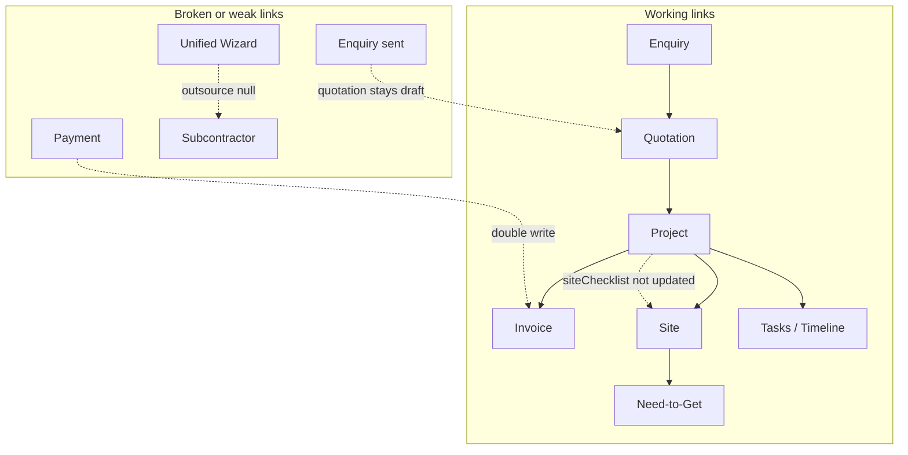

# MSS Application Audit — Final Issues to Fix

**Audit date:** 2026-05-24  
**Scope:** Working prototype (not production enterprise review)  
**Perspective:** super_admin, admin, ceo, management, salesperson, installation_team  
**Focus:** Flow continuity, module interconnection, journey completion, live UI correctness, role gates, operational realism

---

## Executive Summary

MSS is a **broad, functional prototype** with a real command-bus pipeline (Enquiry → Quotation → Project → Site/Tasks/Finance) and strong route-level ACL. Most list pages, empty states, and tabbed project detail work for demo purposes.

**Prototype-breaking issues found:** 5 critical flows that corrupt data, block journeys, or fail CI.  
**Major issues:** 12 logic/permission/entity-link gaps that break trust or leave journeys incomplete.  
**Medium/Minor:** UX consistency, mobile friction, and polish items acceptable to defer but worth fixing before stakeholder demos.

**Strongest areas:** Permission matrix + route gating, quotation approval validation, audit/finance aggregates, smart generator nav coverage, tabbed Project Detail by project kind, Need-to-Get derivation from live site checklists.

**Weakest areas:** Materials return flow (dead UI), invoice payment double-write, enquiry/quotation status continuity, project BOQ vs site checklist sync after dispatch, OUTSOURCED_INC wizard missing subcontractor link, legacy `CreateProjectWizard` broken import.

---

## Critical Issues

### 1. Invoice payment double-counts `amountReceived`

| Field | Detail |
|-------|--------|
| **Module** | Finance → Invoices (`src/pages/Invoices.tsx`) |
| **Status** | **FIXED** (2026-05-24) |
| **Why it's a problem** | `handleRecordPayment` (~428–444) manually patched `amountReceived` on the invoice, then called `recordCustomerInflow` → `addPayment`, which **added the same amount again** in `AppDataContext.addPayment` (~2703–2708). |
| **Impact** | Invoice shows paid/overpaid incorrectly; receivables KPI, debtors report, and project collected totals drift from actual payments. Breaks finance trust immediately. |
| **Fix applied** | Removed manual `updateInvoice`/`updateSaleBill` patch from `Invoices.tsx`. Centralized receipt application in `applyInvoiceReceiptToDocument` / `applyInvoiceReceiptDeltaToDocument` (`invoicePaymentStatus.ts`); `addPayment` and `updatePayment` now derive status + `receivedIn` from payments only. Added detail-sheet sync effect so live UI updates after payment. |

### 2. Materials “Return from Site” is a non-functional stub

| Field | Detail |
|-------|--------|
| **Module** | Warehouse → Materials (`src/pages/Materials.tsx`) |
| **Status** | **FIXED** (2026-05-24) |
| **Why it's a problem** | Return sheet showed placeholder only; site select used name vs id; `returnQuantities` never populated. |
| **Impact** | Warehouse return journey was dead; issue → return loop incomplete. |
| **Fix applied** | Site select by id; list returnable lines from project `siteMaterialLedger`; qty validation; `recordProjectMaterialMovement` (`ReturnToWarehouse` / transfer via return + issue); movement history on inventory items; `siteMaterialReturn.ts` helper + tests. |

### 3. Legacy `CreateProjectWizard` imports missing module (CI / test break)

| Field | Detail |
|-------|--------|
| **Module** | Projects wizard (`src/components/projects/CreateProjectWizard.tsx`) |
| **Status** | **FIXED** (2026-05-24) |
| **Why it's a problem** | Imports `@/components/projects/wizard/WizardStepContent` which **does not exist** on disk. Fails `src/tests/pageImportsSmoke.test.ts` and `createProjectWizard.test.tsx`. |
| **Impact** | CI red; any code path still importing legacy wizard crashes at load. Live Quotations/Projects use `CreateProjectWizardContainer` → `UnifiedProjectWizard` (works), but legacy wizard remains in repo and tests. |
| **Fix applied** | Restored legacy step components from git history; added `WizardStepContent` router with consolidated step mappings (`DEAL_TYPE`, `QUOTATION`, `EXCEPTION`, `ATTACH_PARTIES`, etc.); aligned `isStepVisible` / `getVisibleWizardSteps` with flow manifests; added `WIZARD_STEPS` export. |

### 4. Employees “Add Expense” opens two sheets simultaneously

| Field | Detail |
|-------|--------|
| **Module** | People → Employees (`src/pages/Employees.tsx`) |
| **Status** | **FIXED** (2026-05-24) |
| **Why it's a problem** | Both legacy `<Sheet open={isAddExpenseOpen}>` (~1138) and `<UnifiedExpenseSheet isOpen={isAddExpenseOpen}>` (~1361) bind to the same state. |
| **Impact** | Double overlay on desktop; unusable on mobile. Expense capture from HR view is broken/confusing. |
| **Fix applied** | Removed legacy inline expense sheet and confirmation sheet; kept single `UnifiedExpenseSheet` with employee prefill; cleared selection on close. |

### 5. Super Admin data wipe uses `window.confirm` (policy violation)

| Field | Detail |
|-------|--------|
| **Module** | Super Admin → Data Engine (`src/pages/SuperAdminDataEngine.tsx` ~29–44) |
| **Status** | **FIXED** (2026-05-24) |
| **Why it's a problem** | Uses raw `window.confirm` for “Clear All Data” and “Clear & Regenerate”. Violates `src/lib/confirmDialogPolicy.ts`; fails `src/tests/confirmDialogConsistency.test.ts`. |
| **Impact** | Inconsistent destructive UX; CI failure; no typed confirmation for catastrophic wipe. |
| **Fix applied** | Replaced with `DestructiveConfirmDialog`: standard confirm for clear-all; typed `REGENERATE` confirmation for clear-and-regenerate. |

---

## Major Issues

### 6. Dashboard “Ops blockages” KPI conflates three different metrics

| Field | Detail |
|-------|--------|
| **Module** | Dashboard (`src/pages/Dashboard.tsx` ~522–531, ~1679–1707) |
| **Status** | **FIXED** (2026-05-24) |
| **Why it's a problem** | Card **value** = `openOpsBlockagesCount` (timeline blockages entity). **Hint** = projects on managerial hold. **Click sheet** = “Projects on hold” (`status === "On Hold"`). Deep link (`dashboardKpiNavigation.ts`) → `/projects?status=On%20Hold`. |
| **Impact** | Admin/CEO cannot trust ops KPI; drill-down shows different data than the number clicked. |
| **Fix applied** | Split into two KPIs: **Ops blockages** (timeline entity count, active-sites drill-down, `DashboardOpsBlockageRow`) and **Projects on hold** (managerial lifecycle hold, projects list drill-down). Aligned hints, sheets, and deep links per metric. |

### 7. Enquiry “Send Quotation” does not send the quotation

| Field | Detail |
|-------|--------|
| **Module** | Pipeline → Enquiries (`src/pages/Enquiries.tsx` ~785–796) |
| **Status** | **FIXED** (2026-05-24) |
| **Why it's a problem** | `handleSendQuotation` only calls `transitionEnquiryStatus(..., "quotation_sent")`. Linked quotation stays `draft`; no `transitionQuotationStatus(..., "sent")`. |
| **Impact** | Sales journey appears complete on enquiry but quotation pipeline is stale. “Mark as Converted” requires `quotation_sent` on enquiry while approve/project paths may auto-convert from other states. |
| **Fix applied** | Centralized cascade in `enquirySendQuotation.ts`; `transitionEnquiryStatus` and `UPDATE_ENQUIRY_STATUS` now send the current linked draft quotation to `sent` (with validation) before marking the enquiry `quotation_sent`. UI toasts updated on Enquiries and Dashboard. |

### 8. Enquiry conversion lifecycle inconsistent with quotation approve / project create

| Field | Detail |
|-------|--------|
| **Module** | Pipeline continuity (`src/lib/enquiryConversionAtProjectWin.ts`, `src/lib/reconcileEnquiryConvertedOnProjectLink.ts`, `Enquiries.tsx`) |
| **Status** | **FIXED** (2026-05-24) |
| **Why it's a problem** | Manual convert requires enquiry `quotation_sent`. Auto-convert on quotation **approve** or project create uses `pipelineWin: true` and can convert from `new`/`meeting_scheduled` without `quotation_sent`. Hydrate reconciler also forces converted when approved quotation has customerId. |
| **Impact** | Same business outcome reachable via inconsistent paths; UI labels (“Mark as Converted” only from quotation_sent) mislead; pipeline status filters disagree with reality. |
| **Fix applied** | Canonical path enforced: `quotation_sent` → `converted` for all paths. Pipeline wins auto-advance `new`/`meeting_scheduled` to `quotation_sent` when linked quotation is sent/approved, then convert. Manual convert unchanged (quotation_sent only). Reconciler and stale detection use `isOpenEnquiryAwaitingPipelineWinClosure`. |

### 9. Project BOQ (`siteChecklist`) drifts from site checklist after material dispatch

| Field | Detail |
|-------|--------|
| **Module** | Project Detail Materials tab vs Active Sites / Need-to-Get (`AppDataContext.dispatchSiteMaterial` ~4154+, `NeedToGetService`, `MaterialsSentTab`) |
| **Why it's a problem** | `dispatchSiteMaterial` updates `site.checklistItems` + readiness but **not** `project.siteChecklist[].qtySent`. Materials tab reads project BOQ; Need-to-Get reads site lines. `findStaleSiteChecklistNeedToGetDrift` exists but is **never called**. |
| **Impact** | After dispatch, Materials tab, Need-to-Get, and site view show different quantities. Ops team loses single source of truth. |
| **Fix** | On dispatch, sync qtySent on matching `project.siteChecklist` line; call drift detector on hydrate or show admin warning banner when drift detected. |

### 10. OUTSOURCED_INC project wizard never links subcontractor entity

| Field | Detail |
|-------|--------|
| **Module** | Unified project wizard (`src/lib/unifiedProjectWizardFlow.ts`, `src/lib/buildProjectFromUnifiedWizardState.ts`) |
| **Why it's a problem** | `parties` step only for `PARTNER` and `INC_TAKEN` — not `OUTSOURCED_INC`. `buildProjectFromUnifiedWizardState` hardcodes `outsource: null` (~196). Legacy `Step3Parties.tsx` maps vendorship companies as subcontractors (wrong entity). Subcontractors collection exists (`/subcontractors`) but wizard ignores it. |
| **Impact** | OUTSOURCED_INC journey incomplete at creation; user must manually attach subcontractor on Project Detail outsource tab. Demo generator seeds subcontractors but wizard path doesn't connect. |
| **Fix** | Add parties step for `OUTSOURCED_INC` selecting from `subcontractors`; set `project.outsource` + `subcontractorPayoutRate` on create. Remove vendorship-as-subcontractor hack in legacy wizard. |

### 11. Project create does not seed first site — checklist sync delayed

| Field | Detail |
|-------|--------|
| **Module** | Project commands + Detail (`registerProjectCommands.ts`, `ProjectDetail.tsx`) |
| **Why it's a problem** | Project creation adds project + quotation link only. First site requires manual “Add site” in Project Detail. Until then, `syncSitesChecklistFromProjects` has nothing to sync; Active Sites / Need-to-Get empty for new projects. |
| **Impact** | Post-create journey has extra mandatory manual step not guided by wizard; field ops modules appear empty immediately after win. |
| **Fix** | Optional: auto-create default site from project location on create, or wizard step “Site setup” with template apply. |

### 12. Project Detail “Outstanding” uses contract − collected, not billed − collected

| Field | Detail |
|-------|--------|
| **Module** | Project Detail → Financials KPI strip (`src/pages/ProjectDetail.tsx` ~1387) |
| **Why it's a problem** | `billed` and `collected` computed correctly (~776–777) but Outstanding displays `contractAmount - collected`. Partial billing / change orders make this wrong. |
| **Impact** | Misleading receivable on project hero; CEO/sales trust issue when contract ≠ invoiced. |
| **Fix** | Use `Math.max(0, billed - collected)` or shared open-balance helper from `invoicePaymentStatus.ts`. |

### 13. Invoice “Finalize draft” not permission-gated

| Field | Detail |
|-------|--------|
| **Module** | Invoices (`src/pages/Invoices.tsx` ~1119–1137) |
| **Why it's a problem** | “Edit draft” wrapped in `canEditInvoice`; “Finalize draft” button has **no** permission check. |
| **Impact** | Roles with invoice view but not edit can finalize drafts if they reach the sheet (route ACL alone). |
| **Fix** | Wrap finalize in `canEditInvoice` (or dedicated `finance:finalize_invoice` action). |

### 14. Invoice update/delete and task/site CRUD lack context-level permission guards

| Field | Detail |
|-------|--------|
| **Module** | `AppDataContext.tsx` |
| **Why it's a problem** | `updateInvoice`/`deleteInvoice` (~2055+) have no `canPerformActionOrWarn`. `addTask`/`updateTask`/`deleteTask` (~3442+) and `addSite`/`updateSite` (~3727+) same. `ProjectDetail` passes `onAddTask` without `canWriteExecution` guard (~1097). |
| **Impact** | UI gates exist on some pages but direct context calls or future UI can mutate data without role checks. CEO read-only partially enforced on Project Detail but not on tasks. |
| **Fix** | Add permission guards in context mirroring command-bus patterns; wrap `onAddTask` with `canWriteExecution`. |

### 15. `applySiteChecklistFromTemplate` skips project BOQ and readiness sync

| Field | Detail |
|-------|--------|
| **Module** | `AppDataContext.applySiteChecklistFromTemplate` (~4105–4148) |
| **Why it's a problem** | Updates site + reservations only; does not push to `project.siteChecklist` or run `syncProjectsSiteReadinessFromChecklist`. |
| **Impact** | Template apply on site doesn't reflect on project Materials tab or readiness gates for Start Project. |
| **Fix** | After template apply, sync project BOQ from site lines and recompute readiness. |

### 16. Dead breadcrumb route `/super-admin`

| Field | Detail |
|-------|--------|
| **Module** | Super Admin Data Engine (`src/pages/SuperAdminDataEngine.tsx` breadcrumb) |
| **Why it's a problem** | Breadcrumb links to `/super-admin` which is **not** registered in `App.tsx` / `appRoutes.ts`. |
| **Impact** | Click breadcrumb → 404 / access denied during demo navigation. |
| **Fix** | Point breadcrumb to `/settings` or register a Super Admin hub route. |

### 17. Project Detail user-visible text encoding corruption (mojibake)

| Field | Detail |
|-------|--------|
| **Module** | `src/pages/ProjectDetail.tsx` (multiple lines: ~877, ~892, ~1393, ~2041, ~2076–2084, financial labels) |
| **Why it's a problem** | Rupee symbols, em dashes, and arrows render as garbage (`Ã"é╣`, `â€"`, `Ã"Çö`). |
| **Impact** | Demo looks broken/unprofessional; financial edit dialogs show wrong currency labels. |
| **Fix** | Re-save file as UTF-8; replace corrupted strings with `₹`, `—`, proper copy. |

---

## Medium Issues

### 18. EntityInfoSheet missing `subcontractor` type

| **Module** | `src/components/shared/EntityInfoSheet.tsx` — union ends at `incGiverCompany`; no subcontractor renderer.  
| **Impact** | Low today — GlobalSearch navigates directly to `/subcontractor/:id`. Breaks if `EntityLink` used with subcontractor type on dashboard rows.  
| **Fix** | Add subcontractor case + ledger summary hook-up.

### 19. Vendors list empty state always says “No vendors match”

| **Module** | `src/pages/Vendors.tsx` ~420–427  
| **Impact** | Fresh workspace mislabels zero-data as filter miss.  
| **Fix** | Branch on `vendors.length === 0` vs filtered empty (pattern from Agents/Projects).

### 20. Active Sites page has no action-level permission checks

| **Module** | `src/pages/ActiveSites.tsx` — no `useCan` / `useCanAction`.  
| **Impact** | Route ACL only; installation_team vs admin write differences depend entirely on child components.  
| **Fix** | Gate resolve-blockage / install-step toggles with `projectExecution` edit permission.

### 21. Destructive actions without confirm dialog

| **Module** | Materials scrap delete (~675–682); Attendance holiday remove (~581–584).  
| **Impact** | Accidental irreversible actions in ops flows.  
| **Fix** | Use `DestructiveConfirmDialog` per app policy.

### 22. Mobile: data-entry Dialogs instead of full-screen Sheets

| **Module** | Project Detail add site (~2145); Subcontractor/Vendorship/INC record payout dialogs.  
| **Impact** | Cramped forms on phone; inconsistent with Materials/Issue sheets using `APP_SHEET_MOBILE_FULLSCREEN_CLASS`.  
| **Fix** | Convert high-traffic forms to `AppSheetContent` with mobile fullscreen.

### 23. Import smoke tests lag behind new pages

| **Module** | `src/tests/pageImportsSmoke.test.ts`, `allPagesImport.test.ts`  
| **Impact** | `Subcontractors`, `SubcontractorDetail`, `SuperAdminDataEngine` not covered; regressions slip through.  
| **Fix** | Add imports to smoke suite.

### 24. Super Admin Data Engine only reachable via Settings

| **Module** | Sidebar / Settings entry  
| **Impact** | Super admin may not discover demo generator controls.  
| **Fix** | Optional sidebar link for `super_admin` role only (prototype convenience).

### 25. Legacy wizard `Step3Parties` uses vendorship companies as subcontractors

| **Module** | `src/components/projects/wizard/Step3Parties.tsx` ~35–39  
| **Impact** | Wrong entity link if legacy wizard revived; confuses vendorship vs subcontractor modules.  
| **Fix** | Point to `subcontractors` collection or remove legacy step.

### 26. `deleteEnquiry` unguarded and unused

| **Module** | `AppDataContext.deleteEnquiry` ~3569  
| **Impact** | No permission/audit; latent API if wired to UI later.  
| **Fix** | Add command + permission or remove export.

---

## Minor Issues

### 27. Dead code: `_handleStatusChange` on Enquiries

| **Module** | `src/pages/Enquiries.tsx` ~817 — prefixed unused handler.

### 28. Employee photo upload is local preview only

| **Module** | `EmployeeProfile.tsx`, `Employees.tsx` — documented prototype limit; not persisted.

### 29. Invoice void uses `canDeleteInvoice` not `canEditInvoice`

| **Module** | `Invoices.tsx` ~976 — role matrix semantic mismatch (may be intentional).

### 30. Audit sub-pages inconsistent empty UX

| **Module** | Some audit tables use zero rows vs `ListEmptyState` — minor demo polish.

### 31. Notifications page is alert-derived, not a notification inbox

| **Module** | `src/pages/Notifications.tsx` uses `useBusinessAlertsForSession` — no persistent notification entity. Acceptable for prototype; sidebar badge reflects business alerts not user messages.

---

## UX & Product Logic Observations

**What works well**
- Enquiry → draft quotation → edit → approve → create project wizard is the clearest golden path; validation on approve (amount, payment terms) is solid.
- Tabbed Project Detail by `projectDetailTabs.ts` reduces scroll fatigue; outsource execution isolated to tab.
- Smart generator seeds 14 showcase projects + pipeline extras with nav coverage test — sidebar pages populate after bootstrap.
- CEO read-only banners on Project Detail / Finance for operational write blocking (partial).
- Business alerts drive Notifications with dismiss/restore — live derived data, not static mocks.

**Confusing for new users**
- Default login role is `salesperson` — Finance, Audit, Partners, Subcontractors hidden; user may think app is “incomplete.”
- Enquiry “Send Quotation” label implies quotation action; only marks enquiry status.
- Dashboard blockage KPI vs projects-on-hold conflation (see Critical #6).
- Two project wizards in codebase (legacy vs unified) — only unified is live but tests reference legacy.

**Journey completion gaps**
| Journey | Status |
|---------|--------|
| Enquiry → Quotation → Project | Mostly complete; status sync gaps |
| Project → Site → Checklist → Dispatch | Manual site create; dispatch desyncs BOQ |
| Project → Invoice → Payment | Broken double-count on payment |
| OUTSOURCED_INC → Subcontractor | Wizard incomplete; post-hoc attach only |
| Materials Issue → Return | Issue works; Return dead |
| Tool issue → return | Generator seeds; UI on Tools page works |
| Attendance ← team assignment | Auto-fill exists; holidays lack confirm on delete |

---

## Mobile Responsiveness Observations

| Area | Observation |
|------|-------------|
| List pages | Generally use `DataTableShell` + horizontal scroll — usable. |
| Sheets | Materials issue, Need-to-Get, most CRUD use `AppSheetContent` — good. |
| Employees expense | **Broken** — double sheet (Critical #4). |
| Project add site | Centered Dialog — cramped on small screens. |
| Dashboard KPI sheets | Scroll contained; touch targets adequate. |
| Global search | Mobile dropdown scroll with `-webkit-overflow-scrolling: touch` — OK. |

---

## Trust & Realism Observations

| Observation | Severity |
|-------------|----------|
| Invoice payment double-write | **Trust-breaking** — books wrong immediately |
| Outstanding KPI wrong formula | Misleading for partial billing |
| Mojibake currency symbols | Looks like corrupted export / unprofessional |
| Ops blockage KPI mismatch | Executive dashboard not credible |
| Enquiry/quotation status drift | Pipeline reporting unreliable |
| Finance aggregates (`getOutstandingReceivables`) | Correct when payment path fixed |
| Audit P&L / debtors | Generally aligned with payment records if invoice amounts correct |
| Generator data | Realistic enough for prototype demos after smart generator refactor |

---

## Design System Consistency Observations

**Consistent:** `ListEmptyState`, `StickyPageHeader`, `PageShell`, `DestructiveConfirmDialog` on most deletes, `InlineConfirmBanner` for success/error, `DataTableShell` + pagination, badge tones for lifecycle status.

**Inconsistent:**
- `window.confirm` on Super Admin vs typed confirm elsewhere.
- Dialog vs Sheet for forms (see Medium #22).
- Vendors empty copy vs other list pages.
- Audit pages mix `TableEmptyRow` and zero-value tables without empty illustration.

---

## Entity Relationship & Flow Continuity Observations

| Entity A | Entity B | Expected link | Actual |
|----------|----------|---------------|--------|
| Enquiry | Quotation | Send updates both | Enquiry only |
| Quotation approve | Enquiry converted | Consistent status | Auto-convert skips `quotation_sent` |
| Project | Site | Auto or guided | Manual add only |
| Site checklist | Project BOQ | Bidirectional sync | One-way; dispatch doesn't update BOQ |
| Project OUTSOURCED_INC | Subcontractor | Set at create | Post-hoc on detail tab |
| Invoice | Payment | Single amountReceived source | Double increment |
| Subcontractor | GlobalSearch | Navigate | OK |
| Subcontractor | EntityInfoSheet | Preview sheet | Missing type |
| Customer | Enquiry/Project | FK chain | OK via commands |
| Template | Site | Apply checklist | Site only; project not updated |

---
## Appendix — Role-Specific Notes

| Role | Key friction |
|------|----------------|
| **super_admin** | Data Engine hidden in Settings; breadcrumb 404; confirm dialog inconsistent |
| **admin** | Full access; most hurt by data corruption bugs (payment, BOQ drift) |
| **ceo** | Read-only mostly works; misleading KPIs still visible |
| **salesperson** | Cannot see Finance/Audit (by design); enquiry send incomplete |
| **installation_team** | Active Sites + Materials; return flow dead; dispatch desync affects Need-to-Get |

---

## Appendix — Verified Tests (2026-05-24)

| Test | Result |
|------|--------|
| `smartGeneratorNavCoverage.test.tsx` | Pass |
| `npm run build` | Pass |
| `pageImportsSmoke.test.ts` | **Fail** — missing `WizardStepContent` |
| `confirmDialogConsistency.test.ts` | **Fail** — `window.confirm` in SuperAdminDataEngine |

---

*End of audit. Issues are real findings from code inspection and targeted test runs; not inflated for volume.*
